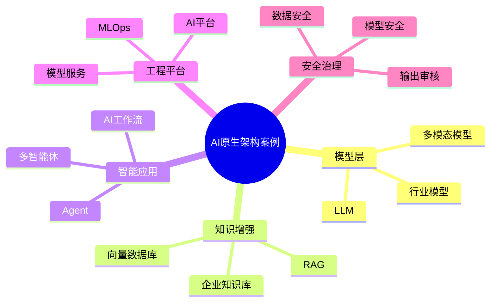

# 63-ai-native-architecture-case.md（AI原生架构案例）

> 本文用于系统架构设计师考试案例分析专题 V2 复习。
>
> 本篇重点整理 AI 原生架构（AI Native Architecture）设计案例，包括大语言模型、RAG、AI Agent、企业AI平台、模型服务化、MLOps、知识库、向量数据库以及AI安全治理。

---

# 目录

1. AI原生架构案例概述
2. AI原生基本概念
3. 传统应用智能化挑战案例
4. AI原生总体架构案例
5. 大语言模型架构案例
6. LLM应用架构案例
7. RAG检索增强生成案例
8. AI Agent智能体架构案例
9. 多智能体协作架构案例
10. AI工作流自动化案例
11. 企业AI平台架构案例
12. 模型服务化架构案例
13. MLOps机器学习运营案例
14. AI数据治理案例
15. 向量数据库架构案例
16. 企业知识库架构案例
17. AI安全架构案例
18. AI应用工程化案例
19. AI原生迁移案例
20. 企业级AI原生架构案例
21. 案例分析答题模板
22. 高频考点
23. 易错点
24. Mermaid知识结构图
25. 本节小结

---

# 1. AI原生架构案例概述

AI原生：

> 将人工智能能力作为应用系统核心能力进行设计的软件架构模式。

传统应用：

```text
用户

↓

业务逻辑

↓

数据库
```

AI原生应用：

```text
用户

↓

AI能力层

↓

业务服务

↓

数据与知识
```

目标：

- 提升业务智能化；
- 自动处理复杂任务；
- 提高决策效率。

---

# 2. AI原生基本概念

主要组成：

## 基础模型

包括：

- 大语言模型；
- 多模态模型；
- 行业模型。

## AI Agent

实现：

- 感知；
- 推理；
- 规划；
- 执行。

## 知识增强

包括：

- 企业知识库；
- 向量数据库；
- RAG。

## AI工程平台

包括：

- 模型管理；
- 推理服务；
- 模型监控。

---

# 3. 传统应用智能化挑战案例

常见问题：

- 知识无法复用；
- 自动化程度低；
- 数据价值不足；
- AI应用难以规模化。

---

# 4. AI原生总体架构案例

```text
智能应用层

↓

Agent应用层

↓

模型服务层

↓

AI平台层

↓

数据与知识层

↓

基础设施层
```

---

# 5. 大语言模型架构案例

流程：

```text
训练数据

↓

基础模型

↓

行业优化

↓

智能应用
```

包括：

- 模型训练；
- 模型微调；
- 模型推理。

---

# 6. LLM应用架构案例

典型结构：

```text
用户

↓

应用接口

↓

Prompt管理

↓

LLM模型

↓

业务系统
```

能力：

- 文本生成；
- 问答；
- 总结；
- 推理。

---

# 7. RAG检索增强生成案例

RAG：

> 将外部知识检索与大模型生成结合。

架构：

```text
用户问题

↓

知识检索

↓

向量数据库

↓

LLM生成

↓

答案输出
```

优势：

- 降低幻觉；
- 使用企业知识；
- 提升准确性。

---

# 8. AI Agent智能体架构案例

Agent：

> 能够自主感知、规划和执行任务的智能系统。

架构：

```text
用户目标

↓

Agent

↓

规划

↓

工具调用

↓

任务执行
```

能力：

- 推理；
- 任务分解；
- 工具调用。

---

# 9. 多智能体协作案例

多个Agent协作：

```text
任务Agent

↓

分析Agent

↓

执行Agent

↓

审核Agent
```

用于复杂业务自动化。

---

# 10. AI工作流自动化案例

流程：

```text
任务输入

↓

AI分析

↓

自动调用服务

↓

结果输出
```

应用：

- 客服；
- 办公自动化；
- 流程审批。

---

# 11. 企业AI平台架构案例

AI平台提供：

- 模型管理；
- 数据管理；
- 推理服务；
- 应用管理。

架构：

```text
AI应用

↓

AI平台

↓

模型服务

↓

计算资源
```

---

# 12. 模型服务化架构案例

模型作为服务：

```text
应用

↓

AI API

↓

模型服务

↓

GPU资源
```

能力：

- API接口；
- 推理服务；
- 模型版本管理。

---

# 13. MLOps案例

MLOps：

> AI模型生命周期管理体系。

流程：

```text
数据准备

↓

模型训练

↓

模型部署

↓

模型监控

↓

模型优化
```

---

# 14. AI数据治理案例

包括：

- 数据质量；
- 数据标注；
- 数据安全；
- 数据权限。

目标：

保证AI模型可靠运行。

---

# 15. 向量数据库架构案例

作用：

存储：

- 文本向量；
- 图片向量；
- 知识表示。

架构：

```text
数据

↓

Embedding

↓

向量数据库

↓

相似检索
```

---

# 16. 企业知识库架构案例

流程：

```text
企业文档

↓

知识处理

↓

向量化

↓

知识库

↓

AI问答
```

---

# 17. AI安全架构案例

包括：

- 模型安全；
- 数据安全；
- Prompt安全；
- 输出审核。

---

# 18. AI应用工程化案例

重点：

- Prompt工程；
- 模型评估；
- 服务监控；
- 成本控制。

---

# 19. AI原生迁移案例

演进：

```text
传统应用

↓

增加AI能力

↓

AI增强应用

↓

AI原生应用
```

---

# 21. 案例分析答题模板

## 企业知识无法利用

> 建设企业知识库，通过RAG技术结合大模型实现知识智能应用。

## AI应用无法规模化

> 建设统一AI平台，实现模型管理、服务治理和应用管理。

## 人工流程效率低

> 引入AI Agent，通过任务规划和工具调用实现业务自动化。

## 模型上线维护困难

> 建设MLOps体系，实现模型全生命周期管理。

---

# 22. 高频考点

重点掌握：

1. AI原生架构思想；
2. 大语言模型应用架构；
3. RAG；
4. AI Agent；
5. AI平台；
6. MLOps；
7. AI安全治理。

---

# 23. 易错点

|易错知识|正确理解|
|-|-|
|AI原生只是调用大模型API|AI原生需要完整架构体系|
|RAG等于训练模型|RAG主要增强知识检索能力|
|Agent只是聊天机器人|Agent具备规划和执行能力|
|AI应用不需要工程治理|企业AI需要平台、安全和运维体系|

---

# 24. Mermaid知识结构图



---

# 25. 本节小结

AI原生架构案例核心：

> 通过大模型、知识增强、智能体和AI工程平台，实现企业应用智能化升级。

案例分析重点：

- 理解AI原生总体架构；
- 掌握LLM应用模式；
- 理解RAG和Agent；
- 掌握AI平台和MLOps治理。
