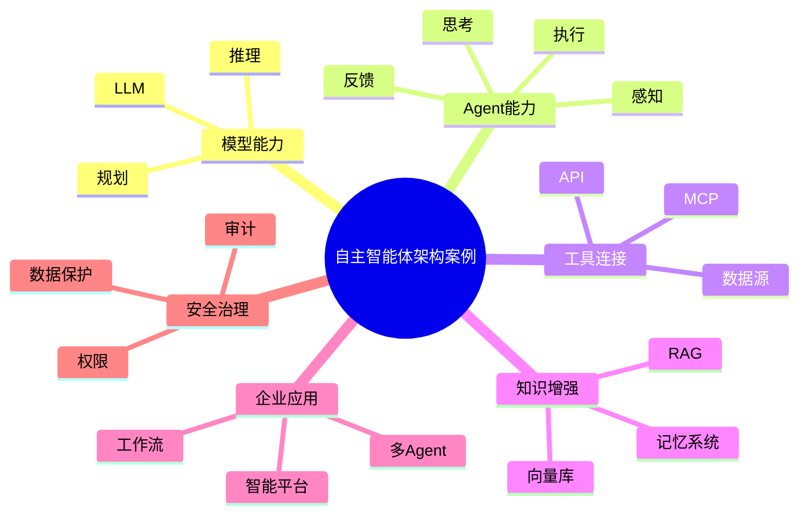

# 64-autonomous-agent-architecture-case.md（自主智能体架构案例）

> 本文用于系统架构设计师考试案例分析专题 V2 复习。
>
> 本篇重点整理自主智能体架构（Autonomous Agent Architecture）设计案例，包括 Agent 架构、任务规划、工具调用、MCP模型上下文协议、记忆系统、RAG增强智能体、多智能体协作、企业智能体平台以及智能体安全治理。

---

# 目录

1. 自主智能体架构案例概述
2. Agent基本概念
3. 传统AI应用挑战案例
4. 自主智能体总体架构案例
5. Agent核心能力架构案例
6. Agent感知模块案例
7. Agent规划与推理案例
8. Agent执行与工具调用案例
9. MCP模型上下文协议案例
10. Agent记忆系统案例
11. RAG增强智能体案例
12. 工作流Agent案例
13. 多智能体协作架构案例
14. 企业智能体平台案例
15. Agent与业务系统集成案例
16. Agent安全架构案例
17. Agent评估与监控案例
18. Agent工程化建设案例
19. 企业级自主智能体架构案例
20. 自主智能体演进案例
21. 案例分析答题模板
22. 高频考点
23. 易错点
24. Mermaid知识结构图
25. 本节小结

---

# 1. 自主智能体架构案例概述

自主智能体：

> 能够理解目标、自主规划任务、调用工具并完成复杂任务的智能系统。

传统AI：

```text
用户

↓

AI模型

↓

回答结果
```

自主智能体：

```text
用户目标

↓

Agent

↓

规划

↓

执行

↓

反馈优化
```

目标：

- 自动完成复杂任务；
- 降低人工操作；
- 提升业务自动化水平。

---

# 2. Agent基本概念

Agent主要组成：

## 大语言模型

负责：

- 理解；
- 推理；
- 决策。

## 规划模块

负责：

- 任务拆解；
- 执行计划。

## 工具调用模块

负责：

- 调用API；
- 操作系统；
- 查询数据。

## 记忆模块

负责：

- 保存上下文；
- 学习历史经验。

---

# 3. 传统AI应用挑战案例

常见问题：

- 只能回答问题；
- 缺少业务连接；
- 复杂任务能力不足；
- 上下文连续性不足。

---

# 4. 自主智能体总体架构案例

```text
用户

↓

智能体应用层

↓

Agent控制层

↓

模型服务层

↓

工具与数据层

↓

基础设施层
```

---

# 5. Agent核心能力架构案例

Agent核心循环：

```text
感知

↓

思考

↓

规划

↓

行动

↓

反馈

↓

优化
```

即：

Reason + Act。

---

# 6. Agent感知模块案例

输入来源：

- 用户请求；
- 系统事件；
- 外部数据。

负责：

- 理解环境；
- 获取信息。

---

# 7. Agent规划与推理案例

规划能力：

包括：

- 任务分解；
- 步骤规划；
- 目标管理。

示例：

```text
目标：

完成旅行规划

↓

查询天气

↓

查询交通

↓

生成路线
```

---

# 8. Agent执行与工具调用案例

工具：

包括：

- API；
- 数据库；
- 搜索服务；
- 企业系统。

架构：

```text
Agent

↓

Tool Calling

↓

外部服务

↓

结果返回
```

---

# 9. MCP模型上下文协议案例

MCP：

> 用于连接AI模型与外部工具、数据源的标准协议。

作用：

- 统一工具接入；
- 标准化上下文交换；
- 提升Agent扩展能力。

架构：

```text
LLM

↓

MCP Client

↓

MCP Server

↓

工具 / 数据
```

---

# 10. Agent记忆系统案例

记忆类型：

## 短期记忆

保存：

- 当前对话上下文。

## 长期记忆

保存：

- 用户偏好；
- 历史任务。

架构：

```text
Agent

↓

Memory

↓

数据库 / 向量库
```

---

# 11. RAG增强智能体案例

结合：

- 企业知识库；
- 向量数据库。

流程：

```text
用户任务

↓

知识检索

↓

Agent推理

↓

任务执行
```

---

# 12. 工作流Agent案例

自动化流程：

```text
任务输入

↓

Agent分析

↓

调用服务

↓

流程执行

↓

结果反馈
```

应用：

- 自动审批；
- 智能客服；
- 自动运维。

---

# 13. 多智能体协作架构案例

多个Agent：

```text
任务管理Agent

↓

分析Agent

↓

执行Agent

↓

审核Agent
```

优势：

- 分工明确；
- 处理复杂任务。

---

# 14. 企业智能体平台案例

平台能力：

- Agent创建；
- 模型管理；
- 工具管理；
- 权限管理；
- 运行监控。

架构：

```text
企业应用

↓

Agent平台

↓

模型服务

↓

数据与工具
```

---

# 15. Agent与业务系统集成案例

集成：

- ERP；
- CRM；
- OA；
- 数据平台。

方式：

- API；
- MCP；
- 消息队列。

---

# 16. Agent安全架构案例

安全包括：

- 权限控制；
- 数据保护；
- 工具调用限制；
- 输出审核。

---

# 17. Agent评估与监控案例

评估：

- 任务完成率；
- 推理质量；
- 响应时间；
- 成本。

监控：

- 日志；
- 链路；
- 模型状态。

---

# 18. Agent工程化建设案例

建设流程：

```text
业务分析

↓

Agent设计

↓

工具接入

↓

测试评估

↓

上线运营
```

---

# 19. 企业级自主智能体架构案例

整体：

```text
企业业务

↓

Agent平台

↓

AI模型

↓

企业数据

↓

基础设施
```

---

# 20. 自主智能体演进案例

```text
聊天机器人

↓

AI助手

↓

任务Agent

↓

多Agent系统

↓

企业智能体平台
```

---

# 案例分析答题模板

## AI只能回答不能执行任务

> 建设自主智能体架构，引入任务规划和工具调用能力，实现业务自动执行。

## AI无法访问企业知识

> 结合RAG和企业知识库，实现知识增强智能应用。

## AI无法连接业务系统

> 通过MCP或API接口实现Agent与外部系统集成。

## 复杂任务处理能力不足

> 采用多智能体协作架构，通过任务拆分和角色分工完成复杂业务。

---

# 高频考点

重点掌握：

1. Agent总体架构；
2. 任务规划与执行；
3. Tool Calling；
4. MCP协议；
5. 记忆系统；
6. 多Agent协作；
7. 企业智能体平台。

---

# 易错点

|易错知识|正确理解|
|-|-|
|Agent只是聊天机器人|Agent具备规划、执行和反馈能力|
|Agent只依赖大模型|Agent还需要工具、数据和记忆体系|
|MCP等同于模型训练|MCP用于模型与外部能力连接|
|多Agent一定更好|需要根据业务复杂度合理设计|

---

# Mermaid知识结构图



---

# 本节小结

自主智能体架构案例核心：

> 通过大语言模型、任务规划、工具调用、记忆管理和多智能体协作，实现从智能问答到自主执行的应用升级。

案例分析重点：

- 理解Agent整体架构；
- 掌握规划、执行、记忆和工具调用；
- 理解MCP和RAG结合方式；
- 掌握企业智能体平台建设方法。
