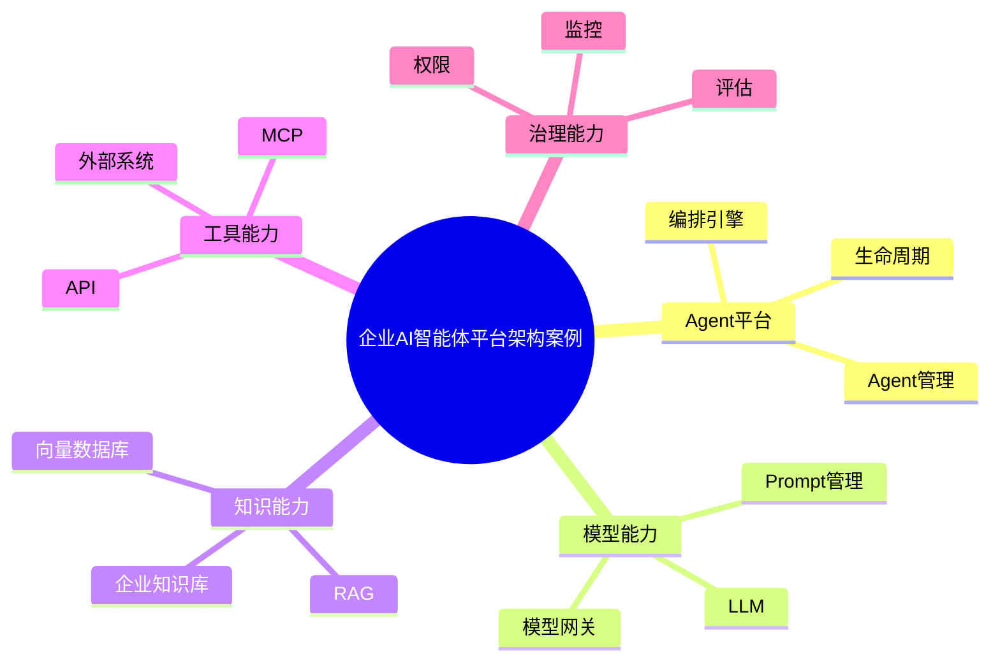

# 65-ai-agent-platform-case.md（企业AI智能体平台架构案例）

> 本文用于系统架构设计师考试案例分析专题 V2 复习。
>
> 本篇重点整理企业AI智能体平台架构（Enterprise AI Agent Platform Architecture）设计案例，包括Agent管理、模型管理、Prompt工程、Agent编排、工具中心、MCP服务、企业知识库、RAG平台、生命周期管理、权限治理和运行监控。

---

# 目录

1. 企业AI智能体平台案例概述
2. AI智能体平台基本概念
3. 企业AI应用建设挑战案例
4. 企业AI智能体平台总体架构案例
5. Agent管理平台架构案例
6. 模型管理平台案例
7. Prompt工程管理案例
8. Agent编排引擎案例
9. 工具中心架构案例
10. MCP服务管理案例
11. 企业知识库管理案例
12. RAG服务平台案例
13. Agent生命周期管理案例
14. Agent权限治理案例
15. Agent运行监控案例
16. Agent评估体系案例
17. 企业AI应用市场案例
18. AI平台与业务系统集成案例
19. 企业级AI智能体平台案例
20. AI平台建设方法案例
21. AI智能体平台演进案例
22. 案例分析答题模板
23. 高频考点
24. 易错点
25. Mermaid知识结构图
26. 本节小结

---

# 1. 企业AI智能体平台案例概述

企业AI智能体平台：

> 为企业提供智能体创建、运行、管理和治理能力的平台。

目标：

- 降低AI应用开发成本；
- 提升AI能力复用；
- 实现企业智能化规模部署。

整体关系：

```text
业务需求

↓

AI智能体平台

↓

AI模型 + 数据 + 工具

↓

业务应用
```

---

# 2. AI智能体平台基本概念

平台核心能力：

## Agent管理

负责：

- Agent创建；
- Agent配置；
- Agent发布。

## 模型管理

负责：

- LLM接入；
- 模型切换；
- 模型版本管理。

## 工具管理

负责：

- API接入；
- MCP服务；
- 外部系统连接。

## 知识管理

负责：

- 企业知识库；
- RAG检索。

---

# 3. 企业AI应用建设挑战案例

常见问题：

- AI应用重复建设；
- 模型能力无法共享；
- 数据知识分散；
- AI应用缺少治理。

---

# 4. 企业AI智能体平台总体架构案例

```text
企业AI应用层

↓

Agent服务层

↓

AI平台能力层

↓

模型与知识层

↓

基础设施层
```

---

# 5. Agent管理平台架构案例

能力：

- 创建Agent；
- 配置Agent；
- 发布Agent；
- 管理Agent版本。

架构：

```text
用户

↓

Agent管理中心

↓

Agent实例

↓

业务应用
```

---

# 6. 模型管理平台案例

功能：

- 模型注册；
- 模型部署；
- 模型调用；
- 模型监控。

架构：

```text
应用

↓

模型网关

↓

LLM服务

↓

计算资源
```

---

# 7. Prompt工程管理案例

管理：

- Prompt模板；
- Prompt版本；
- Prompt评估。

目标：

提升模型输出稳定性。

---

# 8. Agent编排引擎案例

负责：

- 任务流程设计；
- Agent组合；
- 工作流执行。

架构：

```text
任务输入

↓

编排引擎

↓

多个Agent

↓

任务完成
```

---

# 9. 工具中心架构案例

工具包括：

- API；
- 数据库；
- 企业系统；
- MCP服务。

架构：

```text
Agent

↓

工具中心

↓

外部能力
```

---

# 10. MCP服务管理案例

MCP作用：

> 提供统一方式连接模型与外部工具。

架构：

```text
Agent

↓

MCP Client

↓

MCP Server

↓

工具资源
```

---

# 11. 企业知识库管理案例

流程：

```text
企业文档

↓

知识处理

↓

向量化

↓

知识库

↓

Agent调用
```

---

# 12. RAG服务平台案例

能力：

- 文档解析；
- 向量检索；
- 知识召回；
- 上下文增强。

---

# 13. Agent生命周期管理案例

生命周期：

```text
设计

↓

开发

↓

测试

↓

发布

↓

运行

↓

优化
```

---

# 14. Agent权限治理案例

包括：

- 用户权限；
- Agent权限；
- 工具权限；
- 数据权限。

---

# 15. Agent运行监控案例

监控：

- 调用次数；
- 响应时间；
- 成本；
- 错误率。

---

# 16. Agent评估体系案例

指标：

- 任务完成率；
- 准确率；
- 稳定性；
- 用户满意度。

---

# 17. 企业AI应用市场案例

类似：

> 企业内部AI应用商店。

提供：

- Agent发布；
- Agent搜索；
- Agent复用。

---

# 18. AI平台与业务系统集成案例

集成：

- ERP；
- CRM；
- OA；
- 数据平台。

方式：

- API；
- MCP；
- 消息队列。

---

# 19. 企业级AI智能体平台案例

整体：

```text
企业业务

↓

AI Agent平台

↓

模型服务

↓

知识数据

↓

基础设施
```

---

# 20. AI平台建设方法案例

建设步骤：

```text
需求分析

↓

平台规划

↓

能力建设

↓

应用开发

↓

治理运营
```

---

# 21. AI智能体平台演进案例

演进：

```text
单点AI应用

↓

AI助手平台

↓

Agent平台

↓

企业智能体生态
```

---

# 案例分析答题模板

## 企业AI应用开发重复

> 建设统一AI智能体平台，实现Agent能力复用和统一管理。

## AI无法连接企业系统

> 建设工具管理中心，通过API和MCP实现智能体与业务系统集成。

## AI应用缺少治理

> 建立AI平台治理体系，实现权限、监控和生命周期管理。

## 企业知识无法利用

> 建设RAG知识服务平台，实现企业知识增强。

---

# 高频考点

重点掌握：

1. 企业AI智能体平台架构；
2. Agent管理；
3. 模型管理；
4. RAG知识服务；
5. MCP工具接入；
6. Agent治理；
7. AI平台运营。

---

# 易错点

|易错知识|正确理解|
|-|-|
|AI智能体平台只是模型调用平台|平台还需要Agent管理、工具管理和治理能力|
|Agent创建后无需维护|企业级Agent需要生命周期管理|
|所有AI应用独立建设|平台化建设可以提升复用能力|
|AI平台不需要权限控制|企业应用必须考虑安全治理|

---

# Mermaid知识结构图



---

# 本节小结

企业AI智能体平台架构案例核心：

> 通过统一平台管理Agent、模型、知识和工具，实现企业AI应用规模化建设和治理。

案例分析重点：

- 理解AI智能体平台分层架构；
- 掌握Agent生命周期管理；
- 理解MCP和RAG平台化建设；
- 掌握企业AI治理方法。
