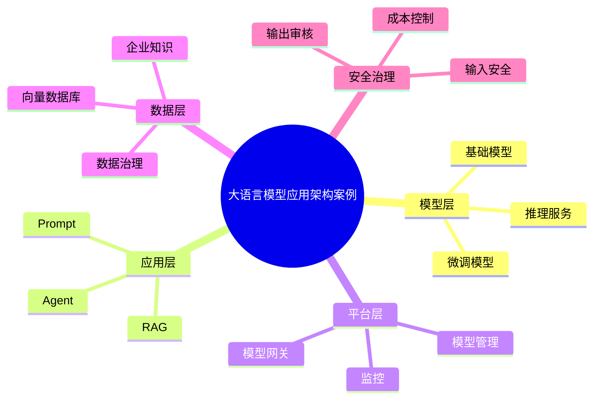

# 66-llm-application-case.md（大语言模型应用架构案例）

> 本文用于系统架构设计师考试案例分析专题 V2 复习。
>
> 本篇重点整理大语言模型应用架构（Large Language Model Application Architecture）设计案例，包括LLM应用分层架构、Prompt工程、模型微调、LoRA/PEFT、推理服务、模型网关、RAG结合、Agent结合、安全治理以及企业级大模型应用建设。

---

# 目录

1. 大语言模型应用架构案例概述
2. LLM基本概念
3. 企业LLM应用建设挑战案例
4. LLM应用总体架构案例
5. 大模型服务层架构案例
6. Prompt工程架构案例
7. Prompt模板管理案例
8. 模型微调架构案例
9. LoRA与PEFT轻量化微调案例
10. 推理服务架构案例
11. 模型网关架构案例
12. 多模型协同架构案例
13. LLM应用开发流程案例
14. LLM与RAG结合案例
15. LLM与Agent结合案例
16. 企业智能助手案例
17. 大模型应用安全案例
18. 大模型成本优化案例
19. LLM应用监控案例
20. 企业级LLM架构案例
21. LLM应用建设方法案例
22. 大语言模型演进案例
23. 案例分析答题模板
24. 高频考点
25. 易错点
26. Mermaid知识结构图
27. 本节小结

---

# 1. 大语言模型应用架构案例概述

大语言模型应用：

> 基于大规模预训练模型构建智能应用的软件架构模式。

传统应用：

```text
用户

↓

业务逻辑

↓

数据库
```

LLM应用：

```text
用户

↓

应用层

↓

LLM服务

↓

知识与数据
```

---

# 2. LLM基本概念

LLM核心能力：

- 文本理解；
- 文本生成；
- 推理分析；
- 内容总结。

主要组成：

- 基础模型；
- 模型服务；
- 应用层。

---

# 3. 企业LLM应用建设挑战案例

常见问题：

- 模型不了解企业知识；
- 数据无法有效利用；
- 输出效果不稳定；
- 推理成本较高。

---

# 4. LLM应用总体架构案例

```text
用户应用层

↓

业务服务层

↓

AI应用编排层

↓

模型服务层

↓

数据知识层

↓

基础设施层
```

---

# 5. 大模型服务层架构案例

模型服务提供：

- 模型加载；
- 推理接口；
- 版本管理。

```text
应用

↓

模型API

↓

推理服务

↓

GPU资源
```

---

# 6. Prompt工程架构案例

Prompt：

> 指导大模型生成结果的输入指令。

作用：

- 控制模型输出；
- 提升任务效果。

包括：

- 角色设定；
- 任务描述；
- 示例输入。

---

# 7. Prompt模板管理案例

管理：

- 模板版本；
- 参数配置；
- 效果评估。

流程：

```text
Prompt设计

↓

测试

↓

评估

↓

优化
```

---

# 8. 模型微调架构案例

微调：

> 使用业务数据优化模型能力。

方式：

- 全量微调；
- 参数高效微调。

目标：

- 行业适配；
- 专业能力提升。

---

# 9. LoRA与PEFT轻量化微调案例

优势：

- 降低训练成本；
- 减少参数更新；
- 提升部署效率。

```text
基础模型

+

LoRA参数

↓

业务模型
```

---

# 10. 推理服务架构案例

关注：

- 响应速度；
- 并发能力；
- 资源利用率。

优化：

- 模型量化；
- 批处理；
- GPU调度。

---

# 11. 模型网关架构案例

模型网关统一管理：

- 模型调用；
- 权限；
- 流量控制。

```text
应用

↓

模型网关

↓

多个LLM模型
```

---

# 12. 多模型协同架构案例

根据任务选择：

- 大模型；
- 小模型；
- 专业模型。

```text
请求

↓

模型路由

↓

最佳模型
```

---

# 13. LLM应用开发流程案例

```text
需求分析

↓

Prompt设计

↓

模型选择

↓

应用开发

↓

测试优化

↓

上线运行
```

---

# 14. LLM与RAG结合案例

```text
用户问题

↓

知识检索

↓

向量数据库

↓

LLM生成

↓

答案输出
```

优势：

- 企业知识增强；
- 降低幻觉。

---

# 15. LLM与Agent结合案例

```text
用户目标

↓

Agent

↓

LLM推理

↓

工具调用

↓

任务完成
```

---

# 16. 企业智能助手案例

应用：

- 企业客服；
- 知识助手；
- 办公助手；
- 数据分析助手。

---

# 17. 大模型应用安全案例

包括：

- 输入安全；
- Prompt注入防护；
- 数据保护；
- 输出审核。

---

# 18. 大模型成本优化案例

方法：

- 模型选择；
- Token优化；
- 缓存机制；
- 小模型协同。

---

# 19. LLM应用监控案例

监控：

- 调用次数；
- 响应时间；
- Token消耗；
- 输出质量。

---

# 20. 企业级LLM架构案例

```text
企业应用

↓

LLM应用平台

↓

模型服务

↓

知识数据

↓

计算基础设施
```

---

# 21. LLM应用建设方法案例

```text
业务分析

↓

场景选择

↓

模型接入

↓

知识增强

↓

应用上线

↓

持续优化
```

---

# 22. 大语言模型演进案例

```text
规则系统

↓

机器学习

↓

深度学习

↓

大语言模型

↓

AI智能体
```

---

# 案例分析答题模板

## 企业需要智能问答

> 引入大语言模型结合企业知识库，通过RAG实现智能问答能力。

## 模型无法适应行业场景

> 采用领域数据微调或参数高效微调提升模型专业能力。

## 大模型调用成本过高

> 通过模型路由、小模型协同和Token优化降低成本。

## AI应用无法稳定运行

> 建设模型服务平台，实现模型管理、监控和治理。

---

# 高频考点

重点掌握：

1. LLM应用架构；
2. Prompt工程；
3. 模型微调；
4. RAG结合；
5. Agent结合；
6. 模型服务治理；
7. AI安全。

---

# 易错点

|易错知识|正确理解|
|-|-|
|LLM应用就是调用模型API|企业应用需要完整架构体系|
|微调可以解决所有问题|很多企业场景优先采用RAG|
|大模型越大越好|需要结合成本和业务选择|
|上线模型后无需治理|需要持续监控和优化|

---

# Mermaid知识结构图



---

# 本节小结

大语言模型应用架构案例核心：

> 通过大模型服务、Prompt工程、知识增强和应用工程化，实现企业智能应用落地。

案例分析重点：

- 理解LLM应用分层架构；
- 掌握Prompt、微调和RAG；
- 理解LLM与Agent结合；
- 掌握企业级大模型治理方法。
