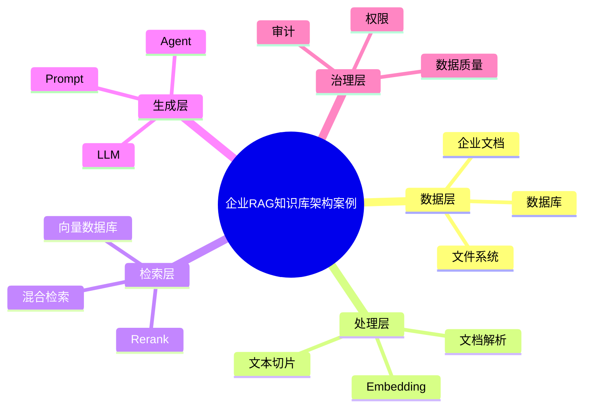

# 67-rag-enterprise-case.md（企业RAG知识库架构案例）

> 本文用于系统架构设计师考试案例分析专题 V2 复习。
>
> 本篇重点整理企业RAG知识库架构（Enterprise Retrieval-Augmented Generation Architecture）设计案例，包括知识采集、文档解析、文本切片、Embedding向量化、向量数据库、检索优化、Rerank、LLM结合、Agent结合以及企业知识库治理。

---

# 目录

1. 企业RAG知识库案例概述
2. RAG基本概念
3. 企业知识应用挑战案例
4. 企业RAG总体架构案例
5. 数据采集架构案例
6. 文档解析处理案例
7. 文本切片策略案例
8. Embedding向量化案例
9. 向量数据库架构案例
10. 检索召回架构案例
11. 混合检索架构案例
12. Rerank重排序案例
13. RAG与LLM结合案例
14. RAG与Agent结合案例
15. 企业知识库治理案例
16. 多知识库管理案例
17. 权限安全架构案例
18. RAG效果优化案例
19. 企业级RAG平台案例
20. RAG建设方法案例
21. RAG演进案例
22. 案例分析答题模板
23. 高频考点
24. 易错点
25. Mermaid知识结构图
26. 本节小结

---

# 1. 企业RAG知识库案例概述

RAG：

> 将外部知识检索能力与大语言模型生成能力结合的架构模式。

传统LLM：

```text
用户

↓

LLM

↓

回答
```

RAG：

```text
用户

↓

知识检索

↓

LLM生成

↓

增强答案
```

目标：

- 企业知识问答；
- 智能客服；
- 制度助手；
- 技术助手；
- 企业知识管理。

---

# 2. RAG基本概念

RAG包含三个阶段：

## Retrieval（检索）

从知识库获取相关信息。

## Augmentation（增强）

将检索结果加入模型上下文。

## Generation（生成）

由LLM生成最终答案。

流程：

```text
问题

↓

检索

↓

增强上下文

↓

模型生成
```

---

# 3. 企业知识应用挑战案例

常见问题：

- 企业资料分散；
- 知识无法共享；
- 大模型不了解业务；
- 知识更新困难。

---

# 4. 企业RAG总体架构案例

```text
用户应用层

↓

RAG服务层

↓

检索增强层

↓

知识库层

↓

数据源层
```

---

# 5. 数据采集架构案例

数据来源：

- 企业文档；
- 数据库；
- 网页；
- 文件系统。

流程：

```text
数据源

↓

采集

↓

清洗

↓

进入知识库
```

---

# 6. 文档解析处理案例

处理对象：

- PDF；
- Word；
- Excel；
- HTML。

流程：

```text
原始文档

↓

解析

↓

结构化内容

↓

文本数据
```

---

# 7. 文本切片策略案例

目的：

> 将长文本转换为适合检索的小块。

策略：

- 固定长度切片；
- 按章节切片；
- 语义切片。

影响：

- 检索效果；
- 上下文质量。

---

# 8. Embedding向量化案例

Embedding：

> 将文本转换为向量表示。

流程：

```text
文本

↓

Embedding模型

↓

向量
```

用途：

- 相似度计算；
- 语义检索。

---

# 9. 向量数据库架构案例

作用：

存储：

- 文本向量；
- 元数据。

架构：

```text
文本

↓

向量化

↓

向量数据库

↓

相似搜索
```

---

# 10. 检索召回架构案例

流程：

```text
用户问题

↓

向量检索

↓

相关知识

↓

返回结果
```

---

# 11. 混合检索架构案例

结合：

- 关键词检索；
- 向量检索。

架构：

```text
查询

↓

关键词检索

+

向量检索

↓

融合结果
```

优势：

- 提升召回准确率。

---

# 12. Rerank重排序案例

作用：

对候选结果再次排序。

流程：

```text
初步召回

↓

Rerank模型

↓

最佳知识
```

---

# 13. RAG与LLM结合案例

架构：

```text
用户问题

↓

知识检索

↓

上下文增强

↓

LLM

↓

答案
```

优势：

- 企业知识增强；
- 降低模型幻觉。

---

# 14. RAG与Agent结合案例

架构：

```text
用户任务

↓

Agent

↓

RAG知识检索

↓

工具调用

↓

任务完成
```

---

# 15. 企业知识库治理案例

包括：

- 数据质量；
- 知识更新；
- 生命周期管理；
- 标签管理。

---

# 16. 多知识库管理案例

例如：

- HR知识库；
- 技术知识库；
- 产品知识库。

架构：

```text
企业知识中心

↓

多个业务知识库
```

---

# 17. 权限安全架构案例

包括：

- 用户权限；
- 文档权限；
- 数据隔离；
- 查询审计。

---

# 18. RAG效果优化案例

优化方向：

## 提升召回

- 优化Embedding；
- 混合检索。

## 提升生成

- Prompt优化；
- 上下文控制。

## 降低幻觉

- 引用来源；
- 答案校验。

---

# 19. 企业级RAG平台案例

整体：

```text
企业应用

↓

RAG平台

↓

知识服务

↓

LLM服务

↓

数据资源
```

---

# 20. RAG建设方法案例

建设步骤：

```text
需求分析

↓

数据整理

↓

知识库建设

↓

检索优化

↓

LLM接入

↓

效果评估
```

---

# 21. RAG演进案例

```text
关键词搜索

↓

语义搜索

↓

RAG知识库

↓

Agent增强RAG

↓

企业知识智能体
```

---

# 案例分析答题模板

## 大模型不了解企业知识

> 建设企业RAG知识库，通过检索增强生成方式，将企业知识注入大模型上下文。

## 企业资料无法统一利用

> 建设知识采集和治理平台，实现企业数据统一管理。

## AI回答准确率不足

> 优化Embedding、检索策略和Rerank机制，提高知识召回准确率。

## 企业知识存在权限问题

> 建立知识库权限控制和访问审计机制，保障数据安全。

---

# 高频考点

重点掌握：

1. RAG总体架构；
2. 文档处理流程；
3. Embedding向量化；
4. 向量数据库；
5. 混合检索；
6. Rerank优化；
7. 企业知识治理。

---

# 易错点

|易错知识|正确理解|
|-|-|
|RAG等于重新训练模型|RAG主要通过检索增强上下文|
|向量数据库替代关系数据库|两者解决不同问题|
|文档直接入库即可|需要解析、切片和向量化|
|RAG无需权限控制|企业场景必须考虑安全治理|

---

# Mermaid知识结构图



---

# 本节小结

企业RAG知识库架构案例核心：

> 通过知识采集、向量化检索和大模型生成，实现企业知识智能化应用。

案例分析重点：

- 理解RAG整体架构；
- 掌握知识库建设流程；
- 理解向量数据库和检索优化；
- 掌握企业知识治理方法。
