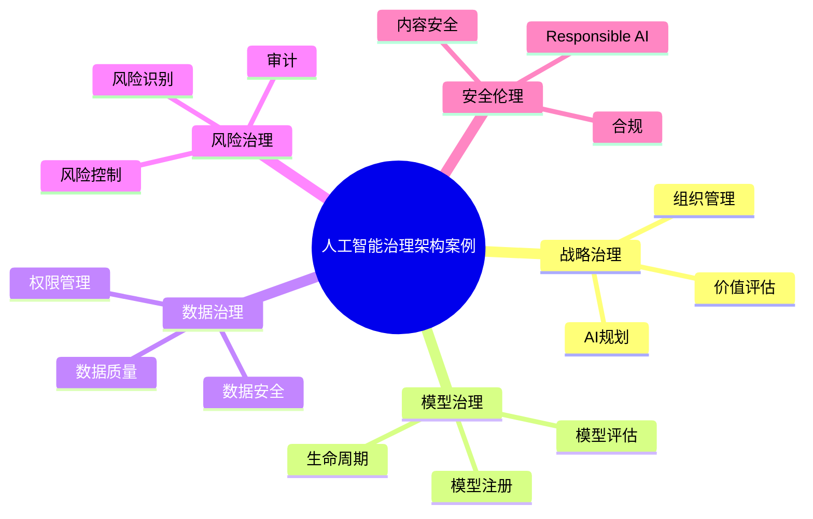

# 68-ai-governance-case.md（人工智能治理架构案例）

> 本文用于系统架构设计师考试案例分析专题 V2 复习。
>
> 本篇重点整理人工智能治理架构（AI Governance Architecture）设计案例，包括AI战略治理、模型治理、数据治理、风险管理、安全治理、Responsible AI、大模型治理、AI生命周期管理和企业AI治理平台。

---

# 目录

1. 人工智能治理案例概述
2. AI治理基本概念
3. 企业AI应用治理挑战案例
4. AI治理总体架构案例
5. AI战略治理案例
6. AI组织治理案例
7. AI模型治理案例
8. AI数据治理案例
9. AI风险管理案例
10. AI安全治理案例
11. AI伦理治理案例
12. Responsible AI案例
13. 大模型治理案例
14. Prompt安全治理案例
15. AI内容安全案例
16. AI合规管理案例
17. AI生命周期治理案例
18. AI评估体系案例
19. AI审计架构案例
20. 企业AI治理平台案例
21. AI治理建设方法案例
22. AI治理演进案例
23. 案例分析答题模板
24. 高频考点
25. 易错点
26. Mermaid知识结构图
27. 本节小结

---

# 1. 人工智能治理案例概述

AI治理：

> 通过制度、流程、技术和工具，对人工智能系统进行全过程管理。

目标：

- 保证AI安全；
- 提升模型可信度；
- 满足法规要求；
- 降低业务风险。

整体关系：

```text
企业战略

↓

AI治理体系

↓

AI模型与应用

↓

业务价值
```

---

# 2. AI治理基本概念

AI治理包含：

## 战略治理

包括：

- AI发展方向；
- 投入规划；
- 应用范围。

## 技术治理

包括：

- 模型管理；
- 数据管理；
- 系统安全。

## 风险治理

包括：

- 风险识别；
- 风险评估；
- 风险控制。

---

# 3. 企业AI应用治理挑战案例

常见问题：

- 模型不可解释；
- 数据质量不足；
- AI输出存在风险；
- 缺少责任体系。

---

# 4. AI治理总体架构案例

```text
AI治理层

↓

AI平台治理层

↓

模型与数据治理层

↓

AI应用层

↓

基础设施层
```

---

# 5. AI战略治理案例

内容：

- AI战略规划；
- 应用场景选择；
- 投资管理；
- 价值评估。

---

# 6. AI组织治理案例

建立：

- AI治理委员会；
- 技术团队；
- 业务团队；
- 风险团队。

形成：

```text
战略决策

↓

治理组织

↓

技术执行

↓

业务应用
```

---

# 7. AI模型治理案例

模型治理包括：

- 模型注册；
- 模型版本管理；
- 模型评估；
- 模型发布审批。

流程：

```text
模型开发

↓

测试评估

↓

审批发布

↓

运行监控
```

---

# 8. AI数据治理案例

数据治理包括：

- 数据质量；
- 数据标准；
- 数据权限；
- 数据安全。

流程：

```text
数据采集

↓

数据清洗

↓

数据管理

↓

模型使用
```

---

# 9. AI风险管理案例

风险包括：

## 技术风险

例如：

- 模型失效。

## 数据风险

例如：

- 数据泄露。

## 业务风险

例如：

- 错误决策。

---

# 10. AI安全治理案例

安全措施：

- 身份认证；
- 权限控制；
- 数据加密；
- 输出过滤。

---

# 11. AI伦理治理案例

关注：

- 公平性；
- 透明性；
- 可解释性；
- 责任追踪。

---

# 12. Responsible AI案例

Responsible AI：

> 负责任人工智能。

核心原则：

- 公平；
- 透明；
- 安全；
- 隐私保护；
- 可解释。

---

# 13. 大模型治理案例

重点：

- 模型评估；
- 幻觉控制；
- 输出审核；
- 使用限制。

---

# 14. Prompt安全治理案例

风险：

- Prompt注入；
- 越权指令；
- 数据泄露。

措施：

- 输入过滤；
- 指令隔离；
- 权限控制。

---

# 15. AI内容安全案例

包括：

- 内容审核；
- 敏感信息检测；
- 输出控制。

---

# 16. AI合规管理案例

包括：

- 数据合规；
- 隐私保护；
- 行业监管要求。

---

# 17. AI生命周期治理案例

生命周期：

```text
需求设计

↓

模型开发

↓

测试评估

↓

部署运行

↓

持续优化

↓

退役管理
```

---

# 18. AI评估体系案例

指标：

- 准确率；
- 稳定性；
- 公平性；
- 安全性；
- 成本。

---

# 19. AI审计架构案例

审计内容：

- 模型版本；
- 数据来源；
- 调用记录；
- 输出结果。

---

# 20. 企业AI治理平台案例

平台能力：

- 模型管理；
- 数据管理；
- 风险监控；
- 审计管理。

架构：

```text
AI应用

↓

治理平台

↓

模型服务

↓

数据资源
```

---

# 21. AI治理建设方法案例

建设步骤：

```text
现状分析

↓

治理规划

↓

制度建设

↓

平台建设

↓

持续优化
```

---

# 22. AI治理演进案例

```text
AI应用

↓

AI管理

↓

AI治理

↓

可信AI体系
```

---

# 案例分析答题模板

## AI模型风险不可控

> 建立AI模型治理体系，通过模型评估、版本管理和运行监控降低风险。

## 企业担心数据泄露

> 建立AI数据治理体系，通过权限控制、数据安全和审计机制保障数据安全。

## AI输出存在错误

> 引入内容审核、模型评估和人工复核机制，提高AI可靠性。

## AI应用规模扩大难管理

> 建设企业AI治理平台，实现模型、数据和应用统一管理。

---

# 高频考点

重点掌握：

1. AI治理总体架构；
2. 模型治理；
3. 数据治理；
4. AI风险管理；
5. Responsible AI；
6. 大模型治理；
7. AI生命周期管理。

---

# 易错点

|易错知识|正确理解|
|-|-|
|AI治理只是安全管理|AI治理还包括战略、模型、数据和组织管理|
|模型上线后无需管理|需要持续评估和生命周期治理|
|AI效果只看准确率|还需考虑公平、安全、可解释性|
|AI治理完全依赖人工|需要制度、平台和自动化工具结合|

---

# Mermaid知识结构图



---

# 本节小结

人工智能治理架构案例核心：

> 通过战略、组织、技术和制度体系，对AI模型、数据和应用进行全过程治理，建设安全可信的人工智能体系。

案例分析重点：

- 理解AI治理总体架构；
- 掌握模型和数据治理方法；
- 理解Responsible AI；
- 掌握企业AI治理平台建设方法。
