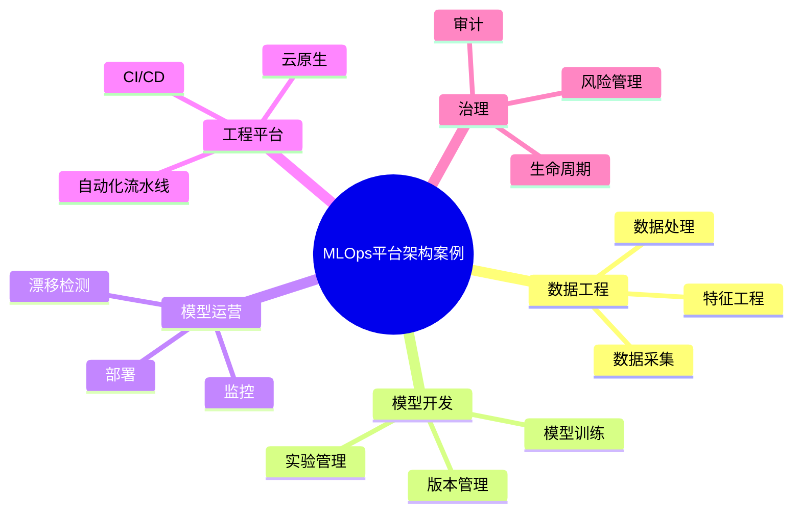

# 69-mlops-platform-case.md（MLOps平台架构案例）

> 本文用于系统架构设计师考试案例分析专题 V2 复习。
>
> 本篇重点整理 MLOps 平台架构（Machine Learning Operations Platform Architecture）设计案例，包括数据流水线、特征工程、模型训练、实验管理、模型版本管理、模型部署、ML CI/CD、模型监控、模型漂移检测、云原生结合以及企业级 MLOps 平台建设。

---

# 目录

1. MLOps平台案例概述
2. MLOps基本概念
3. 企业机器学习应用挑战案例
4. MLOps总体架构案例
5. 数据工程流水线案例
6. 特征工程平台案例
7. 模型训练平台案例
8. 模型实验管理案例
9. 模型版本管理案例
10. 模型仓库架构案例
11. 模型部署架构案例
12. ML CI/CD流水线案例
13. 自动化训练案例
14. 模型监控案例
15. 模型性能评估案例
16. 模型漂移检测案例
17. MLOps与云原生结合案例
18. MLOps与AI治理结合案例
19. 企业MLOps平台案例
20. MLOps建设方法案例
21. MLOps演进案例
22. 案例分析答题模板
23. 高频考点
24. 易错点
25. Mermaid知识结构图
26. 本节小结

---

# 1. MLOps平台案例概述

MLOps：

> 将机器学习模型开发、部署和运营管理结合的软件工程体系。

传统模型开发：

```text
数据科学家

↓

训练模型

↓

人工部署

↓

运行
```

MLOps：

```text
数据

↓

训练

↓

测试

↓

部署

↓

监控

↓

优化
```

目标：

- 提升模型交付效率；
- 保证模型稳定运行；
- 实现自动化管理。

---

# 2. MLOps基本概念

MLOps融合：

- Machine Learning；
- DevOps；
- Data Engineering。

核心：

```text
数据 + 模型 + 工程化
```

---

# 3. 企业机器学习应用挑战案例

常见问题：

- 模型开发周期长；
- 数据与模型脱节；
- 模型无法追踪；
- 缺少运行监控。

---

# 4. MLOps总体架构案例

```text
AI应用层

↓

模型服务层

↓

MLOps平台层

↓

数据与模型层

↓

基础设施层
```

---

# 5. 数据工程流水线案例

流程：

```text
数据采集

↓

数据清洗

↓

数据处理

↓

训练数据集
```

管理：

- 数据版本；
- 数据质量；
- 数据血缘。

---

# 6. 特征工程平台案例

Feature Store：

```text
原始数据

↓

特征处理

↓

Feature Store

↓

模型训练
```

能力：

- 特征生成；
- 特征存储；
- 特征复用。

---

# 7. 模型训练平台案例

能力：

- 训练任务管理；
- GPU资源调度；
- 参数配置。

架构：

```text
训练任务

↓

训练平台

↓

计算资源

↓

模型输出
```

---

# 8. 模型实验管理案例

管理：

- 实验记录；
- 参数；
- 指标；
- 结果。

目标：

方便模型比较和优化。

---

# 9. 模型版本管理案例

管理：

- 模型版本；
- 发布时间；
- 使用状态。

流程：

```text
模型V1

↓

模型V2

↓

模型V3
```

---

# 10. 模型仓库架构案例

Model Registry：

存储：

- 模型文件；
- 元数据；
- 版本信息。

---

# 11. 模型部署架构案例

部署方式：

- 在线推理；
- 批量推理；
- 边缘部署。

架构：

```text
应用

↓

模型服务

↓

推理引擎

↓

计算资源
```

---

# 12. ML CI/CD流水线案例

流程：

```text
代码提交

↓

自动训练

↓

模型测试

↓

自动部署
```

---

# 13. 自动化训练案例

触发方式：

- 数据更新；
- 模型效果下降；
- 定时任务。

流程：

```text
数据变化

↓

自动训练

↓

模型评估

↓

发布
```

---

# 14. 模型监控案例

监控：

- 服务状态；
- 响应时间；
- 资源使用。

---

# 15. 模型性能评估案例

指标：

- 准确率；
- 召回率；
- F1值；
- 推理性能。

---

# 16. 模型漂移检测案例

模型漂移：

> 数据分布或业务环境变化导致模型效果下降。

类型：

- 数据漂移；
- 概念漂移。

处理：

- 重新训练；
- 模型更新。

---

# 17. MLOps与云原生结合案例

结合：

- Kubernetes；
- 容器；
- 自动扩缩。

架构：

```text
MLOps平台

↓

Kubernetes

↓

模型服务
```

---

# 18. MLOps与AI治理结合案例

治理内容：

- 模型审批；
- 模型审计；
- 风险管理。

---

# 19. 企业MLOps平台案例

整体：

```text
企业AI应用

↓

MLOps平台

↓

模型服务

↓

数据平台

↓

基础设施
```

---

# 20. MLOps建设方法案例

建设步骤：

```text
需求分析

↓

平台建设

↓

流水线建设

↓

模型接入

↓

运营优化
```

---

# 21. MLOps演进案例

```text
人工模型开发

↓

自动化训练

↓

MLOps平台

↓

智能模型运营
```

---

# 案例分析答题模板

## 模型上线效率低

> 建设MLOps平台，通过自动化训练、测试和部署提升模型交付效率。

## 模型无法持续优化

> 建立模型监控和自动训练机制，实现模型生命周期管理。

## 多模型难管理

> 建设模型仓库和版本管理体系，实现统一管理。

## AI系统缺少工程能力

> 引入MLOps体系，将机器学习流程与DevOps融合。

---

# 高频考点

重点掌握：

1. MLOps总体架构；
2. 数据流水线；
3. 模型训练管理；
4. 模型版本管理；
5. ML CI/CD；
6. 模型监控；
7. 模型治理。

---

# 易错点

|易错知识|正确理解|
|-|-|
|MLOps只是模型部署工具|MLOps覆盖模型全生命周期|
|模型训练完成即可长期使用|需要持续监控和优化|
|只管理模型不管理数据|数据也是机器学习核心资产|
|MLOps与DevOps完全相同|MLOps增加了数据和模型管理|

---

# Mermaid知识结构图



---

# 本节小结

MLOps平台架构案例核心：

> 通过数据工程、模型管理和自动化运维体系，实现机器学习模型从开发到生产运行的全生命周期管理。

案例分析重点：

- 理解MLOps总体架构；
- 掌握模型训练与部署流程；
- 理解模型监控和漂移检测；
- 掌握企业级AI工程平台建设方法。
