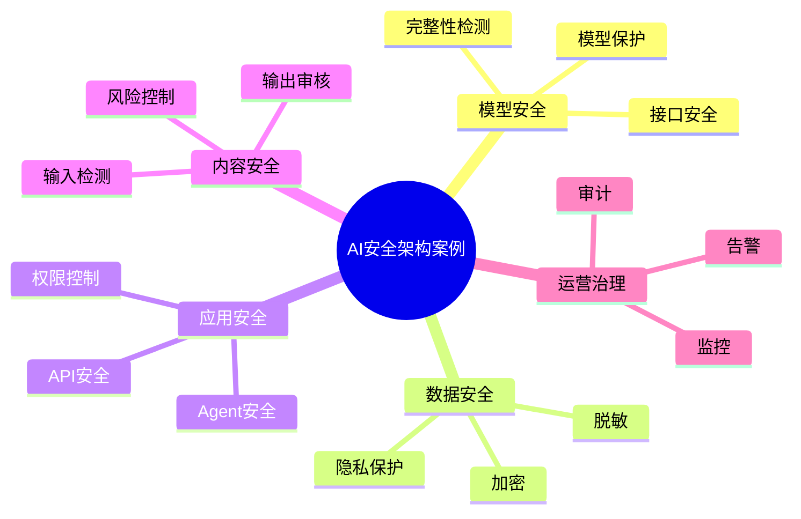

# 70-ai-security-case.md（AI安全架构案例）

> 本文用于系统架构设计师考试案例分析专题 V2 复习。
>
> 本篇重点整理 AI 安全架构（AI Security Architecture）设计案例，包括 AI 模型安全、大语言模型安全、Prompt 注入防护、数据安全、Agent安全、MCP安全、内容安全、访问控制、安全监控和企业AI安全治理。

---

# 目录

1. AI安全架构案例概述
2. AI安全基本概念
3. 企业AI安全挑战案例
4. AI安全总体架构案例
5. AI模型安全案例
6. 大语言模型安全案例
7. Prompt注入攻击案例
8. 越权调用防护案例
9. AI数据安全案例
10. 数据隐私保护案例
11. AI应用安全案例
12. Agent安全架构案例
13. MCP安全治理案例
14. 内容安全架构案例
15. AI输出安全案例
16. AI访问控制案例
17. AI安全监控案例
18. AI安全审计案例
19. AI安全运营平台案例
20. AI安全建设方法案例
21. AI安全演进案例
22. 案例分析答题模板
23. 高频考点
24. 易错点
25. Mermaid知识结构图
26. 本节小结

---

# 1. AI安全架构案例概述

AI安全：

> 对人工智能系统从数据、模型、应用到运行环境进行全过程安全保护。

传统安全：

```text
用户

↓

应用系统

↓

数据库
```

AI系统安全：

```text
用户

↓

AI应用

↓

模型

↓

数据

↓

基础设施
```

目标：

- 防止攻击；
- 保护数据；
- 控制风险；
- 保证可信运行。

---

# 2. AI安全基本概念

AI安全包括：

## 模型安全

保护：

- 模型参数；
- 模型能力；
- 模型接口。

## 数据安全

保护：

- 训练数据；
- 用户数据；
- 企业知识。

## 应用安全

保护：

- AI应用逻辑；
- API接口；
- Agent工具调用。

## 内容安全

控制：

- 输入内容；
- 输出内容。

---

# 3. 企业AI安全挑战案例

常见问题：

- 大模型数据泄露；
- Prompt攻击；
- 模型越权调用；
- 恶意内容生成；
- AI应用安全风险。

---

# 4. AI安全总体架构案例

```text
AI安全治理层

↓

AI安全防护层

↓

AI应用安全层

↓

模型与数据安全层

↓

基础设施安全层
```

---

# 5. AI模型安全案例

保护：

- 模型文件；
- 模型参数；
- 模型接口。

措施：

- 模型访问控制；
- 模型加密；
- 完整性检测。

---

# 6. 大语言模型安全案例

风险：

- 模型幻觉；
- 越权回答；
- 敏感信息泄露。

措施：

- 输入过滤；
- 输出检测；
- 安全策略控制。

---

# 7. Prompt注入攻击案例

Prompt Injection：

> 通过恶意指令影响模型行为。

攻击流程：

```text
用户输入

↓

恶意Prompt

↓

模型偏离任务
```

防护：

- Prompt隔离；
- 输入检测；
- 指令优先级控制。

---

# 8. 越权调用防护案例

风险：

Agent调用：

- 非授权API；
- 敏感数据。

措施：

- 最小权限原则；
- API权限控制；
- 调用审计。

---

# 9. AI数据安全案例

保护：

- 训练数据；
- 知识库数据；
- 用户数据。

措施：

- 数据脱敏；
- 加密存储；
- 权限管理。

---

# 10. 数据隐私保护案例

方法：

- 匿名化；
- 脱敏；
- 隐私计算；
- 数据隔离。

---

# 11. AI应用安全案例

包括：

- API安全；
- 身份认证；
- 输入校验；
- 安全编码。

---

# 12. Agent安全架构案例

Agent风险：

- 工具滥用；
- 权限扩大；
- 自动执行风险。

架构：

```text
Agent

↓

权限控制

↓

工具网关

↓

外部系统
```

---

# 13. MCP安全治理案例

重点：

- Server身份认证；
- 工具权限控制；
- 数据访问限制。

架构：

```text
Agent

↓

MCP安全层

↓

MCP Server

↓

工具资源
```

---

# 14. 内容安全架构案例

包括：

- 敏感内容检测；
- 违规内容过滤；
- 输出审核。

---

# 15. AI输出安全案例

措施：

- 内容审核；
- 事实校验；
- 人工复核。

---

# 16. AI访问控制案例

采用：

- 身份认证；
- 权限管理；
- 零信任架构。

原则：

> 永不默认信任，持续验证。

---

# 17. AI安全监控案例

监控：

- 调用行为；
- 异常请求；
- 模型输出；
- 安全事件。

---

# 18. AI安全审计案例

记录：

- 用户操作；
- 模型调用；
- 数据访问；
- 输出结果。

---

# 19. AI安全运营平台案例

平台能力：

- 风险检测；
- 安全策略；
- 审计分析；
- 告警处理。

架构：

```text
AI应用

↓

安全平台

↓

模型服务

↓

数据资源
```

---

# 20. AI安全建设方法案例

建设步骤：

```text
风险分析

↓

安全设计

↓

技术防护

↓

监控运营

↓

持续优化
```

---

# 21. AI安全演进案例

```text
传统安全

↓

数据安全

↓

模型安全

↓

AI安全体系

↓

可信AI
```

---

# 案例分析答题模板

## 大模型存在数据泄露风险

> 建立AI数据安全体系，通过数据脱敏、权限控制和审计机制保护企业数据。

## AI容易受到Prompt攻击

> 建立Prompt安全防护机制，通过输入检测、指令隔离和输出审核降低攻击风险。

## Agent调用权限过大

> 采用最小权限原则，通过工具网关和权限控制限制Agent访问范围。

## AI应用缺少安全治理

> 建设AI安全运营平台，实现风险检测、监控和审计。

---

# 高频考点

重点掌握：

1. AI安全总体架构；
2. 模型安全；
3. 数据安全；
4. Prompt安全；
5. Agent安全；
6. AI访问控制；
7. 安全审计。

---

# 易错点

|易错知识|正确理解|
|-|-|
|AI安全只是传统网络安全|AI安全还包含模型、数据和算法风险|
|大模型只需要保护接口|需要保护模型、数据和输出|
|Agent可以无限调用工具|企业场景必须限制权限|
|AI上线后无需监控|需要持续安全运营|

---

# Mermaid知识结构图



---

# 本节小结

AI安全架构案例核心：

> 通过模型安全、数据安全、应用安全和运营治理体系，保障人工智能系统安全、可靠、可信运行。

案例分析重点：

- 理解AI安全总体架构；
- 掌握大模型安全风险；
- 理解Prompt和Agent安全；
- 掌握企业AI安全治理方法。
