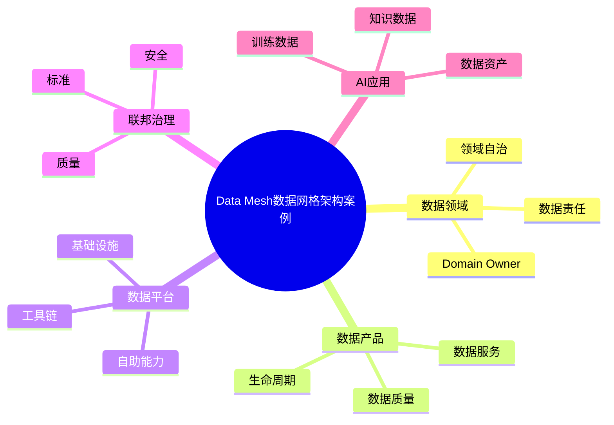

# 71-data-mesh-case.md（Data Mesh数据网格架构案例）

> 本文用于系统架构设计师考试案例分析专题 V2 复习。
>
> 本篇重点整理 Data Mesh（数据网格）架构设计案例，包括数据领域化、数据产品化、数据自治、数据平台能力、联邦式治理、数据质量、安全治理以及企业数据架构演进。

---

# 目录

1. Data Mesh案例概述
2. Data Mesh基本概念
3. 企业数据架构挑战案例
4. Data Mesh总体架构案例
5. 数据领域化架构案例
6. 数据产品架构案例
7. 数据所有权治理案例
8. 数据自治团队案例
9. 数据平台能力案例
10. 数据共享架构案例
11. 数据目录架构案例
12. 数据标准治理案例
13. 数据质量管理案例
14. 数据安全治理案例
15. Data Mesh与数据湖仓结合案例
16. Data Mesh与数据中台结合案例
17. Data Mesh与AI应用结合案例
18. 企业级Data Mesh案例
19. Data Mesh建设方法案例
20. Data Mesh演进案例
21. 案例分析答题模板
22. 高频考点
23. 易错点
24. Mermaid知识结构图
25. 本节小结

---

# 1. Data Mesh案例概述

Data Mesh：

> 一种面向组织规模化数据管理的数据架构方法。

传统集中式数据架构：

```text
业务系统

↓

集中数据平台

↓

数据分析
```

Data Mesh：

```text
业务领域

↓

领域数据产品

↓

企业数据共享
```

目标：

- 提升数据交付效率；
- 明确数据责任；
- 提高数据质量；
- 支撑企业级数据共享。

---

# 2. Data Mesh基本概念

Data Mesh四大核心原则：

## 2.1 数据领域化

数据由业务领域负责。

例如：

- 销售领域；
- 财务领域；
- 客户领域。

---

## 2.2 数据产品化

数据作为产品提供。

要求：

- 可发现；
- 可理解；
- 可访问；
- 可使用。

---

## 2.3 数据平台自助化

提供：

- 数据开发工具；
- 数据治理能力；
- 数据服务能力。

---

## 2.4 联邦式数据治理

统一：

- 数据标准；
- 安全规则；
- 质量规范。

同时保留领域自治。

---

# 3. 企业数据架构挑战案例

常见问题：

- 数据规模增长困难；
- 数据团队成为瓶颈；
- 数据质量不足；
- 数据孤岛严重。

---

# 4. Data Mesh总体架构案例

```text
企业数据用户

↓

数据产品层

↓

业务领域数据域

↓

数据平台能力层

↓

基础设施层
```

---

# 5. 数据领域化架构案例

核心：

> 每个业务领域拥有自己的数据责任。

示例：

```text
销售域

↓

销售数据产品


财务域

↓

财务数据产品
```

---

# 6. 数据产品架构案例

数据产品包含：

- 数据内容；
- 数据接口；
- 数据质量指标；
- 使用说明。

生命周期：

```text
创建

↓

发布

↓

使用

↓

维护

↓

下线
```

---

# 7. 数据所有权治理案例

Data Mesh明确：

- 数据Owner；
- 数据维护者；
- 数据消费者。

解决数据无人负责问题。

---

# 8. 数据自治团队案例

领域团队负责：

- 数据生产；
- 数据质量；
- 数据服务。

形成：

```text
业务团队

+

数据能力

+

治理责任
```

---

# 9. 数据平台能力案例

平台提供：

- 数据采集；
- 数据处理；
- 数据存储；
- 数据服务；
- 数据治理。

---

# 10. 数据共享架构案例

方式：

- API；
- 数据服务；
- 数据交换。

架构：

```text
数据产品

↓

数据服务层

↓

数据消费者
```

---

# 11. 数据目录架构案例

Data Catalog管理：

- 数据资产；
- 数据位置；
- 数据描述；
- 数据关系。

提升数据发现能力。

---

# 12. 数据标准治理案例

包括：

- 数据标准；
- 元数据管理；
- 数据模型管理。

---

# 13. 数据质量管理案例

质量指标：

- 完整性；
- 准确性；
- 一致性；
- 时效性。

---

# 14. 数据安全治理案例

包括：

- 数据权限；
- 数据脱敏；
- 数据审计。

---

# 15. Data Mesh与数据湖仓结合案例

架构：

```text
Data Mesh

↓

领域数据产品

↓

Lakehouse平台

↓

统一数据能力
```

---

# 16. Data Mesh与数据中台结合案例

区别：

|数据中台|Data Mesh|
|-|-|
|集中建设|领域自治|
|平台驱动|产品驱动|
|统一管理|联邦治理|

结合方式：

> 平台能力集中，数据责任分散。

---

# 17. Data Mesh与AI应用结合案例

AI需要：

- 高质量数据；
- 数据来源可追踪；
- 明确数据责任。

Data Mesh提供：

- AI训练数据；
- 企业知识数据；
- 数据产品。

---

# 18. 企业级Data Mesh案例

整体：

```text
业务领域

↓

数据产品

↓

数据平台

↓

AI应用
```

---

# 19. Data Mesh建设方法案例

建设步骤：

```text
现状分析

↓

领域划分

↓

数据产品建设

↓

治理体系建设

↓

平台支撑

↓

持续优化
```

---

# 20. Data Mesh演进案例

```text
数据库

↓

数据仓库

↓

数据湖

↓

数据湖仓

↓

Data Mesh
```

---

# 案例分析答题模板

## 数据规模扩大导致集中平台压力

> 采用Data Mesh架构，将数据责任下沉到业务领域，实现数据自治管理。

## 数据质量无法保证

> 建立数据产品机制，由领域团队负责数据质量，并通过统一治理规范进行管理。

## 企业存在数据孤岛

> 建设统一数据平台能力，通过数据产品和数据服务实现跨领域共享。

## AI应用缺少高质量数据

> 通过Data Mesh建设领域数据产品，为AI应用提供可信数据基础。

---

# 高频考点

重点掌握：

1. Data Mesh四大原则；
2. 数据领域化；
3. 数据产品化；
4. 联邦式治理；
5. 数据自治；
6. 数据质量治理；
7. Data Mesh与AI结合。

---

# 易错点

|易错知识|正确理解|
|-|-|
|Data Mesh就是数据湖|Data Mesh是一种数据架构方法|
|数据全部集中管理|Data Mesh强调领域自治|
|没有统一治理|采用联邦式治理模式|
|数据产品只是数据表|数据产品包含数据、接口、质量和服务|

---

# Mermaid知识结构图



---

# 本节小结

Data Mesh数据网格架构案例核心：

> 通过领域化、产品化、平台化和联邦治理，实现企业数据规模化管理和共享。

案例分析重点：

- 理解Data Mesh四大原则；
- 掌握数据产品建设方法；
- 理解领域自治与统一治理关系；
- 掌握企业数据架构演进方向。
