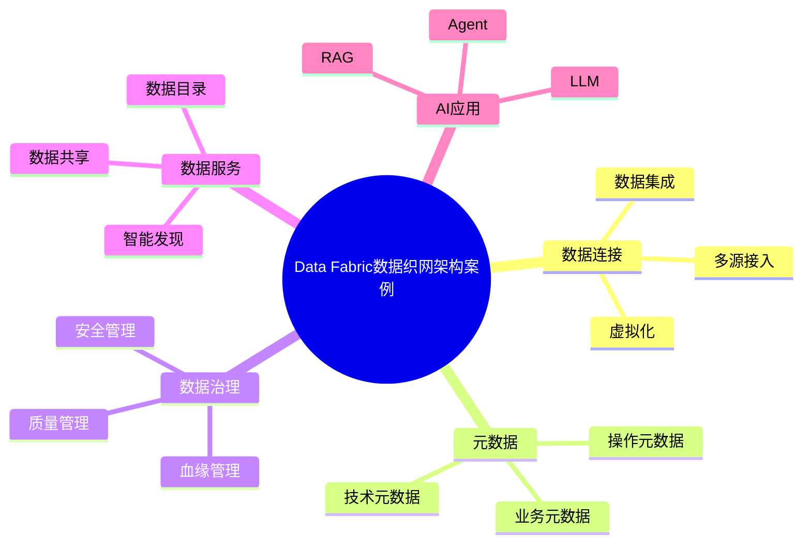

# 72-data-fabric-case.md（Data Fabric数据织网架构案例）

> 本文用于系统架构设计师考试案例分析专题 V2 复习。
>
> 本篇重点整理 Data Fabric（数据织网）架构设计案例，包括数据连接、元数据驱动、数据目录、智能发现、数据集成、数据虚拟化、自动化治理、数据安全、数据血缘以及企业级数据智能化架构。

---

# 目录

1. Data Fabric案例概述
2. Data Fabric基本概念
3. 企业数据管理挑战案例
4. Data Fabric总体架构案例
5. 数据连接架构案例
6. 元数据驱动架构案例
7. 数据目录架构案例
8. 数据智能发现案例
9. 数据集成架构案例
10. 数据虚拟化案例
11. 数据治理自动化案例
12. 数据质量管理案例
13. 数据安全控制案例
14. 数据血缘管理案例
15. Data Fabric与Data Mesh结合案例
16. Data Fabric与Lakehouse结合案例
17. Data Fabric与AI应用结合案例
18. 企业级Data Fabric案例
19. Data Fabric建设方法案例
20. Data Fabric演进案例
21. 案例分析答题模板
22. 高频考点
23. 易错点
24. Mermaid知识结构图
25. 本节小结

---

# 1. Data Fabric案例概述

Data Fabric：

> 一种通过统一数据架构连接企业分散数据资源的数据管理模式。

传统数据架构：

```text
业务系统

↓

数据仓库

↓

分析应用
```

存在：

- 数据孤岛；
- 集成复杂；
- 治理困难。

Data Fabric：

```text
多源数据

↓

数据织网

↓

统一数据服务

↓

业务应用
```

---

# 2. Data Fabric基本概念

核心思想：

> 通过智能化数据连接，实现数据资产统一管理和高效利用。

核心能力：

## 数据连接

连接：

- 数据库；
- 文件；
- API；
- 云服务。

## 元数据驱动

利用：

- 技术元数据；
- 业务元数据；
- 操作元数据。

实现：

- 数据发现；
- 数据治理。

## 自动化治理

包括：

- 数据质量；
- 数据安全；
- 数据生命周期。

---

# 3. 企业数据管理挑战案例

常见问题：

- 数据来源复杂；
- 数据孤岛严重；
- 数据资产不可见；
- 数据治理成本高。

---

# 4. Data Fabric总体架构案例

```text
数据消费层

↓

数据服务层

↓

Data Fabric智能织网层

↓

数据资源层

↓

基础设施层
```

---

# 5. 数据连接架构案例

Data Fabric连接：

- 结构化数据；
- 半结构化数据；
- 非结构化数据。

架构：

```text
数据源

↓

连接层

↓

统一数据访问

↓

应用
```

---

# 6. 元数据驱动架构案例

元数据：

> 描述数据的数据。

包括：

## 技术元数据

例如：

- 表结构；
- 字段信息。

## 业务元数据

例如：

- 业务含义；
- 数据负责人。

## 操作元数据

例如：

- 使用记录；
- 调用情况。

---

# 7. 数据目录架构案例

Data Catalog管理：

- 数据资产；
- 数据位置；
- 数据描述；
- 数据关系。

作用：

提高：

- 数据发现能力；
- 数据使用效率。

---

# 8. 数据智能发现案例

通过：

- 元数据分析；
- 搜索；
- 推荐。

自动发现：

- 数据资源；
- 数据关系。

---

# 9. 数据集成架构案例

支持：

- ETL；
- ELT；
- API；
- 数据同步。

架构：

```text
数据源

↓

集成平台

↓

数据服务
```

---

# 10. 数据虚拟化案例

数据虚拟化：

> 不移动数据，通过统一访问层访问不同数据源。

优势：

- 减少数据复制；
- 提升访问效率。

---

# 11. 数据治理自动化案例

包括：

- 自动分类；
- 自动标签；
- 自动检测。

降低人工治理成本。

---

# 12. 数据质量管理案例

指标：

- 完整性；
- 准确性；
- 一致性；
- 时效性。

---

# 13. 数据安全控制案例

包括：

- 数据权限；
- 数据脱敏；
- 数据加密；
- 访问审计。

---

# 14. 数据血缘管理案例

数据血缘：

> 描述数据从产生到使用的全过程关系。

作用：

- 影响分析；
- 问题定位；
- 合规审计。

---

# 15. Data Fabric与Data Mesh结合案例

区别：

|Data Mesh|Data Fabric|
|-|-|
|组织架构方法|技术架构方法|
|强调领域自治|强调数据连接|
|数据产品|数据智能管理|

结合：

```text
Data Mesh

↓

领域数据产品

+

Data Fabric

↓

智能数据连接
```

---

# 16. Data Fabric与Lakehouse结合案例

架构：

```text
Data Fabric

↓

Lakehouse

↓

统一数据存储

↓

数据应用
```

---

# 17. Data Fabric与AI应用结合案例

AI需要：

- 高质量数据；
- 可追踪数据；
- 丰富数据资产。

Data Fabric提供：

- 数据发现；
- 数据连接；
- 数据治理。

支撑：

- LLM；
- RAG；
- Agent。

---

# 18. 企业级Data Fabric案例

整体：

```text
企业数据源

↓

Data Fabric平台

↓

数据服务

↓

AI应用
```

---

# 19. Data Fabric建设方法案例

建设步骤：

```text
数据现状分析

↓

数据连接建设

↓

元数据管理

↓

治理能力建设

↓

智能化运营
```

---

# 20. Data Fabric演进案例

```text
数据集成

↓

数据仓库

↓

数据湖

↓

Lakehouse

↓

Data Fabric
```

---

# 案例分析答题模板

## 企业存在大量数据孤岛

> 建设Data Fabric架构，通过统一数据连接和元数据管理，实现企业数据统一访问。

## 数据资产无法发现

> 建设企业数据目录，通过元数据管理提升数据发现能力。

## 数据治理成本过高

> 引入自动化数据治理能力，实现数据质量、安全和生命周期管理。

## AI应用缺少数据支撑

> 通过Data Fabric整合企业数据资源，为AI应用提供可信数据基础。

---

# 高频考点

重点掌握：

1. Data Fabric核心理念；
2. 元数据驱动；
3. 数据目录；
4. 数据血缘；
5. 数据虚拟化；
6. 自动化治理；
7. Data Fabric与AI结合。

---

# 易错点

|易错知识|正确理解|
|-|-|
|Data Fabric只是数据集成工具|Data Fabric包含连接、治理和智能管理能力|
|只关注数据移动|强调数据发现和统一访问|
|不需要元数据|元数据是Data Fabric核心能力|
|Data Fabric替代所有数据架构|通常与Lakehouse、Data Mesh结合使用|

---

# Mermaid知识结构图



---

# 本节小结

Data Fabric数据织网架构案例核心：

> 通过数据连接、元数据驱动和自动化治理，实现企业数据资产统一管理和智能化利用。

案例分析重点：

- 理解Data Fabric总体架构；
- 掌握元数据驱动机制；
- 理解Data Mesh与Data Fabric区别；
- 掌握企业数据智能化演进方向。
