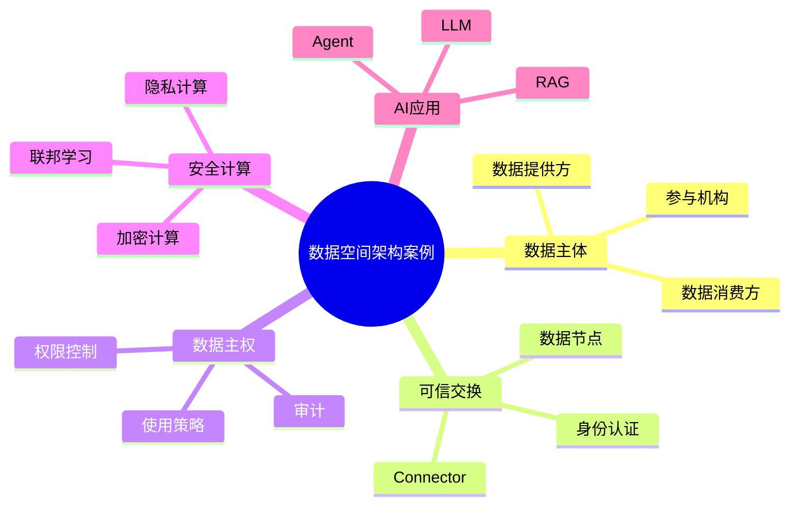

# 73-data-space-case.md（数据空间架构案例）

> 本文用于系统架构设计师考试案例分析专题 V2 复习。
>
> 本篇重点整理数据空间（Data Space）架构设计案例，包括可信数据交换、数据主权控制、数据连接器、使用策略、安全计算、隐私保护、数据确权以及企业级数据生态建设。

---

# 目录

1. 数据空间案例概述
2. 数据空间基本概念
3. 企业数据共享挑战案例
4. 数据空间总体架构案例
5. 数据提供方架构案例
6. 数据消费方架构案例
7. 数据交换节点案例
8. 数据连接器架构案例
9. 数据主权控制案例
10. 数据使用策略案例
11. 可信数据交换案例
12. 数据安全计算案例
13. 隐私保护架构案例
14. 数据确权管理案例
15. 数据资产交易案例
16. 数据空间与Data Mesh结合案例
17. 数据空间与Data Fabric结合案例
18. 数据空间与AI应用结合案例
19. 企业级数据空间案例
20. 数据空间建设方法案例
21. 数据空间演进案例
22. 案例分析答题模板
23. 高频考点
24. 易错点
25. Mermaid知识结构图
26. 本节小结

---

# 1. 数据空间案例概述

数据空间：

> 一种支持多方主体之间可信数据共享和流通的数据架构模式。

传统数据共享：

```text
企业A

↓

数据复制

↓

企业B
```

问题：

- 数据泄露风险；
- 数据无法控制；
- 缺少使用约束。

数据空间：

```text
企业A

↓

可信数据空间

↓

企业B
```

特点：

- 数据不一定移动；
- 使用过程可控制；
- 数据主体拥有控制权。

---

# 2. 数据空间基本概念

核心理念：

> 数据可用不可见，数据可控可追溯。

主要能力：

- 数据连接；
- 身份认证；
- 使用控制；
- 全程审计。

---

# 3. 企业数据共享挑战案例

常见问题：

- 数据孤岛；
- 数据安全风险；
- 数据价值无法释放；
- 数据责任不清。

---

# 4. 数据空间总体架构案例

```text
数据消费者

↓

数据空间服务层

↓

可信交换层

↓

数据提供方

↓

数据资源
```

---

# 5. 数据提供方架构案例

负责：

- 数据发布；
- 数据管理；
- 使用授权。

架构：

```text
数据资源

↓

数据服务

↓

数据空间节点
```

---

# 6. 数据消费方架构案例

流程：

```text
数据需求

↓

授权申请

↓

数据使用
```

---

# 7. 数据交换节点案例

数据空间节点负责：

- 数据连接；
- 身份认证；
- 安全交换。

---

# 8. 数据连接器架构案例

Connector提供：

- 数据接入；
- 数据交换；
- 策略执行。

架构：

```text
数据源

↓

Connector

↓

数据空间
```

---

# 9. 数据主权控制案例

核心：

> 数据拥有者决定数据如何被使用。

控制：

- 使用范围；
- 使用时间；
- 使用目的。

---

# 10. 数据使用策略案例

策略包括：

- 访问条件；
- 使用期限；
- 使用方式。

示例：

```text
允许：

分析使用

禁止：

再次转授权
```

---

# 11. 可信数据交换案例

特点：

- 身份可信；
- 数据可信；
- 过程可信。

---

# 12. 数据安全计算案例

方式：

- 多方安全计算；
- 联邦学习；
- 隐私计算。

目标：

> 数据不直接共享，仍能完成计算。

---

# 13. 隐私保护架构案例

措施：

- 数据脱敏；
- 加密计算；
- 匿名化。

---

# 14. 数据确权管理案例

管理：

- 数据所有权；
- 使用权；
- 收益权。

---

# 15. 数据资产交易案例

支持：

- 数据产品发布；
- 数据授权；
- 数据价值评估。

---

# 16. 数据空间与Data Mesh结合案例

```text
Data Mesh

↓

领域数据产品

↓

数据空间

↓

跨组织共享
```

Data Mesh解决：

- 企业内部数据责任。

数据空间解决：

- 企业之间数据流通。

---

# 17. 数据空间与Data Fabric结合案例

```text
Data Fabric

↓

企业数据连接

↓

数据空间

↓

可信交换
```

---

# 18. 数据空间与AI应用结合案例

AI需要：

- 高质量数据；
- 多来源数据。

数据空间提供：

- 企业共享数据；
- 可信训练数据；
- 安全数据流通。

支撑：

- LLM；
- RAG；
- Agent。

---

# 19. 企业级数据空间案例

```text
企业A

↓

数据空间平台

↓

企业B

↓

AI应用
```

---

# 20. 数据空间建设方法案例

建设步骤：

```text
需求分析

↓

参与方确定

↓

节点建设

↓

安全策略配置

↓

数据服务发布

↓

运营管理
```

---

# 21. 数据空间演进案例

```text
数据共享

↓

数据交换平台

↓

可信数据空间

↓

数据生态网络
```

---

# 案例分析答题模板

## 企业之间无法共享数据

> 建设可信数据空间，通过身份认证、策略控制和安全交换实现跨组织数据流通。

## 数据共享存在泄露风险

> 采用数据主权控制和隐私计算技术，实现数据可用不可见。

## 数据价值无法释放

> 建设数据空间平台，通过数据产品和数据服务促进数据流通。

## AI缺少可信数据来源

> 通过数据空间提供安全可靠的数据资源，支撑AI模型训练和应用。

---

# 高频考点

重点掌握：

1. 数据空间总体架构；
2. 数据主权控制；
3. 数据连接器；
4. 可信数据交换；
5. 隐私计算；
6. 数据确权；
7. 数据空间与AI结合。

---

# 易错点

|易错知识|正确理解|
|-|-|
|数据空间就是数据仓库|数据空间关注跨主体可信流通|
|数据共享就是复制数据|数据空间强调可控使用|
|数据提供后无法管理|通过策略控制保障数据主权|
|数据空间不需要安全机制|身份、权限和审计是核心能力|

---

# Mermaid知识结构图



---

# 本节小结

数据空间架构案例核心：

> 通过可信连接、数据主权控制和安全交换机制，实现跨组织数据安全流通和价值释放。

案例分析重点：

- 理解数据空间总体架构；
- 掌握可信数据交换机制；
- 理解数据主权和隐私保护；
- 掌握数据空间支撑AI应用的方法。
