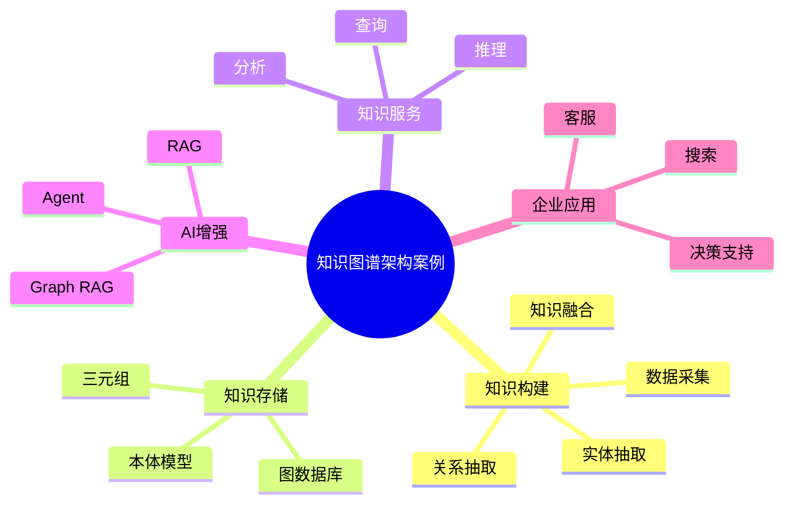

# 74-knowledge-graph-case.md（知识图谱架构案例）

> 本文用于系统架构设计师考试案例分析专题 V2 复习。
>
> 本篇重点整理知识图谱（Knowledge Graph）架构设计案例，包括知识抽取、实体识别、关系抽取、知识融合、图数据库、知识推理、Graph RAG、Agent知识增强以及企业知识智能化建设。

---

# 目录

1. 知识图谱案例概述
2. 知识图谱基本概念
3. 企业知识管理挑战案例
4. 知识图谱总体架构案例
5. 数据采集层案例
6. 信息抽取架构案例
7. 实体识别案例
8. 关系抽取案例
9. 知识融合案例
10. 知识表示与建模案例
11. 图数据库架构案例
12. 知识查询案例
13. 知识推理案例
14. 知识图谱更新案例
15. 企业知识图谱案例
16. 知识图谱与RAG结合案例
17. 知识图谱与Agent结合案例
18. 知识图谱与AI应用结合案例
19. 知识图谱建设方法案例
20. 知识图谱演进案例
21. 案例分析答题模板
22. 高频考点
23. 易错点
24. Mermaid知识结构图
25. 本节小结

---

# 1. 知识图谱案例概述

知识图谱：

> 一种以图结构形式组织和表达知识的方法。

传统数据：

```text
客户表

产品表

订单表
```

知识图谱：

```text
客户

  ↓购买

产品

  ↓属于

类别
```

特点：

- 语义化；
- 关联化；
- 可推理。

---

# 2. 知识图谱基本概念

核心组成：

## 实体（Entity）

表示：

- 人；
- 企业；
- 产品；
- 地点。

## 属性（Attribute）

描述实体特征。

## 关系（Relationship）

表示实体之间联系。

示例：

```text
企业A

投资

企业B
```

---

# 3. 企业知识管理挑战案例

常见问题：

- 知识分散；
- 信息关联困难；
- AI缺少领域知识；
- 知识复用效率低。

---

# 4. 知识图谱总体架构案例

```text
智能应用层

↓

知识服务层

↓

知识图谱层

↓

知识构建层

↓

数据源层
```

---

# 5. 数据采集层案例

数据来源：

- 企业数据库；
- 文档；
- API；
- 外部数据。

流程：

```text
数据源

↓

数据采集

↓

知识构建
```

---

# 6. 信息抽取架构案例

目标：

从非结构化数据中发现知识。

包括：

- 实体抽取；
- 关系抽取；
- 属性抽取。

---

# 7. 实体识别案例

实体识别：

> 从文本中发现关键对象。

示例：

```text
苹果公司发布iPhone
```

识别：

```text
苹果公司 → 企业实体

iPhone → 产品实体
```

---

# 8. 关系抽取案例

形成知识关系：

```text
(苹果公司)-生产->(iPhone)
```

---

# 9. 知识融合案例

解决：

- 同名实体；
- 数据冲突。

示例：

```text
苹果

Apple Inc.

Apple公司
```

统一为：

```text
Apple Inc.
```

---

# 10. 知识表示与建模案例

常见模型：

- RDF；
- 三元组模型；
- 本体模型。

三元组：

```text
主体

↓

关系

↓

客体
```

---

# 11. 图数据库架构案例

存储：

- 节点；
- 边；
- 属性。

架构：

```text
知识数据

↓

图数据库

↓

知识查询
```

---

# 12. 知识查询案例

支持：

- 关系查询；
- 路径查询；
- 关联分析。

---

# 13. 知识推理案例

知识推理：

> 根据已有知识发现新的知识。

示例：

```text
A投资B

B属于C行业
```

推理：

```text
A关注C行业
```

---

# 14. 知识图谱更新案例

更新方式：

- 增量更新；
- 实时更新；
- 定期更新。

---

# 15. 企业知识图谱案例

应用：

- 企业知识管理；
- 智能客服；
- 风险分析；
- 决策支持。

架构：

```text
企业数据

↓

知识图谱

↓

智能应用
```

---

# 16. 知识图谱与RAG结合案例

Graph RAG：

结合：

- 向量检索；
- 图关系检索。

架构：

```text
用户问题

↓

知识图谱

↓

RAG

↓

LLM

↓

答案
```

优势：

- 提升准确性；
- 增强关系理解。

---

# 17. 知识图谱与Agent结合案例

Agent利用：

- 知识查询；
- 关系推理；
- 任务规划。

架构：

```text
Agent

↓

知识图谱

↓

业务系统
```

---

# 18. 知识图谱与AI应用结合案例

支撑：

- LLM；
- RAG；
- 智能问答；
- 企业搜索。

---

# 19. 知识图谱建设方法案例

建设步骤：

```text
需求分析

↓

数据采集

↓

知识建模

↓

信息抽取

↓

知识融合

↓

图谱构建

↓

应用服务
```

---

# 20. 知识图谱演进案例

```text
数据库

↓

数据仓库

↓

知识库

↓

知识图谱

↓

AI知识增强
```

---

# 案例分析答题模板

## 企业知识分散无法利用

> 建设企业知识图谱，通过知识抽取和关联分析，实现知识统一管理。

## AI回答缺少领域知识

> 将知识图谱与RAG结合，为大模型提供结构化领域知识。

## 企业需要智能分析

> 利用知识图谱关系推理能力，实现复杂关联分析。

## 多系统数据无法关联

> 通过实体融合和知识建模，实现跨系统知识关联。

---

# 高频考点

重点掌握：

1. 知识图谱总体架构；
2. 实体与关系抽取；
3. 知识融合；
4. 图数据库；
5. 知识推理；
6. Graph RAG；
7. Agent知识增强。

---

# 易错点

|易错知识|正确理解|
|-|-|
|知识图谱只是数据库|知识图谱强调语义关系和推理能力|
|只存储文本|需要结构化实体和关系|
|构建完成后无需更新|需要持续维护和演进|
|RAG只能使用向量数据库|Graph RAG可结合知识图谱增强|

---

# Mermaid知识结构图



---

# 本节小结

知识图谱架构案例核心：

> 通过知识抽取、知识建模和图数据管理，将企业数据转换为可关联、可推理的知识网络。

案例分析重点：

- 理解知识图谱总体架构；
- 掌握实体关系抽取流程；
- 理解知识推理机制；
- 掌握知识图谱与RAG、Agent结合方法。
