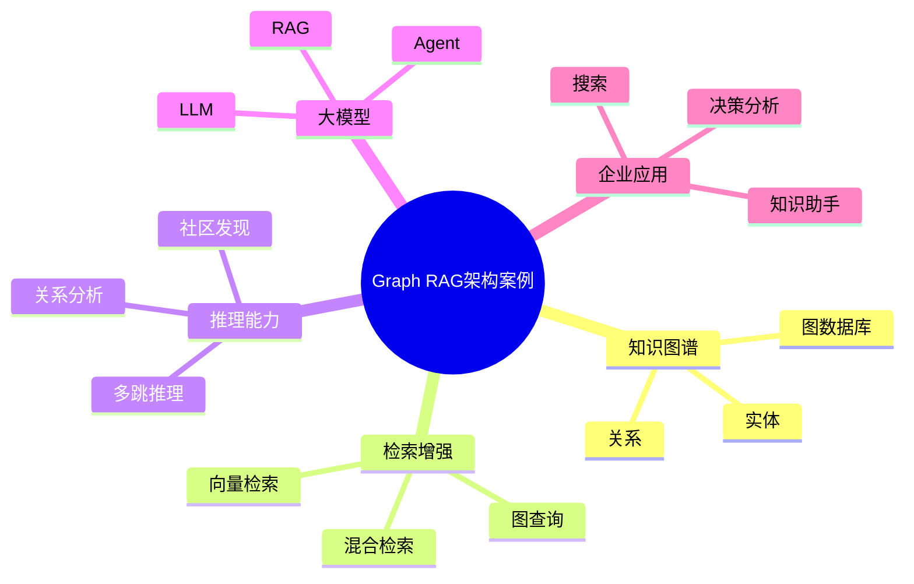

# 75-graph-rag-case.md（Graph RAG架构案例）

> 本文用于系统架构设计师考试案例分析专题 V2 复习。
>
> 本篇重点整理 Graph RAG（知识图谱增强检索生成）架构设计案例，包括知识图谱、向量检索、混合检索、多跳推理、社区发现、大语言模型增强以及企业智能知识应用。

---

# 目录

1. Graph RAG案例概述
2. Graph RAG基本概念
3. 传统RAG架构挑战案例
4. Graph RAG总体架构案例
5. 数据采集与知识构建案例
6. 文档解析架构案例
7. 实体抽取案例
8. 关系抽取案例
9. 知识图谱构建案例
10. 图数据库存储案例
11. 向量数据库结合案例
12. 混合检索架构案例
13. 图查询增强案例
14. 社区发现案例
15. 多跳推理案例
16. 查询理解案例
17. Graph RAG生成案例
18. Graph RAG与Agent结合案例
19. 企业Graph RAG案例
20. Graph RAG建设方法案例
21. Graph RAG演进案例
22. 案例分析答题模板
23. 高频考点
24. 易错点
25. Mermaid知识结构图
26. 本节小结

---

# 1. Graph RAG案例概述

Graph RAG：

> 将知识图谱与检索增强生成结合，通过图结构增强大模型知识理解能力。

传统RAG：

```text
用户问题

↓

向量检索

↓

相关文本

↓

LLM

↓

答案
```

Graph RAG：

```text
用户问题

↓

图检索 + 向量检索

↓

知识增强

↓

LLM

↓

答案
```

---

# 2. Graph RAG基本概念

核心组成：

## Knowledge Graph

表示：

- 实体；
- 关系；
- 属性。

## Retrieval

检索：

- 文本内容；
- 图关系；
- 关联实体。

## Generation

通过LLM生成答案。

---

# 3. 传统RAG架构挑战案例

问题：

- 只能匹配文本相似度；
- 缺少实体关系理解；
- 多跳问题处理能力弱；
- 企业知识关联不足。

---

# 4. Graph RAG总体架构案例

```text
用户

↓

查询理解层

↓

Graph RAG检索层

↓

知识图谱 + 向量数据库

↓

LLM生成层

↓

答案输出
```

---

# 5. 数据采集与知识构建案例

数据来源：

- 企业文档；
- 数据库；
- API；
- 业务系统。

流程：

```text
数据源

↓

知识抽取

↓

知识图谱

↓

Graph RAG
```

---

# 6. 文档解析架构案例

处理：

- PDF；
- Word；
- 网页；
- 数据库。

流程：

```text
文档

↓

解析

↓

文本切片

↓

知识抽取
```

---

# 7. 实体抽取案例

识别：

- 企业；
- 产品；
- 人员；
- 地点。

示例：

```text
华为发布Mate系列手机
```

结果：

```text
华为 → 企业实体

Mate → 产品实体
```

---

# 8. 关系抽取案例

形成：

```text
(华为)-发布->(Mate)
```

---

# 9. 知识图谱构建案例

构建：

- 实体；
- 关系；
- 属性。

结构：

```text
实体

↓

关系

↓

实体
```

---

# 10. 图数据库存储案例

存储：

- 节点；
- 边；
- 属性。

支持：

- 路径查询；
- 关系分析；
- 知识推理。

---

# 11. 向量数据库结合案例

Graph RAG融合：

```text
图数据库

+

向量数据库
```

优势：

图：

- 关系理解。

向量：

- 语义理解。

---

# 12. 混合检索架构案例

流程：

```text
用户问题

↓

向量检索

+

图查询

↓

结果融合

↓

LLM
```

---

# 13. 图查询增强案例

利用：

- 图查询语言；
- 关系路径分析。

应用：

- 企业关系分析；
- 风险分析；
- 上下游分析。

---

# 14. 社区发现案例

社区发现：

> 从知识图谱中发现高度关联的数据群体。

应用：

- 企业关系分析；
- 风险识别；
- 市场分析。

---

# 15. 多跳推理案例

示例：

```text
A投资B

B生产C产品

C属于新能源领域
```

推理：

```text
A涉及新能源领域
```

---

# 16. 查询理解案例

包括：

- 用户意图识别；
- 实体识别；
- 查询扩展。

---

# 17. Graph RAG生成案例

流程：

```text
问题

↓

图谱检索

↓

上下文增强

↓

LLM

↓

答案
```

优势：

- 降低幻觉；
- 提升准确性；
- 增强解释能力。

---

# 18. Graph RAG与Agent结合案例

架构：

```text
Agent

↓

Graph RAG

↓

知识图谱

↓

业务系统
```

Agent可调用：

- 图查询工具；
- 知识服务；
- 企业系统。

---

# 19. 企业Graph RAG案例

应用：

- 企业智能搜索；
- 智能客服；
- 决策分析；
- 企业知识助手。

---

# 20. Graph RAG建设方法案例

建设步骤：

```text
需求分析

↓

知识建模

↓

数据采集

↓

图谱构建

↓

检索设计

↓

LLM接入

↓

应用上线
```

---

# 21. Graph RAG演进案例

```text
搜索

↓

RAG

↓

知识图谱

↓

Graph RAG

↓

智能Agent
```

---

# 案例分析答题模板

## 传统RAG回答准确率不足

> 引入Graph RAG，通过知识图谱增强实体关系理解，提高复杂问题回答能力。

## 企业知识关联复杂

> 构建知识图谱，通过实体和关系建模实现知识关联。

## AI需要复杂推理能力

> 结合图查询和多跳推理能力，为大模型提供结构化知识增强。

## 企业知识助手效果不佳

> 采用Graph RAG架构，将向量检索与图谱检索结合，提高知识问答准确性。

---

# 高频考点

重点掌握：

1. Graph RAG总体架构；
2. 知识图谱构建流程；
3. 图数据库与向量数据库融合；
4. 混合检索；
5. 多跳推理；
6. Agent结合。

---

# 易错点

|易错知识|正确理解|
|-|-|
|Graph RAG只是普通RAG加数据库|核心是利用图结构增强知识理解|
|只需要向量检索|复杂场景需要图关系检索|
|知识图谱建立后无需维护|需要持续更新|
|Graph RAG只能用于搜索|可用于Agent、决策和企业智能应用|

---

# Mermaid知识结构图



---

# 本节小结

Graph RAG架构案例核心：

> 通过知识图谱和检索增强生成结合，使大模型具备更强的知识关联、推理和企业知识理解能力。

案例分析重点：

- 理解Graph RAG总体架构；
- 掌握图谱与向量检索融合方法；
- 理解多跳推理机制；
- 掌握Graph RAG与Agent结合方式。
