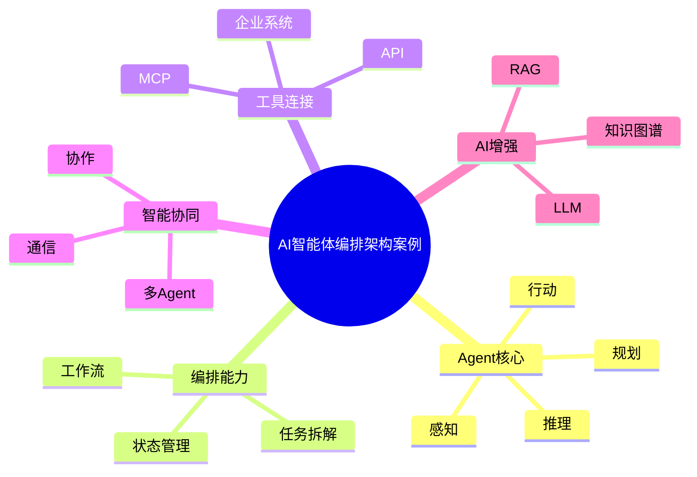

# 76-ai-agent-orchestration-case.md（AI智能体编排架构案例）

> 本文用于系统架构设计师考试案例分析专题 V2 复习。
>
> 本篇重点整理 AI 智能体编排（AI Agent Orchestration）架构设计案例，包括 Agent 规划、任务分解、工具调用、MCP、多智能体协同、工作流编排、状态管理、安全控制以及企业智能体平台建设。

---

# 目录

1. AI智能体编排案例概述
2. Agent基本概念
3. 企业智能体应用挑战案例
4. Agent总体架构案例
5. Agent规划层案例
6. Agent执行层案例
7. Agent记忆架构案例
8. Agent工具调用案例
9. MCP工具协议案例
10. Agent工作流编排案例
11. 多智能体协同案例
12. Agent通信架构案例
13. Agent任务分解案例
14. Agent决策控制案例
15. Agent状态管理案例
16. Agent安全控制案例
17. Agent与RAG结合案例
18. Agent与知识图谱结合案例
19. 企业Agent平台案例
20. Agent编排建设方法案例
21. Agent演进案例
22. 案例分析答题模板
23. 高频考点
24. 易错点
25. Mermaid知识结构图
26. 本节小结

---

# 1. AI智能体编排案例概述

AI Agent：

> 利用大语言模型作为推理核心，通过感知、规划、行动完成复杂任务的智能系统。

传统LLM：

```text
用户

↓

LLM

↓

回答
```

Agent：

```text
用户

↓

Agent

↓

规划

↓

工具调用

↓

执行任务

↓

反馈优化
```

---

# 2. Agent基本概念

Agent核心能力：

## 感知（Perception）

获取：

- 用户输入；
- 环境信息；
- 系统状态。

## 推理（Reasoning）

负责：

- 理解任务；
- 制定方案。

## 规划（Planning）

负责：

- 子任务拆解；
- 执行顺序设计。

## 行动（Action）

调用：

- API；
- 工具；
- 数据系统。

---

# 3. 企业智能体应用挑战案例

常见问题：

- 复杂任务无法一次完成；
- 多系统调用困难；
- AI流程无法管理；
- 智能应用重复建设。

---

# 4. Agent总体架构案例

```text
用户

↓

Agent应用层

↓

Agent编排层

↓

模型服务层

↓

工具与知识层

↓

业务系统层
```

---

# 5. Agent规划层案例

Planning负责：

- 任务理解；
- 目标拆解；
- 路径规划。

流程：

```text
目标

↓

任务分解

↓

执行计划

↓

任务执行
```

---

# 6. Agent执行层案例

执行：

- 调用工具；
- 获取结果；
- 更新状态。

架构：

```text
计划

↓

执行器

↓

工具

↓

结果
```

---

# 7. Agent记忆架构案例

记忆类型：

## 短期记忆

保存：

- 当前上下文。

## 长期记忆

保存：

- 用户偏好；
- 历史任务。

架构：

```text
Agent

↓

Memory

↓

知识存储
```

---

# 8. Agent工具调用案例

工具：

- API；
- 数据库；
- 搜索服务；
- 企业系统。

流程：

```text
Agent

↓

工具选择

↓

调用执行

↓

返回结果
```

---

# 9. MCP工具协议案例

MCP：

> Model Context Protocol，用于连接模型与外部工具。

架构：

```text
Agent

↓

MCP Client

↓

MCP Server

↓

工具资源
```

优势：

- 标准化工具接入；
- 降低Agent扩展成本。

---

# 10. Agent工作流编排案例

Workflow负责：

- 节点管理；
- 条件判断；
- 流程控制。

架构：

```text
任务

↓

工作流引擎

↓

多个Agent

↓

结果
```

---

# 11. 多智能体协同案例

Multi-Agent：

多个Agent分工协作。

例如：

```text
任务Agent

↓

分析Agent

↓

执行Agent

↓

审核Agent
```

---

# 12. Agent通信架构案例

通信方式：

- API；
- 消息队列；
- Agent协议。

作用：

实现多个Agent之间的信息交换。

---

# 13. Agent任务分解案例

示例：

用户：

> 制定企业市场分析报告。

拆解：

```text
数据收集

↓

市场分析

↓

报告生成

↓

审核发布
```

---

# 14. Agent决策控制案例

控制：

- 执行策略；
- 异常处理；
- 人工介入。

目标：

保证Agent行为可控。

---

# 15. Agent状态管理案例

管理：

- 当前任务；
- 执行历史；
- 中间结果。

---

# 16. Agent安全控制案例

安全措施：

- 权限控制；
- 工具限制；
- 操作审计。

原则：

> Agent不能拥有无限执行权限。

---

# 17. Agent与RAG结合案例

架构：

```text
Agent

↓

RAG

↓

知识库

↓

LLM
```

作用：

- 获取企业知识；
- 提升回答准确性。

---

# 18. Agent与知识图谱结合案例

架构：

```text
Agent

↓

知识图谱

↓

关系推理

↓

业务执行
```

作用：

- 增强知识理解；
- 支持复杂决策。

---

# 19. 企业Agent平台案例

平台能力：

- Agent创建；
- 工作流管理；
- 工具管理；
- 模型管理；
- 监控审计。

整体：

```text
企业应用

↓

Agent平台

↓

模型与工具

↓

业务系统
```

---

# 20. Agent编排建设方法案例

建设步骤：

```text
业务分析

↓

任务拆解

↓

Agent设计

↓

工具接入

↓

流程编排

↓

测试优化
```

---

# 21. Agent演进案例

演进：

```text
聊天机器人

↓

RAG助手

↓

单Agent

↓

多Agent

↓

自主智能系统
```

---

# 案例分析答题模板

## 企业业务流程复杂

> 引入AI Agent编排架构，通过任务规划、工具调用和流程管理实现业务自动化。

## 单模型无法完成复杂任务

> 采用多Agent协同模式，将复杂任务拆解为多个智能体完成。

## AI无法调用企业系统

> 通过MCP和工具网关实现Agent与外部系统标准化连接。

## Agent风险不可控

> 建立Agent权限控制、执行审计和人工审核机制。

---

# 高频考点

重点掌握：

1. Agent总体架构；
2. 任务规划与执行；
3. 工具调用机制；
4. MCP协议；
5. 多Agent协同；
6. 工作流编排；
7. Agent安全治理。

---

# 易错点

|易错知识|正确理解|
|-|-|
|Agent就是聊天机器人|Agent具备规划、执行和反馈能力|
|Agent可以无限调用工具|企业环境需要权限控制|
|单Agent适合所有场景|复杂任务需要多Agent协作|
|Agent不需要流程管理|企业应用需要编排和治理|

---

# Mermaid知识结构图



---

# 本节小结

AI智能体编排架构案例核心：

> 通过Agent规划、工具调用、工作流编排和多智能体协同，实现企业复杂任务自动化。

案例分析重点：

- 理解Agent总体架构；
- 掌握任务规划与执行流程；
- 理解MCP工具连接机制；
- 掌握企业Agent平台建设方法。
