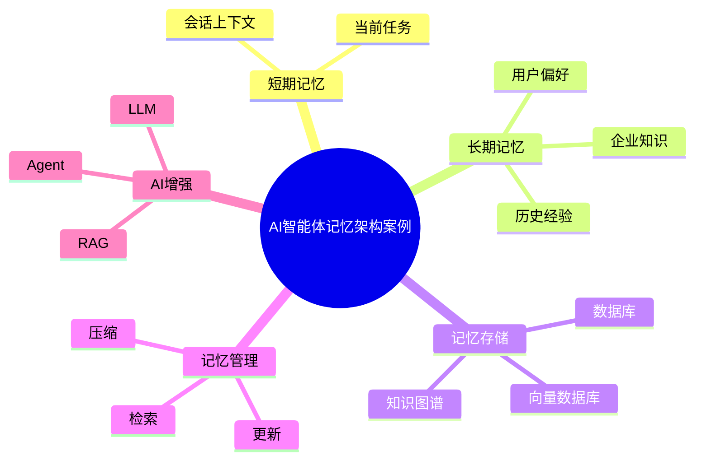

# 77-ai-agent-memory-case.md（AI智能体记忆架构案例）

> 本文用于系统架构设计师考试案例分析专题 V2 复习。
>
> 本篇重点整理 AI Agent Memory（智能体记忆）架构设计案例，包括短期记忆、长期记忆、情景记忆、语义记忆、程序记忆、向量记忆、知识图谱记忆、记忆检索、记忆更新以及企业级Agent上下文管理。

---

# 目录

1. AI Agent Memory案例概述
2. Agent记忆基本概念
3. 企业Agent上下文挑战案例
4. Agent Memory总体架构案例
5. 短期记忆架构案例
6. 长期记忆架构案例
7. 情景记忆架构案例
8. 语义记忆架构案例
9. 程序记忆架构案例
10. 用户记忆管理案例
11. 会话上下文管理案例
12. 向量记忆架构案例
13. 知识图谱记忆案例
14. 记忆检索架构案例
15. 记忆更新机制案例
16. 记忆压缩案例
17. Agent Memory与RAG结合案例
18. Agent Memory与知识图谱结合案例
19. 企业级Agent Memory案例
20. Memory建设方法案例
21. Agent Memory演进案例
22. 案例分析答题模板
23. 高频考点
24. 易错点
25. Mermaid知识结构图
26. 本节小结

---

# 1. AI Agent Memory案例概述

Agent Memory：

> 让智能体能够保存、检索和利用历史信息的能力。

普通LLM：

```text
用户

↓

问题

↓

回答
```

Agent：

```text
用户

↓

Agent

↓

读取记忆

↓

推理

↓

执行

↓

保存经验
```

---

# 2. Agent记忆基本概念

记忆作用：

- 保存上下文；
- 提升个性化；
- 支撑长期任务；
- 积累经验。

---

# 3. 企业Agent上下文挑战案例

常见问题：

- 上下文窗口限制；
- 用户信息无法保存；
- 任务状态无法恢复；
- 企业知识无法沉淀。

---

# 4. Agent Memory总体架构案例

```text
用户

↓

Agent

↓

Memory管理层

↓

记忆存储层

↓

知识与数据资源
```

---

# 5. 短期记忆架构案例

Short-term Memory：

保存：

- 当前会话；
- 当前任务；
- 最近上下文。

---

# 6. 长期记忆架构案例

Long-term Memory：

保存：

- 用户偏好；
- 历史行为；
- 企业知识。

---

# 7. 情景记忆架构案例

Episodic Memory：

保存过去发生的事件。

例如：

- 历史任务；
- 操作记录；
- 执行结果。

---

# 8. 语义记忆架构案例

Semantic Memory：

保存：

- 概念；
- 知识；
- 规则。

例如：

```text
客户属于金融行业
```

---

# 9. 程序记忆架构案例

Procedural Memory：

保存：

- 方法；
- 流程；
- 操作经验。

例如：

```text
验证

↓

支付

↓

发货
```

---

# 10. 用户记忆管理案例

保存：

- 用户习惯；
- 用户偏好；
- 历史需求。

---

# 11. 会话上下文管理案例

管理：

- 当前对话；
- 历史消息；
- 关键上下文。

---

# 12. 向量记忆架构案例

通过：

- Embedding；
- Vector Database。

实现语义检索。

架构：

```text
信息

↓

Embedding

↓

向量数据库

↓

Memory Retrieval
```

---

# 13. 知识图谱记忆案例

保存：

- 实体；
- 关系；
- 属性。

架构：

```text
Agent

↓

知识图谱

↓

关系查询
```

---

# 14. 记忆检索架构案例

流程：

```text
当前任务

↓

Memory Query

↓

相关记忆

↓

LLM推理
```

---

# 15. 记忆更新机制案例

更新方式：

- 新增；
- 修改；
- 删除；
- 合并。

---

# 16. 记忆压缩案例

目的：

减少：

- Token消耗；
- 上下文压力。

方式：

- 摘要；
- 信息提取；
- 历史压缩。

---

# 17. Agent Memory与RAG结合案例

架构：

```text
Agent

↓

Memory

↓

RAG

↓

知识库

↓

LLM
```

作用：

- 长期知识增强；
- 个性化回答。

---

# 18. Agent Memory与知识图谱结合案例

架构：

```text
Agent Memory

↓

知识图谱

↓

关系推理
```

优势：

- 可解释；
- 可关联。

---

# 19. 企业级Agent Memory案例

应用：

- 企业助手；
- 智能客服；
- AI办公助手；
- 自动化流程Agent。

---

# 20. Memory建设方法案例

建设步骤：

```text
需求分析

↓

记忆模型设计

↓

存储选型

↓

检索设计

↓

更新策略

↓

安全治理
```

---

# 21. Agent Memory演进案例

```text
无状态LLM

↓

上下文窗口

↓

短期记忆

↓

长期记忆

↓

自主学习Agent
```

---

# 案例分析答题模板

## Agent无法保持连续交流

> 建立Memory机制，通过短期和长期记忆保存上下文信息。

## 用户体验不够个性化

> 建立用户记忆模型，保存用户偏好和历史行为。

## 企业知识无法沉淀

> 结合知识库和向量数据库，实现长期知识记忆。

## Agent任务中断无法恢复

> 通过任务状态记忆保存执行过程，实现任务恢复。

---

# 高频考点

重点掌握：

1. Agent Memory总体架构；
2. 短期与长期记忆区别；
3. 向量记忆；
4. 知识图谱记忆；
5. 记忆检索；
6. 记忆更新机制。

---

# 易错点

|易错知识|正确理解|
|-|-|
|Agent天然拥有记忆|LLM默认无状态，需要Memory机制|
|Memory只是保存聊天记录|还包括知识、经验和任务状态|
|所有记忆都存数据库|需要根据场景选择向量、图数据库等|
|记忆越多越好|需要检索、压缩和治理|

---

# Mermaid知识结构图



---

# 本节小结

AI智能体记忆架构案例核心：

> 通过短期记忆、长期记忆、知识存储和智能检索机制，让Agent具备持续交互、知识积累和任务恢复能力。

案例分析重点：

- 理解Agent Memory架构；
- 掌握不同类型记忆；
- 理解向量数据库与知识图谱结合；
- 掌握企业级Agent上下文管理方法。
