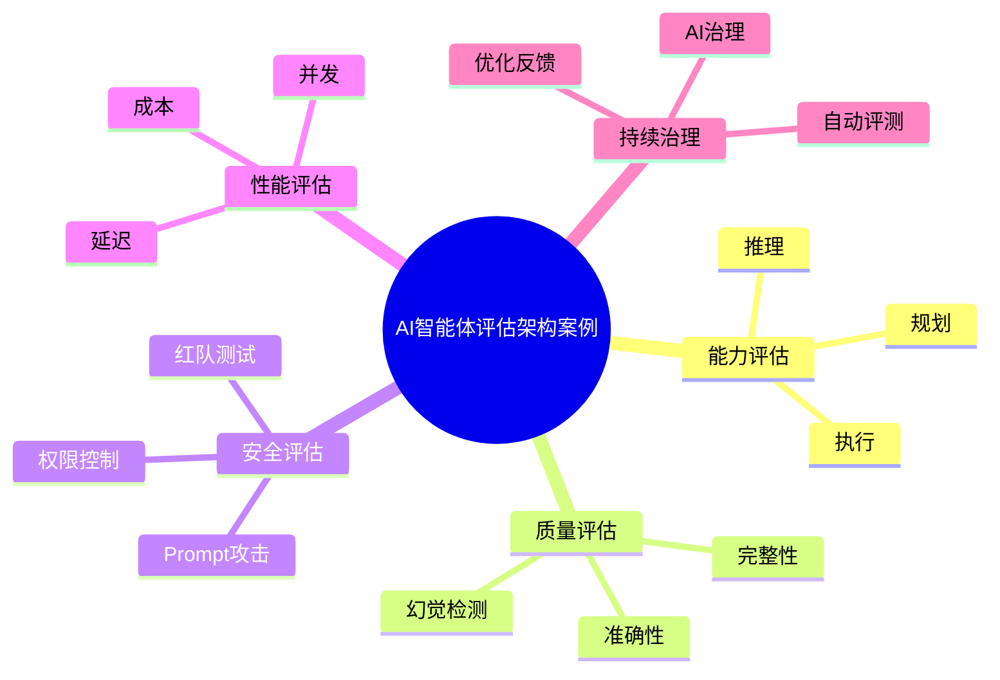

# 78-ai-agent-evaluation-case.md（AI智能体评估架构案例）

> 本文用于系统架构设计师考试案例分析专题 V2 复习。
>
> 本篇重点整理 AI Agent Evaluation（智能体评估）架构设计案例，包括 Agent 能力评估、任务完成率、推理质量、工具调用、RAG效果评估、安全评估、性能评估、自动化评测平台以及企业AI质量治理。

---

# 目录

1. AI Agent Evaluation案例概述
2. Agent评估基本概念
3. 企业Agent质量挑战案例
4. Agent评估总体架构案例
5. Agent能力评估案例
6. 任务完成率评估案例
7. 推理能力评估案例
8. 工具调用评估案例
9. RAG效果评估案例
10. 知识准确性评估案例
11. 幻觉检测案例
12. 安全性评估案例
13. Agent性能评估案例
14. 用户体验评估案例
15. 自动化评测平台案例
16. Benchmark测试案例
17. Agent红队测试案例
18. Agent持续优化案例
19. 企业Agent评估体系案例
20. Agent Evaluation建设方法案例
21. Agent评估演进案例
22. 案例分析答题模板
23. 高频考点
24. 易错点
25. Mermaid知识结构图
26. 本节小结

---

# 1. AI Agent Evaluation案例概述

Agent Evaluation：

> 对智能体能力、效果、安全和稳定性进行系统评价的方法。

传统软件：

```text
输入

↓

程序

↓

输出
```

Agent：

```text
任务

↓

Agent推理

↓

工具调用

↓

执行结果

↓

评价反馈
```

---

# 2. Agent评估基本概念

评估目标：

- 是否理解任务；
- 是否正确规划；
- 是否正确执行；
- 是否安全可靠。

---

# 3. 企业Agent质量挑战案例

常见问题：

- 输出不稳定；
- 幻觉问题；
- 工具调用错误；
- 任务完成率低。

---

# 4. Agent评估总体架构案例

```text
用户任务

↓

Agent系统

↓

评估平台

↓

指标分析

↓

优化反馈
```

---

# 5. Agent能力评估案例

评估：

- 感知能力；
- 推理能力；
- 规划能力；
- 执行能力。

---

# 6. 任务完成率评估案例

指标：

- 成功率；
- 完成时间；
- 步骤数量；
- 异常次数。

---

# 7. 推理能力评估案例

评估：

- 逻辑推理；
- 多步骤规划；
- 问题解决能力。

方法：

- 测试集；
- 人工评价；
- 自动评分。

---

# 8. 工具调用评估案例

关注：

- 工具选择是否正确；
- 参数是否正确；
- 调用顺序是否合理。

---

# 9. RAG效果评估案例

指标：

## 检索质量

包括：

- Recall；
- Precision。

## 生成质量

包括：

- 准确性；
- 完整性。

---

# 10. 知识准确性评估案例

评估：

- 是否基于真实知识；
- 是否引用正确来源。

---

# 11. 幻觉检测案例

检测：

- 虚假事实；
- 错误推理；
- 无依据回答。

方法：

- 事实校验；
- 知识库比对。

---

# 12. 安全性评估案例

测试：

- Prompt攻击；
- 越权访问；
- 数据泄露。

---

# 13. Agent性能评估案例

指标：

- 响应时间；
- Token消耗；
- 并发能力；
- 资源消耗。

---

# 14. 用户体验评估案例

指标：

- 满意度；
- 易用性；
- 交互效率。

---

# 15. 自动化评测平台案例

平台能力：

- 测试管理；
- 指标计算；
- 自动评分；
- 结果分析。

架构：

```text
测试集

↓

Agent

↓

评估引擎

↓

报告
```

---

# 16. Benchmark测试案例

Benchmark：

用于：

- 模型能力比较；
- Agent能力验证。

包括：

- 标准任务集；
- 综合测试集。

---

# 17. Agent红队测试案例

Red Team：

模拟攻击：

- Prompt Injection；
- 越权；
- 恶意输入。

目标：

发现安全漏洞。

---

# 18. Agent持续优化案例

流程：

```text
评估

↓

发现问题

↓

优化Prompt

↓

优化流程

↓

重新评估
```

---

# 19. 企业Agent评估体系案例

体系：

```text
能力评估

+

质量评估

+

安全评估

+

性能评估

+

用户评价
```

---

# 20. Agent Evaluation建设方法案例

步骤：

```text
确定目标

↓

设计指标

↓

建立测试集

↓

自动评测

↓

分析优化

↓

持续运营
```

---

# 21. Agent评估演进案例

```text
人工测试

↓

自动测试

↓

模型评估

↓

Agent评估

↓

AI治理体系
```

---

# 案例分析答题模板

## Agent效果无法衡量

> 建立Agent评估体系，通过能力、任务、安全和性能指标进行综合评价。

## 输出质量不稳定

> 建立自动化测试平台，通过测试集和评价指标持续优化Agent。

## Agent存在安全风险

> 引入红队测试和安全评估机制，降低Prompt攻击和越权风险。

## 企业需要规模化部署Agent

> 建设统一Agent评估平台，实现持续监控和质量治理。

---

# 高频考点

重点掌握：

1. Agent评估总体架构；
2. 能力与任务评估；
3. RAG效果评估；
4. 幻觉检测；
5. 安全评估；
6. 红队测试；
7. 自动化评测平台。

---

# 易错点

|易错知识|正确理解|
|-|-|
|Agent只需要功能测试|还需要质量、安全和性能评估|
|输出正确就代表Agent优秀|需要综合评价任务完成和可靠性|
|评估只靠人工|企业场景需要自动化评测|
|上线后无需评估|Agent需要持续优化|

---

# Mermaid知识结构图



---

# 本节小结

AI智能体评估架构案例核心：

> 通过能力、质量、安全、性能等多维度评估体系，保障企业Agent稳定可靠运行。

案例分析重点：

- 理解Agent评估体系；
- 掌握自动化评测平台；
- 理解RAG和安全评估方法；
- 掌握企业AI质量治理方向。
