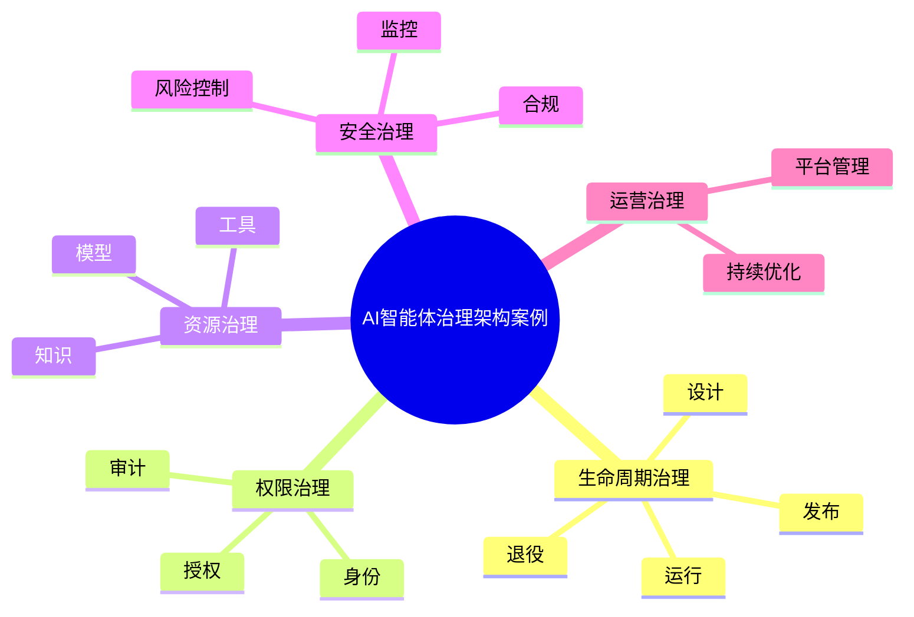

# 79-ai-agent-governance-case.md（AI智能体治理架构案例）

> 本文用于系统架构设计师考试案例分析专题 V2 复习。
>
> 本篇重点整理 AI Agent Governance（智能体治理）架构设计案例，包括 Agent 生命周期管理、注册中心、身份管理、权限控制、工具治理、模型治理、提示词治理、知识治理、运行监控、审计管理、安全治理以及企业级智能体运营体系。

---

# 目录

1. AI Agent Governance案例概述
2. Agent治理基本概念
3. 企业Agent治理挑战案例
4. Agent治理总体架构案例
5. Agent生命周期管理案例
6. Agent注册中心案例
7. Agent身份管理案例
8. Agent权限治理案例
9. Agent工具治理案例
10. Agent模型治理案例
11. Agent提示词治理案例
12. Agent知识治理案例
13. Agent运行监控案例
14. Agent审计管理案例
15. Agent风险管理案例
16. Agent合规治理案例
17. Agent安全策略案例
18. Agent运营平台案例
19. 企业级Agent治理体系案例
20. Agent Governance建设方法案例
21. Agent治理演进案例
22. 案例分析答题模板
23. 高频考点
24. 易错点
25. Mermaid知识结构图
26. 本节小结

---

# 1. AI Agent Governance案例概述

Agent Governance：

> 对企业智能体从设计、部署、运行到退出全过程进行管理和控制。

Agent治理对象：

- Agent；
- 模型；
- 工具；
- 知识；
- 数据；
- 用户。

---

# 2. Agent治理基本概念

治理目标：

- 保证Agent可靠运行；
- 控制安全风险；
- 保护企业数据；
- 满足合规要求。

核心：

> 让Agent具备能力，同时保持可控。

---

# 3. 企业Agent治理挑战案例

常见问题：

- Agent数量快速增长；
- 权限难控制；
- 行为无法追踪；
- 输出质量不稳定；
- 缺少统一管理平台。

---

# 4. Agent治理总体架构案例

```text
企业治理层

↓

Agent管理平台

↓

Agent运行控制层

↓

模型与工具层

↓

数据与知识资源层
```

---

# 5. Agent生命周期管理案例

生命周期：

```text
设计

↓

开发

↓

测试

↓

发布

↓

运行

↓

优化

↓

退役
```

管理内容：

- 版本；
- 配置；
- 状态；
- 责任人。

---

# 6. Agent注册中心案例

Agent Registry：

管理：

- Agent名称；
- Agent能力；
- Agent版本；
- Agent负责人。

作用：

> 建立企业Agent资产目录。

---

# 7. Agent身份管理案例

管理：

- Agent身份；
- 用户身份；
- 服务身份。

采用：

- IAM；
- 零信任。

---

# 8. Agent权限治理案例

原则：

> 最小权限原则。

控制：

- 数据访问权限；
- 工具调用权限；
- 操作执行权限。

---

# 9. Agent工具治理案例

管理：

- MCP工具；
- API；
- 企业服务。

控制：

- 工具注册；
- 工具授权；
- 工具审计。

---

# 10. Agent模型治理案例

管理：

- 基础模型；
- 微调模型；
- 模型版本。

包括：

- 模型评估；
- 模型切换；
- 模型管理。

---

# 11. Agent提示词治理案例

Prompt治理：

管理：

- Prompt版本；
- Prompt模板；
- Prompt测试。

目标：

- 提升稳定性；
- 提升复用能力。

---

# 12. Agent知识治理案例

管理：

- 知识库；
- RAG数据；
- 知识版本。

保证：

- 数据准确；
- 来源可靠。

---

# 13. Agent运行监控案例

监控：

- 调用次数；
- 响应时间；
- Token消耗；
- 错误率。

---

# 14. Agent审计管理案例

记录：

- 用户请求；
- Agent决策；
- 工具调用；
- 输出结果。

作用：

- 问题追踪；
- 合规检查。

---

# 15. Agent风险管理案例

风险：

- Prompt攻击；
- 数据泄露；
- 越权访问；
- 错误执行。

措施：

- 风险检测；
- 安全策略；
- 人工审核。

---

# 16. Agent合规治理案例

包括：

- 数据合规；
- 隐私保护；
- 行业规范。

---

# 17. Agent安全策略案例

```text
身份认证

↓

权限控制

↓

行为监控

↓

安全审计
```

---

# 18. Agent运营平台案例

平台能力：

- Agent管理；
- 模型管理；
- 工具管理；
- 监控分析；
- 审计管理。

架构：

```text
业务用户

↓

Agent平台

↓

模型/工具/知识

↓

企业系统
```

---

# 19. 企业级Agent治理体系案例

体系：

```text
战略治理

+

技术治理

+

安全治理

+

运营治理

+

合规治理
```

---

# 20. Agent Governance建设方法案例

步骤：

```text
治理目标确定

↓

制度建设

↓

平台建设

↓

安全控制

↓

运营优化
```

---

# 21. Agent治理演进案例

```text
单Agent应用

↓

Agent平台

↓

Agent治理体系

↓

企业智能体生态
```

---

# 案例分析答题模板

## 企业Agent数量快速增加

> 建设Agent治理平台，实现Agent注册、生命周期管理和统一运营。

## Agent权限风险较高

> 采用身份认证、最小权限控制和操作审计机制保障Agent安全运行。

## Agent行为无法追踪

> 建立运行监控和审计体系，实现Agent全过程可观察。

## 企业需要规模化应用AI

> 建立统一Agent治理体系，实现智能体的规范化管理。

---

# 高频考点

重点掌握：

1. Agent治理总体架构；
2. 生命周期管理；
3. 身份与权限控制；
4. 工具治理；
5. 运行监控；
6. 审计体系；
7. 企业级治理平台。

---

# 易错点

|易错知识|正确理解|
|-|-|
|Agent只需要开发管理|企业环境需要全生命周期治理|
|权限越大能力越强越好|应遵循最小权限原则|
|Agent运行无需审计|企业应用必须可追踪|
|治理只关注模型|还包括工具、知识、数据和流程|

---

# Mermaid知识结构图



---

# 本节小结

AI智能体治理架构案例核心：

> 通过生命周期管理、权限控制、安全审计和运营治理，实现企业Agent规模化、安全化、规范化运行。

案例分析重点：

- 理解Agent治理体系；
- 掌握生命周期管理；
- 理解权限和审计机制；
- 掌握企业级Agent运营治理方法。
