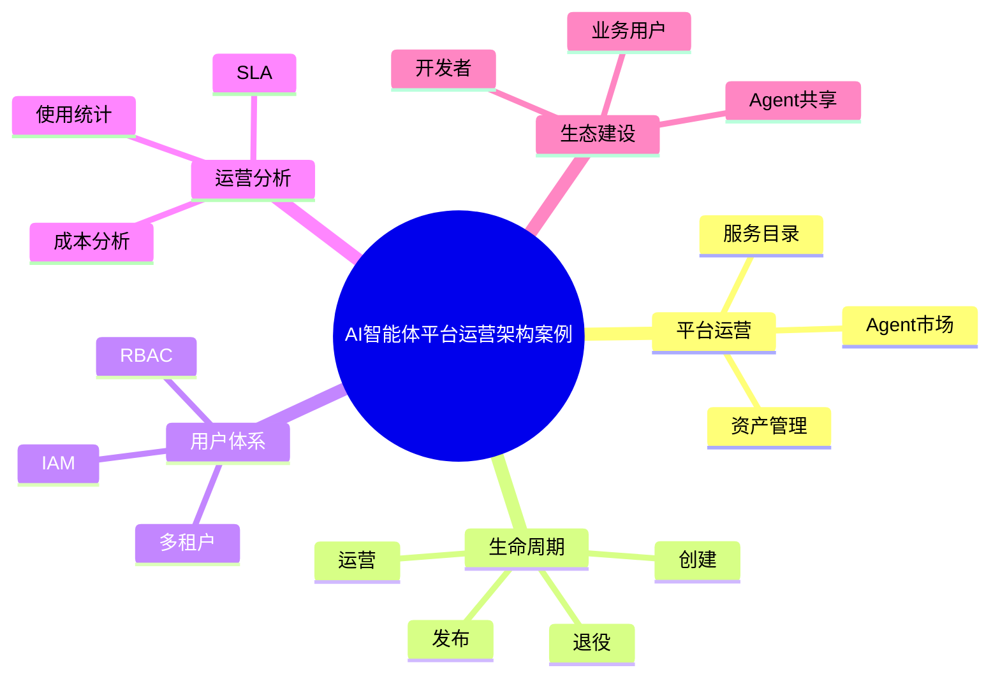

# 80-ai-agent-platform-operation-case.md（AI智能体平台运营架构案例）

> 本文用于系统架构设计师考试案例分析专题 V2 复习。
>
> 本篇重点整理 AI Agent Platform Operation（智能体平台运营）架构设计案例，包括 Agent 服务目录、Agent市场、资产管理、生命周期运营、多租户管理、用户管理、使用分析、成本运营、SLA管理以及企业智能体生态建设。

---

# 目录

1. AI智能体平台运营案例概述
2. Agent平台运营基本概念
3. 企业Agent运营挑战案例
4. Agent平台运营总体架构案例
5. Agent服务目录案例
6. Agent市场案例
7. Agent资产管理案例
8. Agent生命周期运营案例
9. Agent多租户架构案例
10. Agent用户管理案例
11. Agent服务运营案例
12. Agent使用分析案例
13. Agent成本运营案例
14. Agent资源调度案例
15. Agent SLA管理案例
16. Agent生态建设案例
17. Agent运营监控案例
18. Agent平台开放能力案例
19. 企业级Agent运营平台案例
20. Agent平台运营建设方法案例
21. Agent平台运营演进案例
22. 案例分析答题模板
23. 高频考点
24. 易错点
25. Mermaid知识结构图
26. 本节小结

---

# 1. AI智能体平台运营案例概述

Agent平台运营：

> 对企业智能体平台进行持续管理、服务和优化，使Agent能够规模化应用。

传统应用：

```text
开发

↓

部署

↓

使用
```

Agent平台：

```text
创建

↓

发布

↓

运营

↓

分析

↓

优化

↓

迭代
```

---

# 2. Agent平台运营基本概念

运营目标：

- 提升Agent利用率；
- 降低建设成本；
- 提高服务质量；
- 促进智能体生态。

---

# 3. 企业Agent运营挑战案例

常见问题：

- Agent数量快速增长；
- 重复建设严重；
- 使用情况无法统计；
- 模型成本不可控；
- 缺少共享机制。

---

# 4. Agent平台运营总体架构案例

```text
企业用户

↓

Agent运营门户

↓

Agent平台运营层

↓

Agent服务管理层

↓

模型/工具/知识基础设施
```

---

# 5. Agent服务目录案例

Service Catalog：

管理：

- Agent列表；
- 服务能力；
- 使用说明；
- 服务负责人。

作用：

> 让企业用户快速发现和使用Agent。

---

# 6. Agent市场案例

Agent Marketplace：

类似：

> 企业内部智能体应用商店。

提供：

- Agent发布；
- Agent搜索；
- Agent评价；
- Agent订阅。

---

# 7. Agent资产管理案例

管理：

- Agent配置；
- Prompt；
- Workflow；
- 工具；
- 知识库。

形成：

> 企业Agent资产库。

---

# 8. Agent生命周期运营案例

生命周期：

```text
创建

↓

测试

↓

上线

↓

运营

↓

升级

↓

下线
```

运营关注：

- 使用情况；
- 版本变化；
- 用户反馈。

---

# 9. Agent多租户架构案例

支持：

- 多部门；
- 多团队；
- 多业务。

架构：

```text
企业平台

↓

租户A

↓

租户B

↓

租户C
```

---

# 10. Agent用户管理案例

管理：

- 用户身份；
- 用户角色；
- 使用权限。

结合：

- IAM；
- RBAC。

---

# 11. Agent服务运营案例

运营指标：

- 调用次数；
- 活跃用户；
- 成功率；
- 响应时间。

---

# 12. Agent使用分析案例

分析：

- 热门Agent；
- 用户行为；
- 使用趋势。

用于：

- 优化资源配置。

---

# 13. Agent成本运营案例

关注：

- Token消耗；
- 模型费用；
- GPU资源。

结合：

- FinOps。

---

# 14. Agent资源调度案例

管理：

- 模型资源；
- 推理资源；
- 计算资源。

目标：

提高：

- 利用率；
- 响应速度。

---

# 15. Agent SLA管理案例

指标：

- 可用性；
- 响应时间；
- 服务质量。

例如：

```text
99.9%服务可用性
```

---

# 16. Agent生态建设案例

生态包括：

- 开发者；
- 业务人员；
- Agent供应商。

形成：

```text
开发

↓

共享

↓

复用

↓

创新
```

---

# 17. Agent运营监控案例

监控：

- 调用量；
- 错误率；
- 性能；
- 成本。

---

# 18. Agent平台开放能力案例

提供：

- API；
- SDK；
- MCP接口；
- 插件机制。

支持：

- 第三方扩展。

---

# 19. 企业级Agent运营平台案例

平台能力：

```text
Agent管理

+

服务目录

+

市场运营

+

数据分析

+

成本管理

+

治理审计
```

---

# 20. Agent平台运营建设方法案例

步骤：

```text
平台规划

↓

能力建设

↓

Agent接入

↓

运营体系建立

↓

数据分析优化
```

---

# 21. Agent平台运营演进案例

```text
单个Agent

↓

Agent平台

↓

Agent市场

↓

企业智能体生态
```

---

# 案例分析答题模板

## 企业Agent数量快速增加

> 建设统一Agent运营平台，通过服务目录、资产管理和生命周期管理实现规模化运营。

## Agent重复建设严重

> 建立Agent市场和共享机制，提高智能体复用能力。

## AI成本无法控制

> 引入成本运营体系，通过资源监控和FinOps方法优化模型使用成本。

## 企业需要推广AI应用

> 建立Agent生态运营体系，促进业务人员和开发人员共同参与。

---

# 高频考点

重点掌握：

1. Agent平台运营架构；
2. Agent市场；
3. 服务目录；
4. 生命周期运营；
5. 多租户管理；
6. 成本运营；
7. 企业智能体生态。

---

# 易错点

|易错知识|正确理解|
|-|-|
|Agent开发完成即可结束|企业应用需要持续运营|
|Agent越多越好|需要统一管理和复用|
|运营只关注使用次数|还需要质量、成本和SLA|
|平台只负责部署|还需要生态和治理能力|

---

# Mermaid知识结构图



---

# 本节小结

AI智能体平台运营架构案例核心：

> 通过统一平台、服务目录、生命周期管理和运营分析，实现企业智能体规模化推广和持续优化。

案例分析重点：

- 理解Agent平台运营体系；
- 掌握Agent市场和资产管理；
- 理解成本和SLA运营；
- 掌握企业智能体生态建设方法。
