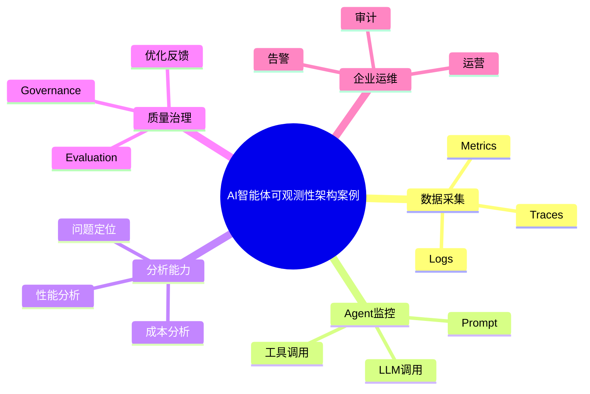

# 81-ai-agent-observability-case.md（AI智能体可观测性架构案例）

> 本文用于系统架构设计师考试案例分析专题 V2 复习。
>
> 本篇重点整理 AI Agent Observability（智能体可观测性）架构设计案例，包括 Agent Trace 链路追踪、Prompt监控、LLM调用监控、Token成本分析、工具调用监控、多Agent链路分析、日志管理、指标体系以及企业AI运维体系建设。

---

# 目录

1. AI Agent Observability案例概述
2. Agent可观测性基本概念
3. 企业Agent运维挑战案例
4. Agent可观测总体架构案例
5. Agent Trace链路追踪案例
6. Agent执行过程监控案例
7. Prompt监控案例
8. LLM调用监控案例
9. Token成本分析案例
10. Agent性能监控案例
11. 工具调用监控案例
12. 多Agent链路分析案例
13. Agent日志管理案例
14. Agent指标体系案例
15. Agent异常检测案例
16. Agent问题定位案例
17. Agent可观测与Evaluation结合案例
18. Agent可观测与治理结合案例
19. 企业级Agent运维平台案例
20. Agent Observability建设方法案例
21. Agent可观测演进案例
22. 案例分析答题模板
23. 高频考点
24. 易错点
25. Mermaid知识结构图
26. 本节小结

---

# 1. AI Agent Observability案例概述

Agent Observability：

> 通过日志、指标、链路追踪等技术，对智能体运行过程进行全面感知和分析。

传统应用：

```text
请求

↓

服务

↓

响应
```

Agent：

```text
用户请求

↓

Agent规划

↓

模型推理

↓

工具调用

↓

知识检索

↓

结果生成

↓

反馈优化
```

---

# 2. Agent可观测性基本概念

三大核心：

## Metrics（指标）

关注：

- 调用次数；
- 延迟；
- 成功率；
- 成本。

## Logs（日志）

记录：

- 输入；
- 输出；
- 错误；
- 工具调用。

## Traces（链路）

追踪：

- Agent步骤；
- 子任务；
- 服务调用。

---

# 3. 企业Agent运维挑战案例

常见问题：

- Agent执行过程不可见；
- 多Agent调用链复杂；
- Token成本无法统计；
- 问题定位困难。

---

# 4. Agent可观测总体架构案例

```text
用户

↓

Agent应用

↓

Observability采集层

↓

分析平台

↓

监控告警

↓

优化治理
```

---

# 5. Agent Trace链路追踪案例

Trace记录：

- 用户请求；
- Agent规划；
- 模型调用；
- 工具调用；
- 最终输出。

示例：

```text
用户问题

↓

Agent Planner

↓

LLM

↓

RAG

↓

工具API

↓

结果生成
```

---

# 6. Agent执行过程监控案例

监控：

- 当前任务；
- 执行步骤；
- 状态变化。

---

# 7. Prompt监控案例

分析：

- Prompt版本；
- Prompt效果；
- Prompt变化。

目标：

提升：

- 稳定性；
- 准确性。

---

# 8. LLM调用监控案例

监控：

- 模型版本；
- 调用次数；
- 响应时间；
- 输出质量。

---

# 9. Token成本分析案例

统计：

- 输入Token；
- 输出Token；
- 单次成本；
- 用户成本。

结合：

- FinOps。

---

# 10. Agent性能监控案例

指标：

- 响应时间；
- 吞吐量；
- 错误率；
- 并发能力。

---

# 11. 工具调用监控案例

监控：

- 调用了什么工具；
- 参数是否正确；
- 返回是否成功。

---

# 12. 多Agent链路分析案例

分析：

```text
主Agent

↓

任务Agent

↓

分析Agent

↓

执行Agent
```

关注：

- 调用关系；
- 执行效率。

---

# 13. Agent日志管理案例

日志内容：

- 用户请求；
- Agent决策；
- 工具调用；
- 错误信息。

---

# 14. Agent指标体系案例

指标：

## 业务指标

- 任务成功率；
- 用户满意度。

## 技术指标

- 延迟；
- 错误率。

## 成本指标

- Token；
- 模型费用。

---

# 15. Agent异常检测案例

检测：

- 调用失败；
- 输出异常；
- 成本异常增长。

---

# 16. Agent问题定位案例

流程：

```text
发现异常

↓

查看Trace

↓

分析日志

↓

定位模型/工具/流程问题

↓

优化
```

---

# 17. Agent可观测与Evaluation结合案例

结合：

```text
Observability

↓

运行数据

↓

Evaluation

↓

质量优化
```

---

# 18. Agent可观测与治理结合案例

结合：

- 审计；
- 风险控制；
- 合规检查。

---

# 19. 企业级Agent运维平台案例

平台能力：

```text
链路追踪

+

日志分析

+

指标监控

+

成本分析

+

告警管理
```

---

# 20. Agent Observability建设方法案例

步骤：

```text
确定指标

↓

建设采集体系

↓

建立分析平台

↓

配置告警

↓

持续优化
```

---

# 21. Agent可观测演进案例

```text
日志监控

↓

应用监控

↓

云原生可观测

↓

LLM Observability

↓

Agent Observability
```

---

# 案例分析答题模板

## Agent运行过程不可见

> 建立Agent可观测体系，通过日志、指标和链路追踪实现全过程监控。

## 多Agent问题难定位

> 采用Trace链路追踪技术，分析Agent之间调用关系。

## AI成本无法控制

> 建立Token和模型调用监控体系，实现成本分析。

## Agent质量持续优化

> 将可观测数据与Evaluation结合，实现闭环优化。

---

# 高频考点

重点掌握：

1. Agent可观测总体架构；
2. Trace链路追踪；
3. Metrics指标体系；
4. Logs日志管理；
5. Token成本分析；
6. 多Agent调用分析；
7. Observability与Evaluation结合。

---

# 易错点

|易错知识|正确理解|
|-|-|
|Agent只需要输出结果监控|需要监控完整执行过程|
|普通日志即可解决问题|复杂Agent需要Trace链路|
|只关注模型性能|还需要关注工具、知识和流程|
|可观测只是运维问题|同时支撑治理和优化|

---

# Mermaid知识结构图



---

# 本节小结

AI智能体可观测性架构案例核心：

> 通过指标、日志和链路追踪，对Agent运行全过程进行观察和分析，实现问题定位、成本控制和持续优化。

案例分析重点：

- 理解Agent Observability架构；
- 掌握Trace链路追踪；
- 理解指标、日志、链路三大体系；
- 掌握可观测与评估、治理结合方法。
