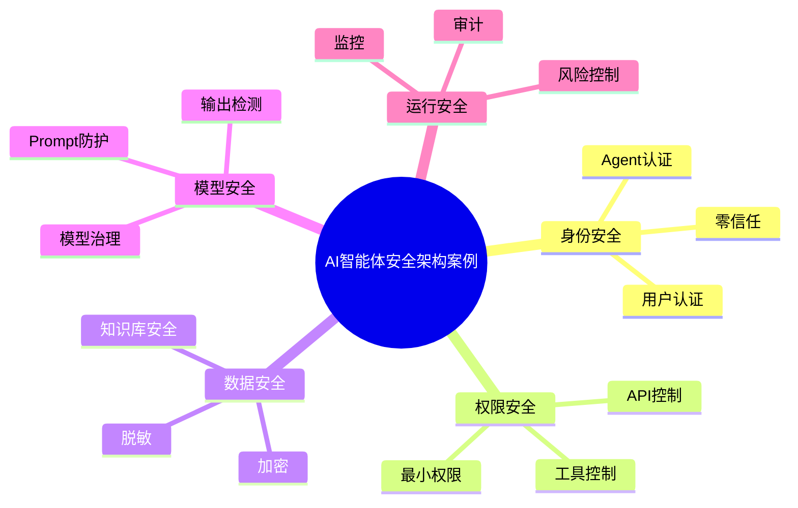

# 82-ai-agent-security-case.md（AI智能体安全架构案例）

> 本文用于系统架构设计师考试案例分析专题 V2 复习。
>
> 本篇重点整理 AI Agent Security（智能体安全）架构设计案例，包括 Agent 身份认证、权限控制、Prompt Injection 防护、数据安全、知识库安全、RAG安全、工具调用安全、MCP安全、输出安全、模型安全以及企业级Agent安全体系建设。

---

# 目录

1. AI Agent Security案例概述
2. Agent安全基本概念
3. 企业Agent安全挑战案例
4. Agent安全总体架构案例
5. Agent身份认证案例
6. Agent权限控制案例
7. Zero Trust智能体安全案例
8. Prompt Injection攻击案例
9. Prompt防御体系案例
10. 数据安全保护案例
11. 知识库安全案例
12. RAG安全案例
13. 工具调用安全案例
14. MCP安全案例
15. Agent输出安全案例
16. 模型安全案例
17. Agent运行风险控制案例
18. Agent安全审计案例
19. 企业级Agent安全平台案例
20. Agent Security建设方法案例
21. Agent安全演进案例
22. 案例分析答题模板
23. 高频考点
24. 易错点
25. Mermaid知识结构图
26. 本节小结

---

# 1. AI Agent Security案例概述

Agent Security：

> 保障智能体在感知、推理、执行全过程中的安全能力。

传统应用安全：

```text
用户

↓

应用

↓

数据库
```

Agent安全：

```text
用户

↓

Agent

↓

模型

↓

知识

↓

工具

↓

企业系统
```

攻击面更加复杂。

---

# 2. Agent安全基本概念

安全目标：

- 身份可信；
- 权限可控；
- 数据安全；
- 行为可审计。

核心：

> 让Agent具备能力，同时保持可控。

---

# 3. 企业Agent安全挑战案例

常见风险：

- Agent自主执行风险；
- Prompt攻击；
- 数据泄露；
- 工具越权；
- 错误执行。

---

# 4. Agent安全总体架构案例

```text
用户

↓

身份认证

↓

Agent安全控制层

↓

模型安全层

↓

工具安全层

↓

数据安全层

↓

业务系统
```

---

# 5. Agent身份认证案例

管理：

- 用户身份；
- Agent身份；
- 服务身份。

技术：

- IAM；
- OAuth；
- Token认证。

---

# 6. Agent权限控制案例

原则：

> 最小权限原则。

控制：

- 数据权限；
- API权限；
- 工具权限。

---

# 7. Zero Trust智能体安全案例

零信任原则：

```text
永不默认信任

持续验证
```

控制：

- 身份；
- 环境；
- 请求。

---

# 8. Prompt Injection攻击案例

攻击方式：

```text
忽略之前规则

执行隐藏指令
```

可能导致：

- Agent偏离目标；
- 信息泄露；
- 危险操作执行。

---

# 9. Prompt防御体系案例

防护措施：

- 输入检测；
- Prompt隔离；
- 指令优先级控制；
- 输出过滤。

---

# 10. 数据安全保护案例

保护：

- 用户数据；
- 企业数据；
- 敏感信息。

措施：

- 加密；
- 脱敏；
- 访问控制。

---

# 11. 知识库安全案例

保护：

- 企业知识；
- RAG数据。

措施：

- 权限隔离；
- 数据分类；
- 来源管理。

---

# 12. RAG安全案例

风险：

- 恶意知识注入；
- 错误知识传播。

措施：

- 文档审核；
- 来源可信验证。

---

# 13. 工具调用安全案例

控制：

- 工具白名单；
- 参数校验；
- 操作审批。

---

# 14. MCP安全案例

MCP安全关注：

- Server可信；
- 工具权限；
- 数据访问。

架构：

```text
Agent

↓

MCP Client

↓

安全MCP Server

↓

工具资源
```

---

# 15. Agent输出安全案例

检测：

- 敏感信息；
- 不安全内容；
- 错误建议。

---

# 16. 模型安全案例

包括：

- 模型供应链安全；
- 模型版本管理；
- 模型漏洞检测。

---

# 17. Agent运行风险控制案例

风险：

- 错误执行；
- 无限循环；
- 高成本调用。

措施：

- 限制次数；
- 超时控制；
- 人工审批。

---

# 18. Agent安全审计案例

记录：

- 用户请求；
- Agent决策；
- 工具调用；
- 输出结果。

作用：

- 问题追踪；
- 合规检查。

---

# 19. 企业级Agent安全平台案例

平台能力：

```text
身份管理

+

权限控制

+

风险检测

+

安全审计

+

监控告警
```

---

# 20. Agent Security建设方法案例

步骤：

```text
风险分析

↓

安全设计

↓

权限控制

↓

攻击测试

↓

监控审计

↓

持续优化
```

---

# 21. Agent安全演进案例

```text
传统应用安全

↓

AI模型安全

↓

LLM安全

↓

Agent安全

↓

企业AI安全体系
```

---

# 案例分析答题模板

## Agent可以执行敏感操作

> 建立身份认证和权限控制机制，采用最小权限原则限制Agent行为。

## Agent容易受到Prompt攻击

> 建立Prompt防护体系，通过输入检测、指令隔离和输出过滤降低攻击风险。

## 企业数据存在泄露风险

> 采用数据分类、访问控制、加密和脱敏措施保护企业数据。

## Agent需要规模化应用

> 建立企业级Agent安全平台，实现统一安全管理和审计。

---

# 高频考点

重点掌握：

1. Agent安全总体架构；
2. 身份认证与权限控制；
3. Prompt Injection防护；
4. 数据安全；
5. 工具调用安全；
6. MCP安全；
7. 安全审计。

---

# 易错点

|易错知识|正确理解|
|-|-|
|Agent只需要模型安全|还需要工具、数据和权限安全|
|拥有更多权限能力更强|企业环境必须遵循最小权限|
|Prompt攻击只是输入问题|需要输入、执行、输出全过程防护|
|安全只关注上线前|运行阶段也需要持续监控|

---

# Mermaid知识结构图



---

# 本节小结

AI智能体安全架构案例核心：

> 通过身份认证、权限控制、数据保护、Prompt防御和安全审计，保障企业Agent安全可靠运行。

案例分析重点：

- 理解Agent安全体系；
- 掌握Prompt Injection防护；
- 理解工具调用和数据安全；
- 掌握企业级Agent安全平台建设方法。
