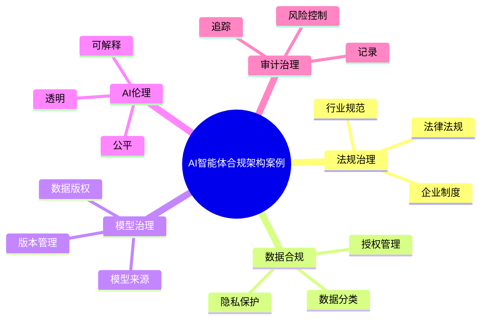

# 83-ai-agent-compliance-case.md（AI智能体合规架构案例）

> 本文用于系统架构设计师考试案例分析专题 V2 复习。
>
> 本篇重点整理 AI Agent Compliance（智能体合规）架构设计案例，包括 AI 法规遵循、数据合规、隐私保护、个人信息保护、模型合规、训练数据治理、AI伦理治理、内容安全、责任管理以及企业AI合规体系建设。

---

# 目录

1. AI Agent Compliance案例概述
2. Agent合规基本概念
3. 企业Agent合规挑战案例
4. Agent合规总体架构案例
5. AI法规遵循案例
6. 数据合规管理案例
7. 隐私保护案例
8. 个人信息保护案例
9. 数据跨境合规案例
10. 模型合规案例
11. 训练数据合规案例
12. AI伦理治理案例
13. 可解释性治理案例
14. 内容安全合规案例
15. Agent责任管理案例
16. 合规审计案例
17. Agent风险分级案例
18. 企业AI合规平台案例
19. Agent Compliance建设方法案例
20. Agent合规运营案例
21. Agent合规演进案例
22. 案例分析答题模板
23. 高频考点
24. 易错点
25. Mermaid知识结构图
26. 本节小结

---

# 1. AI Agent Compliance案例概述

Agent Compliance：

> 对智能体设计、开发、部署、运行全过程进行法律、规范和制度约束。

Agent系统：

```text
用户

↓

Agent

↓

模型

↓

知识

↓

数据

↓

工具

↓

业务系统
```

---

# 2. Agent合规基本概念

合规目标：

- 数据合法使用；
- 输出内容安全；
- 模型来源可靠；
- 决策过程透明。

核心：

> AI能力发展必须建立在合规基础之上。

---

# 3. 企业Agent合规挑战案例

常见问题：

- 数据来源不明确；
- 用户隐私风险；
- 输出责任不清；
- 模型不可解释。

---

# 4. Agent合规总体架构案例

```text
企业合规治理层

↓

AI合规管理平台

↓

Agent运行控制层

↓

模型/知识/数据治理层

↓

业务应用层
```

---

# 5. AI法规遵循案例

关注：

- 法律法规；
- 行业规范；
- 企业制度。

措施：

- 合规评估；
- 风险审查；
- 使用规范。

---

# 6. 数据合规管理案例

管理：

- 数据来源；
- 数据权限；
- 数据生命周期。

包括：

- 数据分类；
- 数据分级；
- 数据授权。

---

# 7. 隐私保护案例

保护：

- 用户身份信息；
- 业务数据；
- 敏感信息。

技术：

- 数据脱敏；
- 加密；
- 匿名化。

---

# 8. 个人信息保护案例

原则：

> 只收集业务需要的数据。

措施：

- 用户授权；
- 最小化采集；
- 用途限定。

---

# 9. 数据跨境合规案例

关注：

- 数据存储位置；
- 数据传输；
- 跨境访问。

措施：

- 合规评估；
- 权限控制；
- 审批流程。

---

# 10. 模型合规案例

管理：

- 模型来源；
- 模型版本；
- 模型授权。

---

# 11. 训练数据合规案例

关注：

- 数据版权；
- 数据授权；
- 数据质量。

措施：

- 数据审核；
- 来源追踪；
- 数据治理。

---

# 12. AI伦理治理案例

关注：

- 公平性；
- 透明性；
- 可控性。

避免：

- 偏见；
- 歧视；
- 不公平决策。

---

# 13. 可解释性治理案例

目标：

> 让用户理解Agent为什么产生该结果。

方式：

- 决策记录；
- 过程分析；
- 结果说明。

---

# 14. 内容安全合规案例

检测：

- 违法内容；
- 虚假信息；
- 有害输出。

措施：

- 内容审核；
- 输出过滤。

---

# 15. Agent责任管理案例

明确：

- 使用部门；
- 开发团队；
- 运营负责人。

建立：

> Agent责任主体体系。

---

# 16. 合规审计案例

记录：

- 用户请求；
- Agent行为；
- 模型调用；
- 数据访问。

作用：

- 责任追踪；
- 合规检查。

---

# 17. Agent风险分级案例

```text
低风险Agent

↓

中风险Agent

↓

高风险Agent
```

不同等级：

- 不同审批；
- 不同监控；
- 不同安全要求。

---

# 18. 企业AI合规平台案例

平台能力：

```text
合规评估

+

数据治理

+

模型管理

+

审计管理

+

风险监控
```

---

# 19. Agent Compliance建设方法案例

步骤：

```text
法规分析

↓

风险识别

↓

制度建设

↓

技术控制

↓

审计检查

↓

持续优化
```

---

# 20. Agent合规运营案例

运营：

- 定期评估；
- 合规检查；
- 风险复盘；
- 制度更新。

---

# 21. Agent合规演进案例

```text
数据合规

↓

AI治理

↓

模型治理

↓

Agent治理

↓

企业AI合规体系
```

---

# 案例分析答题模板

## 企业使用Agent处理用户数据

> 建立数据合规管理体系，通过数据分类、授权控制和隐私保护保障数据安全。

## AI输出存在法律风险

> 建立内容安全审核和责任管理机制，降低AI生成内容风险。

## 企业大规模部署AI

> 建立AI合规治理平台，实现模型、数据和Agent全过程监管。

## Agent需要满足监管要求

> 建立风险分级、审计留痕和持续评估机制，实现合规运营。

---

# 高频考点

重点掌握：

1. Agent合规总体架构；
2. 数据与隐私保护；
3. 模型与训练数据合规；
4. AI伦理治理；
5. 可解释性；
6. 合规审计；
7. 风险分级。

---

# 易错点

|易错知识|正确理解|
|-|-|
|Agent只关注技术能力|企业应用必须满足合规要求|
|数据越多模型越好|数据必须合法、合规|
|输出错误只是技术问题|涉及责任和治理问题|
|合规只在上线前检查|需要持续运营审计|

---

# Mermaid知识结构图



---

# 本节小结

AI智能体合规架构案例核心：

> 通过法规遵循、数据治理、隐私保护、模型治理和审计机制，实现企业Agent安全、可信、合规运行。

案例分析重点：

- 理解Agent合规体系；
- 掌握数据和隐私保护方法；
- 理解模型与训练数据治理；
- 掌握企业AI合规平台建设方法。
