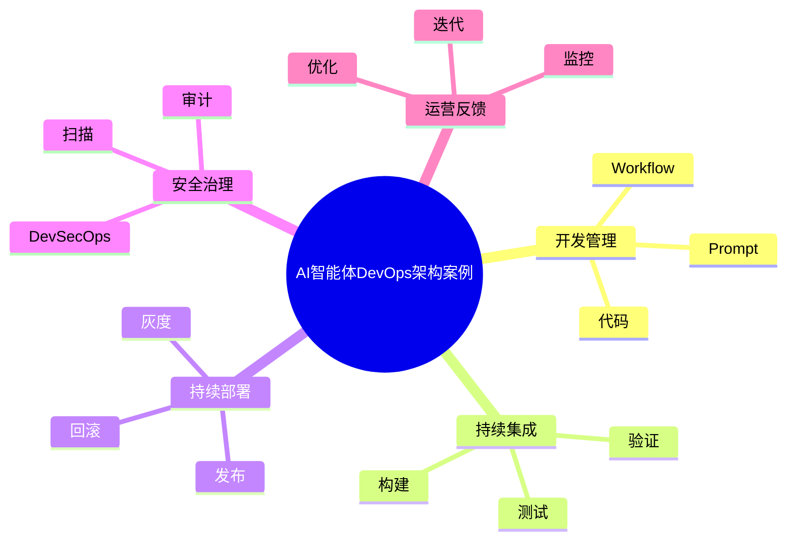

# 85-ai-agent-devops-case.md（AI智能体DevOps架构案例）

> 本文用于系统架构设计师考试案例分析专题 V2 复习。
>
> 本篇重点整理 AI Agent DevOps（智能体DevOps）架构设计案例，包括 CI/CD 流水线、代码管理、Prompt版本管理、Workflow管理、模型版本管理、自动化测试、持续部署、环境管理、发布策略、安全集成以及企业Agent工程交付体系建设。

---

# 目录

1. AI Agent DevOps案例概述
2. Agent DevOps基本概念
3. 企业Agent交付挑战案例
4. Agent DevOps总体架构案例
5. Agent开发流程案例
6. Agent CI/CD流水线案例
7. Agent代码管理案例
8. Prompt版本管理案例
9. Workflow版本管理案例
10. 模型版本管理案例
11. 自动化测试案例
12. Agent持续集成案例
13. Agent持续部署案例
14. 环境管理案例
15. 发布策略案例
16. Agent DevSecOps安全集成案例
17. Agent监控反馈案例
18. Agent回滚机制案例
19. 企业级Agent DevOps平台案例
20. Agent DevOps建设方法案例
21. Agent DevOps演进案例
22. 案例分析答题模板
23. 高频考点
24. 易错点
25. Mermaid知识结构图
26. 本节小结

---

# 1. AI Agent DevOps案例概述

Agent DevOps：

> 将传统DevOps理念应用于智能体开发、测试、部署和运营全过程。

传统DevOps：

```text
代码

↓

构建

↓

测试

↓

部署

↓

运行
```

Agent DevOps：

```text
代码

↓

Prompt

↓

Workflow

↓

模型

↓

知识

↓

测试

↓

部署

↓

监控
```

---

# 2. Agent DevOps基本概念

核心目标：

- 提升Agent交付效率；
- 降低上线风险；
- 实现持续迭代。

管理对象：

- Agent代码；
- Prompt；
- Workflow；
- 模型；
- 知识库；
- 工具。

---

# 3. 企业Agent交付挑战案例

常见问题：

- 发布流程复杂；
- 版本不可控；
- 测试覆盖不足；
- 生产环境风险高。

---

# 4. Agent DevOps总体架构案例

```text
需求

↓

开发平台

↓

代码仓库

↓

CI/CD流水线

↓

测试平台

↓

部署平台

↓

生产Agent

↓

监控反馈
```

---

# 5. Agent开发流程案例

流程：

```text
需求分析

↓

Agent设计

↓

Prompt开发

↓

Workflow设计

↓

工具接入

↓

测试验证
```

---

# 6. Agent CI/CD流水线案例

流程：

```text
代码提交

↓

自动构建

↓

自动测试

↓

自动部署

↓

运行验证
```

---

# 7. Agent代码管理案例

管理：

- Agent代码；
- 工具代码；
- 配置文件。

采用：

- Git；
- 分支管理。

---

# 8. Prompt版本管理案例

管理：

- Prompt模板；
- Prompt版本；
- Prompt效果。

支持：

- 对比；
- 回滚。

---

# 9. Workflow版本管理案例

管理：

- Agent流程；
- 节点配置；
- 调度逻辑。

---

# 10. 模型版本管理案例

管理：

- 基础模型；
- 微调模型；
- 模型参数。

支持：

- 模型切换；
- 灰度验证。

---

# 11. 自动化测试案例

测试：

## 功能测试

验证任务完成能力。

## 效果测试

验证输出质量。

## 安全测试

验证攻击防护。

## 性能测试

验证响应能力。

---

# 12. Agent持续集成案例

目标：

快速发现：

- 代码问题；
- Prompt问题；
- 配置问题。

---

# 13. Agent持续部署案例

策略：

- 自动部署；
- 审批部署；
- 灰度发布。

---

# 14. 环境管理案例

环境：

```text
开发环境

↓

测试环境

↓

预生产环境

↓

生产环境
```

保证：

- 环境一致性。

---

# 15. 发布策略案例

包括：

## 蓝绿发布

两个生产环境切换。

## 灰度发布

部分用户验证。

## 金丝雀发布

小范围试运行。

---

# 16. Agent DevSecOps安全集成案例

集成：

- 安全扫描；
- 权限检查；
- 漏洞检测。

实现：

> 安全左移。

---

# 17. Agent监控反馈案例

监控：

- 成功率；
- 延迟；
- 成本；
- 用户反馈。

用于：

持续优化Agent效果。

---

# 18. Agent回滚机制案例

原因：

- 模型效果下降；
- Prompt异常；
- 发布失败。

措施：

- 版本回滚；
- 配置恢复。

---

# 19. 企业级Agent DevOps平台案例

平台能力：

```text
代码管理

+

Prompt管理

+

模型管理

+

自动测试

+

自动部署

+

监控分析
```

---

# 20. Agent DevOps建设方法案例

步骤：

```text
流程标准化

↓

工具平台建设

↓

自动化流水线

↓

安全集成

↓

持续优化
```

---

# 21. Agent DevOps演进案例

```text
DevOps

↓

MLOps

↓

LLMOps

↓

AgentOps

↓

AI原生工程体系
```

---

# 案例分析答题模板

## Agent发布效率低

> 建立Agent DevOps流水线，实现自动构建、测试和部署。

## Agent版本难管理

> 建立代码、Prompt、模型和Workflow统一版本管理机制。

## Agent上线风险高

> 建立自动化测试和灰度发布机制，降低生产风险。

## 企业规模化应用Agent

> 建设Agent DevOps平台，实现智能体工程化交付。

---

# 高频考点

重点掌握：

1. Agent DevOps总体架构；
2. CI/CD流水线；
3. Prompt和模型版本管理；
4. 自动化测试；
5. 灰度发布；
6. DevSecOps安全集成；
7. AgentOps工程体系。

---

# 易错点

|易错知识|正确理解|
|-|-|
|Agent只管理代码|还需要管理Prompt、模型和知识|
|上线后无需迭代|Agent需要持续优化|
|测试只验证功能|还需要效果、安全和性能测试|
|DevOps只适用于传统软件|AI应用同样需要工程化交付|

---

# Mermaid知识结构图



---

# 本节小结

AI智能体DevOps架构案例核心：

> 通过自动化开发、测试、部署和运营流程，实现Agent应用的快速交付、安全上线和持续优化。

案例分析重点：

- 理解Agent DevOps体系；
- 掌握CI/CD流程；
- 理解Prompt、模型和Workflow版本管理；
- 掌握企业智能体工程化交付方法。
