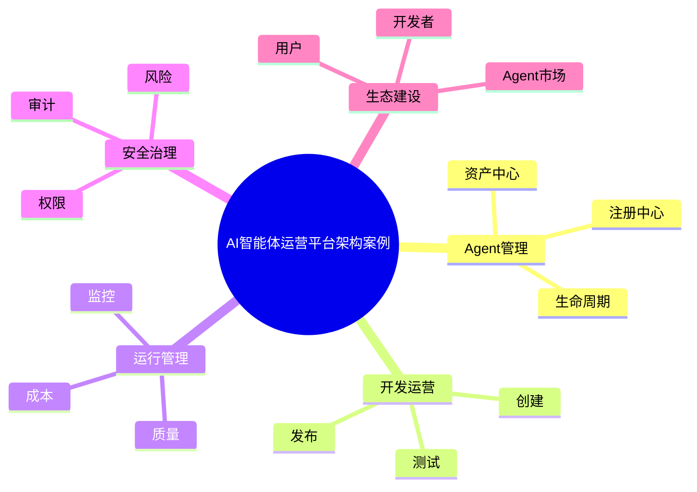

# 86-ai-agentops-platform-case.md（AI智能体运营平台架构案例）

> 本文用于系统架构设计师考试案例分析专题 V2 复习。
>
> 本篇重点整理 AI AgentOps Platform（智能体运营平台）架构设计案例，包括 Agent 注册中心、资产中心、开发管理、测试管理、发布管理、运行管理、质量管理、成本管理、资源管理以及企业级智能体运营体系建设。

---

# 目录

1. AI AgentOps Platform案例概述
2. AgentOps基本概念
3. 企业Agent运营挑战案例
4. AgentOps平台总体架构案例
5. Agent注册中心案例
6. Agent资产中心案例
7. Agent开发管理案例
8. Agent测试管理案例
9. Agent发布管理案例
10. Agent运行管理案例
11. Agent质量管理案例
12. Agent成本管理案例
13. Agent资源管理案例
14. Agent用户管理案例
15. Agent权限管理案例
16. Agent监控运营案例
17. Agent反馈优化案例
18. Agent生态管理案例
19. 企业级AgentOps平台案例
20. AgentOps平台建设方法案例
21. AgentOps平台演进案例
22. 案例分析答题模板
23. 高频考点
24. 易错点
25. Mermaid知识结构图
26. 本节小结

---

# 1. AI AgentOps Platform案例概述

AgentOps Platform：

> 面向企业智能体全生命周期运营管理的平台。

目标：

- 提升Agent开发效率；
- 降低运营成本；
- 提高Agent质量；
- 支撑规模化应用。

---

# 2. AgentOps基本概念

AgentOps：

> 将DevOps、MLOps、LLMOps理念扩展到智能体领域。

管理对象：

```text
Agent

+

模型

+

Prompt

+

Workflow

+

知识

+

工具

+

数据
```

---

# 3. 企业Agent运营挑战案例

主要问题：

- Agent数量快速增长；
- 缺少统一管理；
- Agent资产无法复用；
- 运行状态不可见；
- 成本难以控制。

---

# 4. AgentOps平台总体架构案例

```text
企业用户

↓

AgentOps门户

↓

Agent管理中心

↓

Agent运行平台

↓

模型/知识/工具基础设施
```

---

# 5. Agent注册中心案例

Agent Registry管理：

- Agent名称；
- Agent能力；
- Agent版本；
- Agent负责人。

作用：

> 建立企业Agent资产目录。

---

# 6. Agent资产中心案例

管理：

- Agent配置；
- Prompt；
- Workflow；
- 插件；
- 知识库。

形成：

> 企业智能体资产库。

---

# 7. Agent开发管理案例

能力：

- Agent创建；
- 流程设计；
- 工具接入；
- 调试测试。

---

# 8. Agent测试管理案例

测试：

- 功能测试；
- 效果测试；
- 安全测试；
- 性能测试。

---

# 9. Agent发布管理案例

支持：

- 自动部署；
- 灰度发布；
- 版本回滚。

---

# 10. Agent运行管理案例

管理：

- Agent运行状态；
- 调用情况；
- 异常情况。

---

# 11. Agent质量管理案例

质量指标：

- 成功率；
- 准确率；
- 用户满意度；
- 响应速度。

---

# 12. Agent成本管理案例

关注：

- Token消耗；
- 模型费用；
- 计算资源。

结合：

- FinOps。

---

# 13. Agent资源管理案例

管理：

- GPU资源；
- 模型资源；
- 推理资源。

目标：

提高资源利用率。

---

# 14. Agent用户管理案例

管理：

- 用户；
- 部门；
- 角色。

结合：

- IAM；
- RBAC。

---

# 15. Agent权限管理案例

控制：

- Agent访问权限；
- 工具调用权限；
- 数据访问权限。

原则：

> 最小权限原则。

---

# 16. Agent监控运营案例

监控：

- 调用次数；
- 延迟；
- 错误率；
- 成本。

结合：

- Observability。

---

# 17. Agent反馈优化案例

流程：

```text
运行数据

↓

问题分析

↓

优化Agent

↓

重新发布
```

---

# 18. Agent生态管理案例

生态参与：

- 开发者；
- 业务用户；
- 第三方Agent。

形成：

> 企业智能体生态市场。

---

# 19. 企业级AgentOps平台案例

平台能力：

```text
Agent注册

+

资产管理

+

开发管理

+

发布管理

+

运行监控

+

质量分析

+

成本治理
```

---

# 20. AgentOps平台建设方法案例

步骤：

```text
统一规范

↓

建设平台

↓

接入Agent

↓

建立运营体系

↓

持续优化
```

---

# 21. AgentOps平台演进案例

```text
单Agent应用

↓

Agent平台

↓

AgentOps平台

↓

企业智能体生态
```

---

# 案例分析答题模板

## 企业Agent数量快速增长

> 建设AgentOps平台，实现智能体统一注册、管理和运营。

## Agent资产无法复用

> 建立Agent资产中心，实现Prompt、Workflow和知识资源共享。

## Agent质量无法保证

> 建立测试、监控和质量评价体系，实现持续优化。

## 企业规模化应用AI

> 建设AgentOps运营平台，实现智能体工程化管理。

---

# 高频考点

重点掌握：

1. AgentOps平台架构；
2. Agent注册中心；
3. Agent资产管理；
4. 生命周期运营；
5. 质量管理；
6. 成本治理；
7. 企业智能体生态。

---

# 易错点

|易错知识|正确理解|
|-|-|
|Agent开发完成即可结束|企业需要持续运营|
|只管理Agent本身|还需要管理模型、Prompt、知识和工具|
|运营只关注调用量|还需要关注质量、成本和安全|
|Agent平台等于部署平台|运营平台还包括治理和优化|

---

# Mermaid知识结构图



---

# 本节小结

AI智能体运营平台架构案例核心：

> 通过AgentOps平台实现智能体资产统一管理、运行统一监控、质量持续优化和企业级规模化运营。

案例分析重点：

- 理解AgentOps平台定位；
- 掌握注册中心和资产中心；
- 理解质量、成本和权限治理；
- 掌握企业智能体运营平台建设方法。
