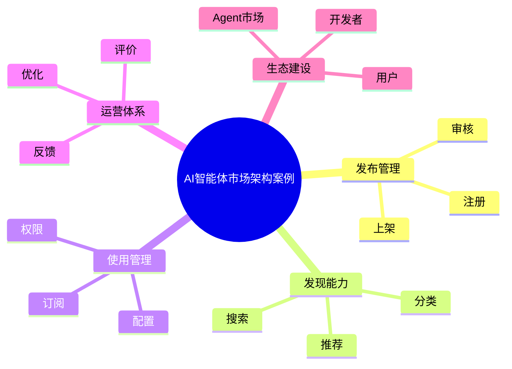

# 87-ai-agent-marketplace-case.md（AI智能体市场架构案例）

> 本文用于系统架构设计师考试案例分析专题 V2 复习。
>
> 本篇重点整理 AI Agent Marketplace（智能体市场）架构设计案例，包括 Agent 发布管理、分类管理、搜索发现、订阅管理、评价体系、审核机制、安全检测、多租户共享以及企业智能体生态建设。

---

# 目录

1. AI Agent Marketplace案例概述
2. Agent市场基本概念
3. 企业Agent共享挑战案例
4. Agent Marketplace总体架构案例
5. Agent注册发布案例
6. Agent分类管理案例
7. Agent搜索发现案例
8. Agent订阅管理案例
9. Agent评价体系案例
10. Agent推荐机制案例
11. Agent版本管理案例
12. Agent审核机制案例
13. Agent安全检测案例
14. Agent商业模式案例
15. Agent多租户共享案例
16. Agent生态运营案例
17. Agent开发者中心案例
18. 企业Agent应用商店案例
19. Agent Marketplace建设方法案例
20. Agent Marketplace演进案例
21. 案例分析答题模板
22. 高频考点
23. 易错点
24. Mermaid知识结构图
25. 本节小结

---

# 1. AI Agent Marketplace案例概述

Agent Marketplace：

> 面向企业智能体应用的统一发现、发布、共享和运营平台。

类似：

- App Store；
- 云服务市场；
- API市场。

区别：

Agent市场不仅提供软件，还包含：

```text
Agent

+

Prompt

+

Workflow

+

知识库

+

工具能力
```

---

# 2. Agent市场基本概念

目标：

- 提升Agent复用率；
- 降低开发成本；
- 加速AI应用落地。

核心能力：

- 发布；
- 搜索；
- 使用；
- 评价；
- 管理。

---

# 3. 企业Agent共享挑战案例

常见问题：

- Agent重复建设；
- Agent能力不可发现；
- Agent质量无法判断；
- Agent缺少运营机制。

---

# 4. Agent Marketplace总体架构案例

```text
用户

↓

Agent市场门户

↓

Agent管理中心

↓

审核与运营中心

↓

Agent运行平台

↓

模型/知识/工具基础设施
```

---

# 5. Agent注册发布案例

发布信息：

- Agent名称；
- 功能描述；
- 使用场景；
- 负责人；
- 版本信息。

---

# 6. Agent分类管理案例

分类方式：

- 行业；
- 部门；
- 场景；
- 能力类型。

示例：

```text
办公助手

↓

财务Agent

↓

客服Agent

↓

研发Agent
```

---

# 7. Agent搜索发现案例

能力：

- 关键词搜索；
- 标签搜索；
- 智能推荐。

目标：

快速找到合适Agent。

---

# 8. Agent订阅管理案例

管理：

- 使用申请；
- 权限审批；
- 服务开通。

---

# 9. Agent评价体系案例

评价指标：

- 使用次数；
- 用户评分；
- 成功率；
- 响应速度。

作用：

帮助用户选择优秀Agent。

---

# 10. Agent推荐机制案例

推荐依据：

- 用户角色；
- 使用历史；
- 业务场景。

类似：

> 企业智能体推荐系统。

---

# 11. Agent版本管理案例

管理：

- Agent版本；
- Prompt版本；
- Workflow版本。

支持：

- 升级；
- 回滚。

---

# 12. Agent审核机制案例

审核：

- 功能审核；
- 安全审核；
- 合规审核。

避免：

- 不安全Agent进入市场。

---

# 13. Agent安全检测案例

检测：

- 权限风险；
- 数据风险；
- Prompt风险。

结合：

- Agent Security。

---

# 14. Agent商业模式案例

模式：

## 企业内部

- 免费共享；
- 部门服务。

## 企业外部

- 服务订阅；
- 能力收费。

---

# 15. Agent多租户共享案例

支持：

```text
企业平台

↓

部门A

↓

部门B

↓

部门C
```

实现：

- 隔离；
- 共享。

---

# 16. Agent生态运营案例

参与者：

- Agent开发者；
- 业务用户；
- 平台管理员。

形成：

```text
开发

↓

发布

↓

使用

↓

反馈

↓

优化
```

---

# 17. Agent开发者中心案例

提供：

- 开发工具；
- SDK；
- API；
- 文档。

降低：

Agent开发门槛。

---

# 18. 企业Agent应用商店案例

能力：

```text
Agent浏览

+

Agent安装

+

Agent配置

+

Agent评价

+

Agent管理
```

---

# 19. Agent Marketplace建设方法案例

步骤：

```text
建立规范

↓

建设平台

↓

引入Agent

↓

建立评价体系

↓

生态运营
```

---

# 20. Agent Marketplace演进案例

```text
单Agent应用

↓

企业Agent目录

↓

Agent市场

↓

智能体生态平台
```

---

# 案例分析答题模板

## 企业Agent重复建设严重

> 建设Agent Marketplace，实现智能体统一发布、共享和复用。

## 用户无法找到合适Agent

> 建立Agent分类、搜索和推荐机制，提高智能体发现能力。

## Agent质量无法保证

> 建立审核、评价和运营机制，保障Agent服务质量。

## 企业需要形成AI生态

> 建设智能体市场平台，促进开发者、业务用户和Agent资源协同发展。

---

# 高频考点

重点掌握：

1. Agent Marketplace总体架构；
2. Agent注册发布；
3. Agent搜索发现；
4. Agent评价体系；
5. Agent审核机制；
6. 多租户共享；
7. 智能体生态运营。

---

# 易错点

|易错知识|正确理解|
|-|-|
|Agent开发完成即可结束|需要通过市场推广和运营|
|市场只负责展示|还需要审核、评价和治理|
|Agent越多越好|需要质量管理机制|
|共享意味着没有权限控制|必须支持多租户隔离|

---

# Mermaid知识结构图



---

# 本节小结

AI智能体市场架构案例核心：

> 通过统一市场平台，实现Agent发现、发布、共享、评价和生态运营，促进企业智能体规模化应用。

案例分析重点：

- 理解Agent Marketplace定位；
- 掌握Agent发布和审核流程；
- 理解搜索推荐和评价体系；
- 掌握企业智能体生态建设方法。
