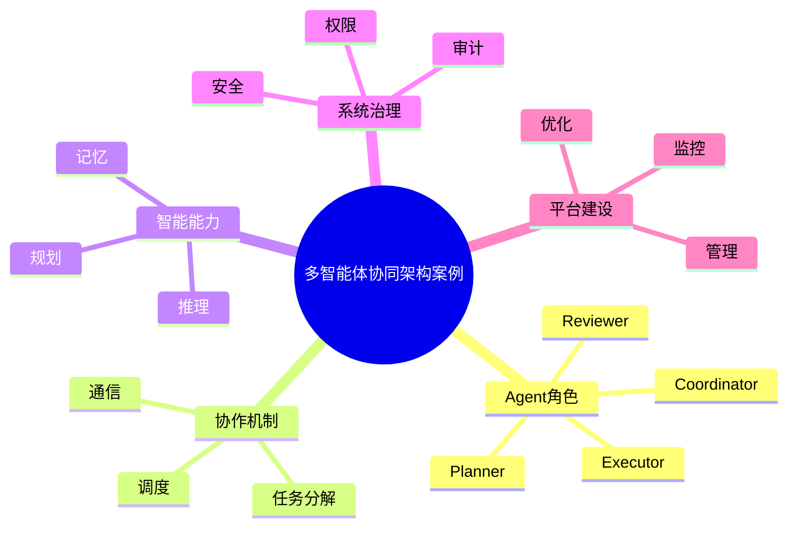

# 89-ai-agent-multi-agent-case.md（多智能体协同架构案例）

> 本文用于系统架构设计师考试案例分析专题 V2 复习。
>
> 本篇重点整理 Multi-Agent System（多智能体系统）架构设计案例，包括 Agent 角色设计、任务拆解、协作模式、通信机制、调度管理、规划推理、上下文共享、记忆协同、结果融合、安全控制以及企业多智能体系统建设。

---

# 目录

1. Multi-Agent案例概述
2. 多智能体基本概念
3. 企业Multi-Agent应用挑战案例
4. Multi-Agent总体架构案例
5. Agent角色设计案例
6. Agent任务分解案例
7. Agent协作模式案例
8. Agent通信机制案例
9. Agent调度管理案例
10. Agent规划推理案例
11. Agent上下文共享案例
12. Agent记忆协同案例
13. Agent冲突处理案例
14. Agent结果融合案例
15. Multi-Agent安全控制案例
16. Multi-Agent性能优化案例
17. 企业Multi-Agent应用案例
18. Multi-Agent平台案例
19. Multi-Agent建设方法案例
20. Multi-Agent演进案例
21. 案例分析答题模板
22. 高频考点
23. 易错点
24. Mermaid知识结构图
25. 本节小结

---

# 1. Multi-Agent案例概述

Multi-Agent System：

> 多个具有独立能力的智能体，通过通信和协作共同完成复杂任务的系统。

单Agent：

```text
用户

↓

Agent

↓

结果
```

Multi-Agent：

```text
用户

↓

任务规划Agent

↓

多个专业Agent

↓

结果融合

↓

最终输出
```

---

# 2. 多智能体基本概念

核心思想：

> 将复杂任务拆分为多个专业Agent协同完成。

特点：

- 自主性；
- 协作性；
- 分布式；
- 可扩展。

---

# 3. 企业Multi-Agent应用挑战案例

主要问题：

- 单Agent能力有限；
- 复杂任务难处理；
- 专业领域覆盖不足；
- Agent之间缺少通信；
- 多结果难统一。

---

# 4. Multi-Agent总体架构案例

```text
用户

↓

任务规划Agent

↓

协调调度Agent

↓

专业Agent集群

↓

结果汇聚Agent

↓

最终输出
```

---

# 5. Agent角色设计案例

常见角色：

## Planner Agent

负责：

- 任务规划；
- 目标拆解。

## Executor Agent

负责：

- 执行业务任务。

## Reviewer Agent

负责：

- 结果检查。

## Coordinator Agent

负责：

- Agent协调。

---

# 6. Agent任务分解案例

流程：

```text
复杂任务

↓

任务分析

↓

子任务拆分

↓

分配Agent

↓

执行汇总
```

---

# 7. Agent协作模式案例

## 主从模式

```text
Master Agent

↓

Worker Agent
```

---

## 分布式模式

多个Agent平等协作。

---

## 层级模式

```text
管理Agent

↓

业务Agent

↓

执行Agent
```

---

# 8. Agent通信机制案例

通信内容：

- 任务消息；
- 状态信息；
- 执行结果。

技术：

- API；
- Message Queue；
- MCP。

---

# 9. Agent调度管理案例

管理：

- Agent选择；
- 任务分配；
- 执行顺序。

目标：

提高系统效率。

---

# 10. Agent规划推理案例

能力：

- 任务规划；
- 推理分析；
- 动态调整。

方式：

- Plan-Execute；
- ReAct。

---

# 11. Agent上下文共享案例

共享：

- 任务状态；
- 中间结果；
- 用户信息。

避免：

重复计算。

---

# 12. Agent记忆协同案例

共享：

- 长期记忆；
- 短期上下文；
- 企业知识。

结合：

- Agent Memory。

---

# 13. Agent冲突处理案例

冲突：

- 结果不同；
- 目标冲突。

解决：

- 仲裁Agent；
- 投票机制；
- 优先级策略。

---

# 14. Agent结果融合案例

融合方式：

- 综合分析；
- 评分选择；
- 人工审核。

---

# 15. Multi-Agent安全控制案例

安全措施：

- Agent身份认证；
- 通信加密；
- 权限控制；
- 行为审计。

---

# 16. Multi-Agent性能优化案例

优化：

- 并行执行；
- 缓存；
- 调度优化。

---

# 17. 企业Multi-Agent应用案例

应用场景：

- 智能客服；
- 自动研发；
- 企业办公；
- 数据分析。

---

# 18. Multi-Agent平台案例

平台能力：

```text
Agent管理

+

任务调度

+

通信管理

+

状态管理

+

监控分析
```

---

# 19. Multi-Agent建设方法案例

步骤：

```text
业务分析

↓

任务拆解

↓

Agent设计

↓

协作机制设计

↓

测试优化
```

---

# 20. Multi-Agent演进案例

```text
单Agent

↓

Workflow Agent

↓

Multi-Agent

↓

Agent Network

↓

自治智能体生态
```

---

# 案例分析答题模板

## 单Agent无法处理复杂业务

> 采用Multi-Agent架构，通过专业Agent分工协作提升复杂任务处理能力。

## 多Agent之间无法协同

> 建立Agent通信和任务调度机制，实现智能体协作。

## 多Agent结果不一致

> 引入结果融合和评价机制，提高输出可靠性。

## 企业需要复杂流程自动化

> 建设Multi-Agent平台，实现任务分解、调度和协同执行。

---

# 高频考点

重点掌握：

1. Multi-Agent总体架构；
2. Agent角色设计；
3. 任务拆解机制；
4. Agent通信机制；
5. 协作模式；
6. 结果融合；
7. 企业多智能体平台建设。

---

# 易错点

|易错知识|正确理解|
|-|-|
|多个Agent简单组合就是Multi-Agent|需要任务协同和通信机制|
|Agent越多系统越强|需要合理角色设计|
|Agent之间无需治理|需要权限、安全和审计|
|只关注单Agent能力|重点是协作能力|

---

# Mermaid知识结构图



---

# 本节小结

多智能体协同架构案例核心：

> 通过多个专业Agent之间的任务分解、通信协作和结果融合，实现复杂业务场景下的智能化处理。

案例分析重点：

- 理解Multi-Agent架构；
- 掌握Agent角色和协作模式；
- 理解任务调度和通信机制；
- 掌握企业多智能体系统建设方法。
