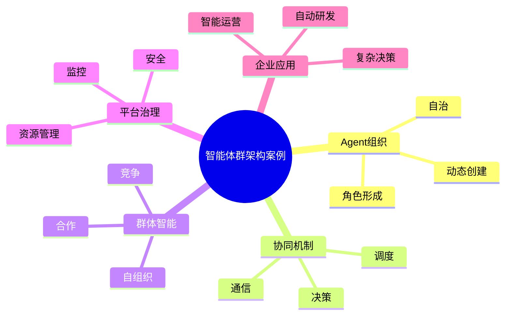

# 90-ai-agent-swarm-case.md（智能体群架构案例）

> 本文用于系统架构设计师考试案例分析专题 V2 复习。
>
> 本篇重点整理 AI Agent Swarm（智能体群）架构设计案例，包括 Agent 自治组织、动态任务分配、群体协作、自组织机制、资源调度、安全治理、可观测性以及企业级智能体群系统建设。

---

# 目录

1. Agent Swarm案例概述
2. 智能体群基本概念
3. Multi-Agent与Agent Swarm区别案例
4. 企业Agent Swarm应用挑战案例
5. Agent Swarm总体架构案例
6. Agent自治组织案例
7. Agent动态创建案例
8. Agent动态任务分配案例
9. Agent协同通信案例
10. Agent群体决策案例
11. Agent自组织协作案例
12. Agent资源调度案例
13. Agent竞争与合作机制案例
14. Agent规模扩展案例
15. Agent Swarm安全治理案例
16. Agent Swarm可观测案例
17. 企业Agent Swarm应用案例
18. Agent Swarm平台案例
19. Agent Swarm建设方法案例
20. Agent Swarm演进案例
21. 案例分析答题模板
22. 高频考点
23. 易错点
24. Mermaid知识结构图
25. 本节小结

---

# 1. Agent Swarm案例概述

Agent Swarm：

> 多个智能体通过动态协作、自组织和群体智能机制，共同完成复杂任务的智能系统。

传统Multi-Agent：

```text
固定Agent

↓

固定流程

↓

完成任务
```

Agent Swarm：

```text
任务输入

↓

动态创建Agent

↓

自主协作

↓

任务完成

↓

Agent释放
```

---

# 2. 智能体群基本概念

核心思想：

> 将智能能力从单个Agent扩展到动态智能群体。

特点：

- 自组织；
- 动态扩展；
- 分布式决策；
- 自适应协作。

---

# 3. Multi-Agent与Agent Swarm区别案例

|比较|Multi-Agent|Agent Swarm|
|-|-|-|
|Agent数量|固定|动态变化|
|组织方式|预定义|自组织|
|任务分配|人工设计|自动调度|
|扩展能力|有限|高扩展|
|智能模式|协作|群体智能|

---

# 4. 企业Agent Swarm应用挑战案例

主要问题：

- 任务规模巨大；
- 环境变化频繁；
- Agent数量增长；
- 协同效率下降。

---

# 5. Agent Swarm总体架构案例

```text
用户

↓

Swarm Manager

↓

Agent调度层

↓

动态Agent群

↓

任务执行环境

↓

结果汇聚
```

---

# 6. Agent自治组织案例

Agent可以：

- 创建角色；
- 选择任务；
- 调整协作关系。

示例：

```text
规划Agent

↓

执行Agent

↓

验证Agent
```

---

# 7. Agent动态创建案例

根据任务需求：

动态生成：

- 专业Agent；
- 临时Agent。

流程：

```text
任务分析

↓

能力需求判断

↓

创建Agent

↓

加入Swarm
```

---

# 8. Agent动态任务分配案例

机制：

- 任务拆解；
- 能力匹配；
- 自动分配。

目标：

提高执行效率。

---

# 9. Agent协同通信案例

通信内容：

- Agent消息；
- 状态同步；
- 任务反馈。

技术：

- API；
- 消息队列；
- MCP。

---

# 10. Agent群体决策案例

方式：

- 投票；
- 评分；
- 多Agent讨论。

提高：

- 决策可靠性。

---

# 11. Agent自组织协作案例

特点：

无需人工提前定义：

- 角色关系；
- 调度流程。

Agent根据任务：

自主形成协作结构。

---

# 12. Agent资源调度案例

管理：

- 模型资源；
- 计算资源；
- Agent数量。

目标：

降低运行成本。

---

# 13. Agent竞争与合作机制案例

## 合作

多个Agent共同完成目标。

## 竞争

多个Agent选择最佳方案。

---

# 14. Agent规模扩展案例

支持：

- 大规模Agent运行；
- 动态扩容；
- 自动释放。

---

# 15. Agent Swarm安全治理案例

安全措施：

- Agent身份认证；
- 通信安全；
- 权限控制；
- 行为审计。

---

# 16. Agent Swarm可观测案例

监控：

- Agent数量；
- 通信状态；
- 任务完成率；
- 资源消耗。

---

# 17. 企业Agent Swarm应用案例

应用场景：

- 自动研发；
- 智能运营；
- 科研分析；
- 复杂决策。

---

# 18. Agent Swarm平台案例

平台能力：

```text
Agent创建

+

任务调度

+

通信管理

+

资源管理

+

监控分析
```

---

# 19. Agent Swarm建设方法案例

步骤：

```text
业务分析

↓

设计Agent能力

↓

建立通信机制

↓

建设调度平台

↓

持续优化
```

---

# 20. Agent Swarm演进案例

```text
单Agent

↓

Workflow Agent

↓

Multi-Agent

↓

Agent Swarm

↓

自治智能体网络
```

---

# 案例分析答题模板

## 固定Agent无法适应复杂环境

> 采用Agent Swarm架构，通过动态Agent创建和自组织协作提升系统适应能力。

## 大规模任务无法自动处理

> 建立智能体群调度机制，实现任务动态分配和协同执行。

## Agent数量增加导致管理困难

> 建设Swarm管理平台，实现Agent生命周期、资源和安全统一治理。

## 企业需要高度自动化

> 构建自治智能体网络，实现复杂业务自主执行。

---

# 高频考点

重点掌握：

1. Agent Swarm总体架构；
2. Multi-Agent与Swarm区别；
3. 动态Agent创建；
4. 自组织协作；
5. 任务调度；
6. 安全治理；
7. 企业智能体群平台。

---

# 易错点

|易错知识|正确理解|
|-|-|
|Swarm只是更多Agent组合|核心是动态协作和自组织|
|Agent越多越智能|需要合理调度和治理|
|不需要人工管理|仍需要安全和运营机制|
|只关注任务执行|还需要资源和生命周期管理|

---

# Mermaid知识结构图



---

# 本节小结

智能体群架构案例核心：

> 通过动态Agent创建、自组织协作和群体智能机制，实现复杂业务场景下的大规模智能协同。

案例分析重点：

- 理解Agent Swarm架构；
- 掌握动态任务分配；
- 理解自组织协作机制；
- 掌握企业智能体群平台建设方法。
