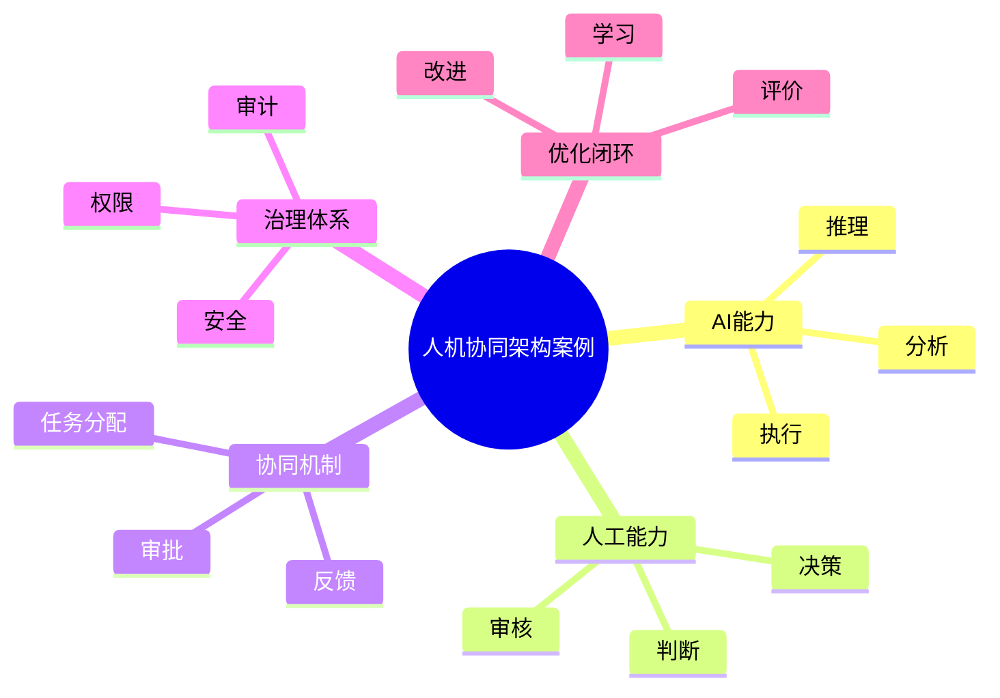

# 91-ai-agent-human-loop-case.md（人机协同架构案例）

> 本文用于系统架构设计师考试案例分析专题 V2 复习。
>
> 本篇重点整理 Human-in-the-Loop（人机协同）架构设计案例，包括人工审核、人工决策介入、任务分配、AI辅助决策、反馈学习、安全控制以及企业可信AI系统建设。

---

# 目录

1. Human-in-the-Loop案例概述
2. 人机协同基本概念
3. AI自动化与人工协同挑战案例
4. 人机协同总体架构案例
5. 人工审核流程案例
6. 人工决策介入案例
7. 人机任务分配案例
8. AI辅助决策案例
9. 人工反馈学习案例
10. 人机交互接口案例
11. 人工审批机制案例
12. 高风险场景控制案例
13. 人机协同安全案例
14. 人机协同质量评价案例
15. 人机协同效率优化案例
16. 企业人机协同应用案例
17. Human-in-the-Loop平台案例
18. 人机协同建设方法案例
19. 人机协同演进案例
20. 案例分析答题模板
21. 高频考点
22. 易错点
23. Mermaid知识结构图
24. 本节小结

---

# 1. Human-in-the-Loop案例概述

Human-in-the-Loop：

> 将人工智能系统与人工专家结合，在AI执行过程中引入人工参与、审核和反馈机制。

传统AI：

```text
输入

↓

AI模型

↓

结果
```

人机协同：

```text
输入

↓

AI分析

↓

人工审核

↓

调整反馈

↓

最终结果
```

---

# 2. 人机协同基本概念

核心思想：

> AI负责效率，人负责判断。

适用：

- 高风险决策；
- 专业领域；
- 复杂业务；
- 法规要求场景。

---

# 3. AI自动化与人工协同挑战案例

主要问题：

- AI输出存在错误风险；
- 高风险业务无法完全自动化；
- 缺少人工反馈闭环；
- 系统可信度不足。

---

# 4. 人机协同总体架构案例

```text
用户

↓

AI Agent

↓

智能分析

↓

人工审核中心

↓

决策执行

↓

反馈学习
```

---

# 5. 人工审核流程案例

流程：

```text
AI生成结果

↓

风险检测

↓

人工审核

↓

通过/修改

↓

执行
```

---

# 6. 人工决策介入案例

人工介入方式：

- 审批；
- 修改；
- 否决；
- 指导。

---

# 7. 人机任务分配案例

AI负责：

- 重复任务；
- 数据分析；
- 自动执行。

人工负责：

- 复杂判断；
- 创造性工作；
- 风险决策。

---

# 8. AI辅助决策案例

流程：

```text
数据

↓

AI分析

↓

生成建议

↓

专家判断

↓

最终决策
```

---

# 9. 人工反馈学习案例

反馈内容：

- 正确结果；
- 错误原因；
- 优化建议。

用于：

- Prompt优化；
- 模型优化；
- Agent优化。

---

# 10. 人机交互接口案例

包括：

- 对话界面；
- 审批页面；
- 工作流平台。

提供：

- 状态展示；
- 修改入口；
- 反馈入口。

---

# 11. 人工审批机制案例

审批内容：

- Agent输出；
- 自动执行任务；
- 数据访问。

支持：

- 多级审批；
- 权限控制。

---

# 12. 高风险场景控制案例

策略：

- 人工确认；
- 风险阈值；
- 自动暂停。

```text
低风险

↓

自动执行

高风险

↓

人工审核
```

---

# 13. 人机协同安全案例

安全措施：

- 身份认证；
- 权限管理；
- 操作审计；
- 数据保护。

---

# 14. 人机协同质量评价案例

评价指标：

- AI准确率；
- 人工修改率；
- 决策效率；
- 用户满意度。

---

# 15. 人机协同效率优化案例

优化：

- 自动推荐；
- 智能排序；
- 风险识别。

目标：

减少人工负担。

---

# 16. 企业人机协同应用案例

应用：

- 智能客服；
- 金融风控；
- 医疗辅助；
- 软件研发。

---

# 17. Human-in-the-Loop平台案例

平台能力：

```text
AI Agent管理

+

人工审核中心

+

任务分配

+

反馈管理

+

质量分析
```

---

# 18. 人机协同建设方法案例

步骤：

```text
业务分析

↓

确定人工介入点

↓

设计审核流程

↓

建立反馈机制

↓

持续优化
```

---

# 19. 人机协同演进案例

```text
人工操作

↓

AI辅助

↓

人机协同

↓

AI自主执行+人工监督

↓

可信自治智能系统
```

---

# 案例分析答题模板

## AI无法完全替代人工

> 建立Human-in-the-Loop机制，在关键环节引入人工审核，提高系统可靠性。

## AI决策存在风险

> 通过风险识别和人工审批机制，实现安全可控的智能决策。

## 需要提升AI应用可信度

> 建立人工反馈闭环，实现模型和Agent持续优化。

## 企业应用高风险AI系统

> 采用人机协同架构，实现自动化效率与人工经验结合。

---

# 高频考点

重点掌握：

1. Human-in-the-Loop架构；
2. 人工审核机制；
3. 人机任务分配；
4. AI辅助决策；
5. 反馈学习闭环；
6. 高风险场景控制；
7. 企业可信AI建设。

---

# 易错点

|易错知识|正确理解|
|-|-|
|AI系统应该完全自动化|高风险场景需要人工参与|
|人工参与降低效率|合理设计可以提高整体效率|
|只关注模型准确率|还需要关注可信性和治理|
|人工审核没有技术要求|需要权限、流程和审计支持|

---

# Mermaid知识结构图



---

# 本节小结

人机协同架构案例核心：

> 通过AI自动化能力与人工判断能力结合，实现高效率、高可靠、可治理的智能系统。

案例分析重点：

- 理解Human-in-the-Loop架构；
- 掌握人工介入机制；
- 理解反馈优化闭环；
- 掌握企业可信AI系统建设方法。
