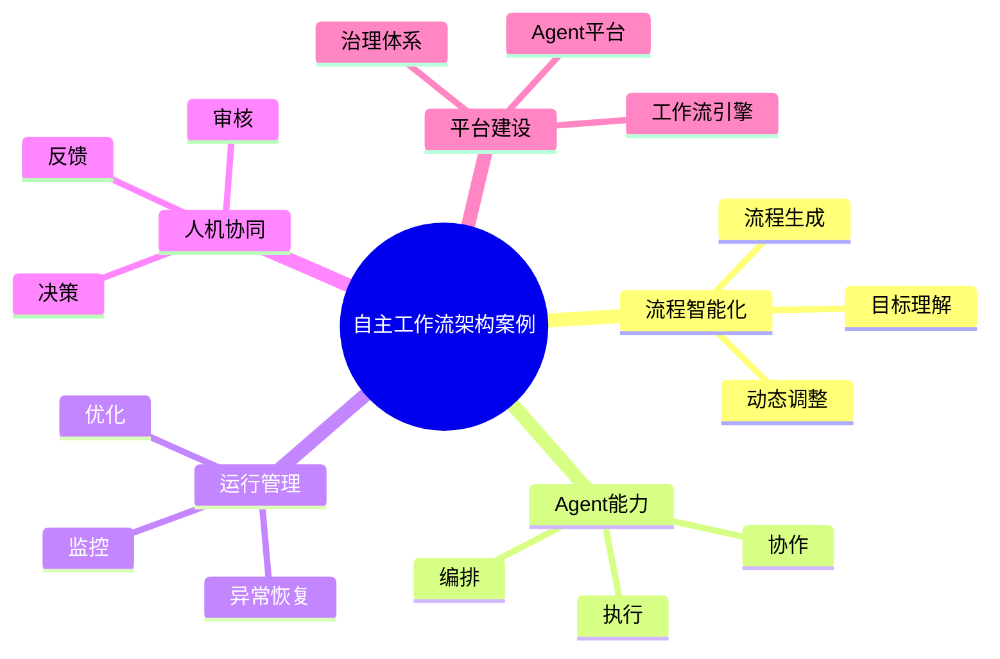

# 92-ai-agent-autonomous-workflow-case.md（自主工作流架构案例）

> 本文用于系统架构设计师考试案例分析专题 V2 复习。
>
> 本篇重点整理 Autonomous Workflow（自主工作流）架构设计案例，包括 AI 流程理解、动态流程生成、Agent任务编排、工具自动选择、流程监控、动态调整、异常恢复、人机协同以及企业自主工作流平台建设。

---

# 目录

1. Autonomous Workflow案例概述
2. 自主工作流基本概念
3. 传统工作流与自主工作流区别案例
4. 企业流程自动化挑战案例
5. 自主工作流总体架构案例
6. AI流程理解案例
7. 动态流程生成案例
8. Agent任务编排案例
9. 工具自动选择案例
10. 流程执行监控案例
11. 流程动态调整案例
12. 异常处理与恢复案例
13. 流程优化学习案例
14. 自主决策机制案例
15. 人机协同工作流案例
16. 企业自主工作流应用案例
17. Autonomous Workflow平台案例
18. 自主工作流建设方法案例
19. 自主工作流演进案例
20. 案例分析答题模板
21. 高频考点
22. 易错点
23. Mermaid知识结构图
24. 本节小结

---

# 1. Autonomous Workflow案例概述

Autonomous Workflow：

> 利用AI Agent自主理解任务目标，并动态生成、执行和优化业务流程的智能工作流系统。

传统Workflow：

```text
固定流程

↓

节点执行

↓

完成任务
```

自主Workflow：

```text
业务目标

↓

AI理解

↓

动态规划流程

↓

Agent执行

↓

反馈优化
```

---

# 2. 自主工作流基本概念

核心思想：

> 从“人工设计流程”转变为“AI自主生成流程”。

特点：

- 动态性；
- 自适应；
- 自动规划；
- 持续优化。

---

# 3. 传统Workflow与自主Workflow区别案例

|比较|传统Workflow|自主Workflow|
|-|-|-|
|流程定义|人工配置|AI生成|
|调整方式|人工修改|动态调整|
|执行方式|固定节点|智能决策|
|适应能力|较弱|较强|
|优化方式|人工分析|自动学习|

---

# 4. 企业流程自动化挑战案例

主要问题：

- 流程变化频繁；
- 业务复杂度高；
- 跨系统协同困难；
- 缺少智能优化能力。

---

# 5. 自主工作流总体架构案例

```text
用户

↓

目标理解Agent

↓

流程规划Agent

↓

任务编排引擎

↓

执行Agent群

↓

结果反馈

↓

流程优化
```

---

# 6. AI流程理解案例

AI分析：

- 用户目标；
- 业务规则；
- 数据需求。

输出：

- 执行计划。

---

# 7. 动态流程生成案例

流程：

```text
业务目标

↓

任务分析

↓

生成Workflow

↓

执行验证

↓

调整优化
```

---

# 8. Agent任务编排案例

能力：

- Agent选择；
- 执行顺序安排；
- 参数传递。

实现：

复杂任务自动执行。

---

# 9. 工具自动选择案例

AI根据任务需求选择：

- API；
- 数据服务；
- 企业工具；
- 外部能力。

---

# 10. 流程执行监控案例

监控：

- 执行状态；
- 任务结果；
- 资源消耗。

---

# 11. 流程动态调整案例

根据：

- 执行结果；
- 环境变化；
- 异常情况。

动态：

- 修改流程；
- 更换Agent；
- 调整策略。

---

# 12. 异常处理与恢复案例

机制：

- 自动重试；
- 替代方案；
- 人工介入。

---

# 13. 流程优化学习案例

优化依据：

- 历史流程数据；
- 用户反馈；
- 执行效果。

形成：

持续优化闭环。

---

# 14. 自主决策机制案例

决策依据：

- 业务规则；
- AI模型；
- 历史经验。

---

# 15. 人机协同工作流案例

模式：

```text
低风险

↓

AI自动执行


高风险

↓

人工审核
```

---

# 16. 企业自主工作流应用案例

应用场景：

- 智能客服流程；
- 自动研发流程；
- 企业审批流程；
- 数据分析流程。

---

# 17. Autonomous Workflow平台案例

平台能力：

```text
流程生成

+

Agent编排

+

任务执行

+

监控分析

+

优化学习
```

---

# 18. 自主工作流建设方法案例

步骤：

```text
业务分析

↓

流程建模

↓

Agent接入

↓

自动执行

↓

持续优化
```

---

# 19. 自主工作流演进案例

```text
人工流程

↓

数字流程

↓

智能流程

↓

自主工作流

↓

自治业务系统
```

---

# 案例分析答题模板

## 传统流程变化频繁

> 建立自主工作流架构，通过AI动态生成和调整业务流程，提高系统适应能力。

## 企业流程自动化程度不足

> 引入Agent编排和自主决策机制，实现业务流程智能化执行。

## 复杂任务难以自动处理

> 采用自主工作流结合Multi-Agent，实现任务动态拆解和协同执行。

## 企业需要智能运营

> 建设自主工作流平台，实现流程自动生成、执行和持续优化。

---

# 高频考点

重点掌握：

1. 自主工作流总体架构；
2. 动态流程生成；
3. Agent任务编排；
4. 工具自动选择；
5. 流程动态调整；
6. 异常恢复机制；
7. 企业自主流程平台。

---

# 易错点

|易错知识|正确理解|
|-|-|
|自主工作流等于普通Workflow|核心是AI动态规划和调整|
|流程生成后无需变化|需要根据执行结果持续优化|
|完全取消人工|高风险场景仍需要人工参与|
|只关注流程执行|还需要监控、反馈和治理|

---

# Mermaid知识结构图



---

# 本节小结

自主工作流架构案例核心：

> 通过AI理解业务目标、动态生成流程、自动编排Agent并持续优化，实现从固定流程到自治业务流程的演进。

案例分析重点：

- 理解Autonomous Workflow架构；
- 掌握动态流程生成机制；
- 理解Agent编排与执行；
- 掌握企业智能自动化流程建设方法。
