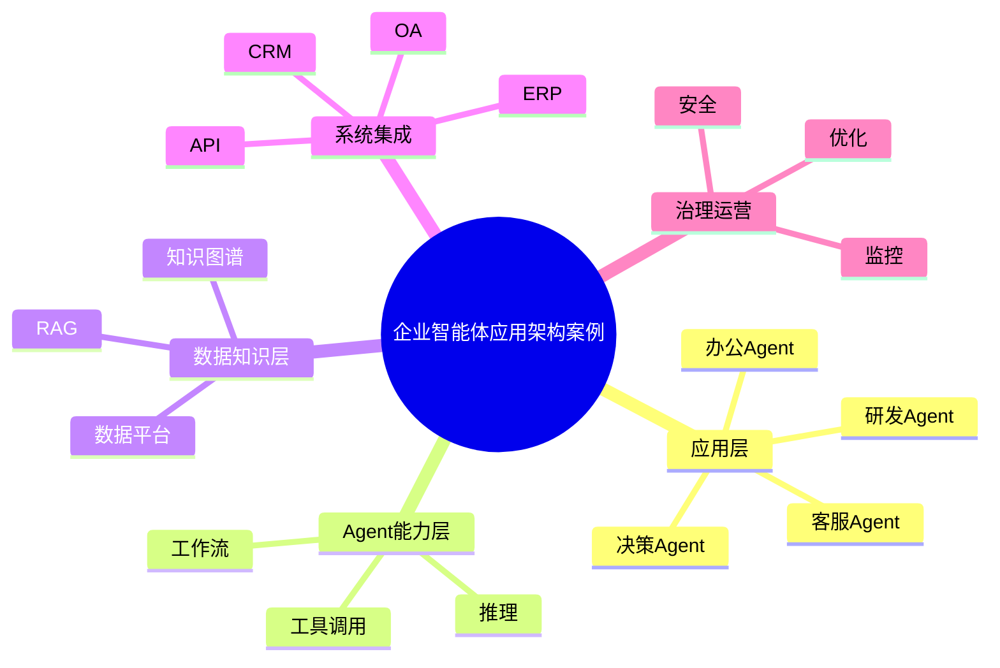

# 93-ai-agent-enterprise-application-case.md（企业智能体应用架构案例）

> 本文用于系统架构设计师考试案例分析专题 V2 复习。
>
> 本篇重点整理 Enterprise AI Agent Application（企业智能体应用）架构设计案例，包括企业Agent应用分层、业务Agent设计、企业知识接入、数据集成、系统集成、流程自动化、办公智能体、研发智能体、客服智能体、运营智能体、决策智能体以及企业级智能体应用治理。

---

# 目录

1. 企业智能体应用案例概述
2. 企业Agent应用基本概念
3. 企业AI应用建设挑战案例
4. 企业智能体应用总体架构案例
5. 企业Agent应用分层案例
6. 业务Agent设计案例
7. 企业知识接入案例
8. 企业数据集成案例
9. 企业系统集成案例
10. 企业流程自动化案例
11. 企业办公智能体案例
12. 企业研发智能体案例
13. 企业客服智能体案例
14. 企业运营智能体案例
15. 企业决策智能体案例
16. 企业Agent安全治理案例
17. 企业Agent运营管理案例
18. 企业智能体应用平台案例
19. 企业Agent建设方法案例
20. 企业智能体应用演进案例
21. 案例分析答题模板
22. 高频考点
23. 易错点
24. Mermaid知识结构图
25. 本节小结

---

# 1. 企业智能体应用案例概述

企业智能体：

> 面向企业业务场景，通过AI Agent实现业务理解、任务执行和智能决策的应用系统。

传统企业应用：

```text
用户

↓

应用系统

↓

数据库
```

企业智能体：

```text
用户

↓

AI Agent

↓

知识库

↓

业务系统

↓

数据平台

↓

模型能力
```

---

# 2. 企业Agent应用基本概念

企业Agent核心能力：

- 理解业务；
- 调用工具；
- 使用知识；
- 执行业务；
- 持续优化。

---

# 3. 企业AI应用建设挑战案例

主要问题：

- 应用碎片化；
- 数据孤岛；
- 系统集成困难；
- 缺少治理体系。

---

# 4. 企业智能体应用总体架构案例

```text
企业用户

↓

Agent应用层

↓

Agent服务层

↓

知识与数据层

↓

模型能力层

↓

企业基础设施
```

---

# 5. 企业Agent应用分层案例

```text
业务应用层

↓

Agent能力层

↓

知识服务层

↓

数据服务层

↓

AI基础模型层
```

---

# 6. 业务Agent设计案例

设计内容：

- 业务目标；
- 用户角色；
- 工作流程；
- 工具能力。

---

# 7. 企业知识接入案例

接入：

- 企业文档；
- 制度流程；
- 产品资料；
- 业务知识。

技术：

- RAG；
- 知识图谱。

---

# 8. 企业数据集成案例

数据来源：

- 业务数据库；
- 数据仓库；
- 数据湖。

目标：

为Agent提供企业数据能力。

---

# 9. 企业系统集成案例

集成：

- ERP；
- CRM；
- OA；
- MES；
- API系统。

实现：

Agent调用企业业务能力。

---

# 10. 企业流程自动化案例

自动执行：

- 审批流程；
- 数据处理；
- 信息查询。

结合：

- Autonomous Workflow。

---

# 11. 企业办公智能体案例

应用：

- 智能会议；
- 文档生成；
- 邮件助手；
- 日程管理。

---

# 12. 企业研发智能体案例

应用：

- 代码生成；
- 测试生成；
- 缺陷分析；
- 技术文档。

---

# 13. 企业客服智能体案例

能力：

- 自动问答；
- 工单处理；
- 客户分析。

---

# 14. 企业运营智能体案例

场景：

- 市场分析；
- 用户运营；
- 数据分析。

---

# 15. 企业决策智能体案例

能力：

- 数据分析；
- 趋势预测；
- 决策建议。

流程：

```text
数据

↓

AI分析

↓

生成建议

↓

管理决策
```

---

# 16. 企业Agent安全治理案例

治理：

- 身份认证；
- 权限控制；
- 数据安全；
- 操作审计。

---

# 17. 企业Agent运营管理案例

管理：

- Agent版本；
- 使用情况；
- 质量指标；
- 成本。

---

# 18. 企业智能体应用平台案例

平台能力：

```text
Agent开发

+

知识管理

+

系统集成

+

运行管理

+

安全治理
```

---

# 19. 企业Agent建设方法案例

步骤：

```text
业务分析

↓

选择场景

↓

设计Agent

↓

接入数据

↓

系统集成

↓

持续优化
```

---

# 20. 企业智能体应用演进案例

```text
传统应用

↓

数字化应用

↓

AI辅助应用

↓

企业智能体

↓

AI原生企业
```

---

# 案例分析答题模板

## 企业AI应用碎片化

> 建设企业智能体平台，实现Agent统一开发、管理和运营。

## 企业数据无法发挥价值

> 通过RAG、知识图谱和数据平台，为Agent提供企业知识能力。

## 业务流程效率低

> 引入Agent和自主工作流，实现业务流程自动化。

## 企业规模化应用AI

> 建立企业智能体应用架构，实现AI能力与业务系统深度融合。

---

# 高频考点

重点掌握：

1. 企业智能体应用架构；
2. Agent应用分层；
3. 企业知识和数据接入；
4. 企业系统集成；
5. 业务场景落地；
6. Agent治理体系；
7. AI原生企业演进。

---

# 易错点

|易错知识|正确理解|
|-|-|
|企业Agent只是聊天机器人|企业Agent需要连接业务系统并执行任务|
|只需要模型能力|还需要知识、数据和工具能力|
|AI应用上线即可结束|需要持续运营和治理|
|Agent独立运行|需要与企业架构融合|

---

# Mermaid知识结构图



---

# 本节小结

企业智能体应用架构案例核心：

> 通过AI Agent连接企业知识、数据和业务系统，实现业务流程智能化和企业AI原生化演进。

案例分析重点：

- 理解企业Agent应用架构；
- 掌握业务场景落地方法；
- 理解知识、数据和系统集成；
- 掌握企业智能体建设路径。
