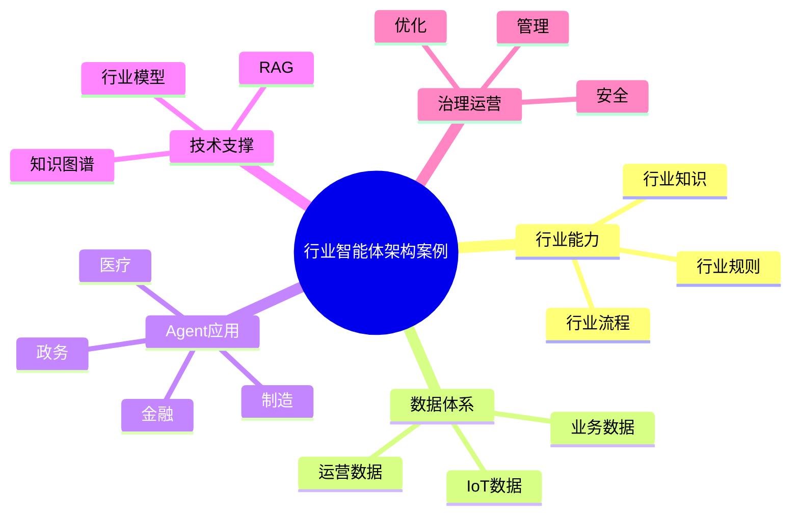

# 94-ai-agent-industry-case.md（行业智能体架构案例）

> 本文用于系统架构设计师考试案例分析专题 V2 复习。
>
> 本篇重点整理 Industry AI Agent（行业智能体）架构设计案例，包括行业知识模型、行业数据资源、行业规则体系、行业流程智能化以及金融、制造、医疗、政务、教育、能源等行业智能体应用。

---

# 目录

1. 行业智能体案例概述
2. 行业Agent基本概念
3. 通用Agent与行业Agent区别案例
4. 行业AI应用建设挑战案例
5. 行业智能体总体架构案例
6. 行业知识模型案例
7. 行业数据资源案例
8. 行业规则体系案例
9. 行业流程智能化案例
10. 金融行业智能体案例
11. 制造行业智能体案例
12. 医疗行业智能体案例
13. 政务行业智能体案例
14. 教育行业智能体案例
15. 能源行业智能体案例
16. 行业Agent安全治理案例
17. 行业Agent运营管理案例
18. 行业智能体平台案例
19. 行业Agent建设方法案例
20. 行业智能体演进案例
21. 案例分析答题模板
22. 高频考点
23. 易错点
24. Mermaid知识结构图
25. 本节小结

---

# 1. 行业智能体案例概述

行业智能体：

> 面向特定行业场景，结合行业知识、数据和业务流程，实现专业化智能服务的AI Agent系统。

通用Agent：

```text
用户

↓

通用模型

↓

通用回答
```

行业Agent：

```text
用户

↓

行业智能体

↓

行业知识

↓

行业数据

↓

业务系统

↓

专业结果
```

---

# 2. 行业Agent基本概念

核心能力：

- 行业理解；
- 专业推理；
- 业务执行；
- 决策辅助。

特点：

- 专业化；
- 场景化；
- 可治理。

---

# 3. 通用Agent与行业Agent区别案例

|比较|通用Agent|行业Agent|
|-|-|-|
|知识来源|公共知识|行业知识|
|应用范围|广泛|专业|
|业务能力|弱|强|
|规则理解|有限|深入|
|数据来源|开放数据|行业数据|

---

# 4. 行业AI应用建设挑战案例

主要问题：

- 行业知识复杂；
- 数据分散；
- 业务流程复杂；
- 合规要求高。

---

# 5. 行业智能体总体架构案例

```text
行业用户

↓

行业Agent应用层

↓

行业Agent能力层

↓

行业知识与数据层

↓

行业模型层

↓

基础AI平台
```

---

# 6. 行业知识模型案例

知识来源：

- 行业标准；
- 专业文档；
- 企业经验；
- 专家知识。

技术：

- RAG；
- 知识图谱；
- 知识库。

---

# 7. 行业数据资源案例

数据：

- 业务数据；
- IoT数据；
- 交易数据；
- 运营数据。

提供：

行业智能分析能力。

---

# 8. 行业规则体系案例

规则：

- 法规；
- 标准；
- 流程；
- 业务约束。

作用：

提高Agent可靠性。

---

# 9. 行业流程智能化案例

实现：

- 自动审批；
- 智能分析；
- 自动执行。

结合：

- Autonomous Workflow。

---

# 10. 金融行业智能体案例

应用：

- 智能客服；
- 风控分析；
- 投资辅助；
- 合规审核。

---

# 11. 制造行业智能体案例

应用：

- 生产优化；
- 设备维护；
- 质量分析；
- 工艺优化。

结合：

- 工业互联网；
- 数字孪生。

---

# 12. 医疗行业智能体案例

应用：

- 辅助诊断；
- 医疗问答；
- 病历分析；
- 医疗管理。

---

# 13. 政务行业智能体案例

应用：

- 政策咨询；
- 办事助手；
- 智能审批。

---

# 14. 教育行业智能体案例

应用：

- 智能教学；
- 个性化辅导；
- 学习分析。

---

# 15. 能源行业智能体案例

应用：

- 能源预测；
- 调度优化；
- 设备管理。

---

# 16. 行业Agent安全治理案例

治理：

- 数据安全；
- 权限管理；
- 模型安全；
- 审计监管。

---

# 17. 行业Agent运营管理案例

管理：

- Agent版本；
- 服务质量；
- 使用情况；
- 成本。

---

# 18. 行业智能体平台案例

平台能力：

```text
行业模型

+

知识管理

+

数据管理

+

Agent开发

+

运行治理
```

---

# 19. 行业Agent建设方法案例

步骤：

```text
行业分析

↓

场景选择

↓

知识建设

↓

Agent设计

↓

系统集成

↓

持续运营
```

---

# 20. 行业智能体演进案例

```text
行业信息化

↓

行业数字化

↓

行业智能化

↓

行业智能体

↓

AI原生行业
```

---

# 案例分析答题模板

## 通用AI无法满足行业需求

> 建设行业智能体，引入行业知识、数据和业务规则，提高专业服务能力。

## 行业数据价值无法发挥

> 构建行业数据和知识体系，为Agent提供专业智能能力。

## 行业流程复杂难自动化

> 结合Agent和自主工作流，实现行业业务流程智能化。

## 推进行业AI转型

> 建设行业智能体平台，实现AI能力与行业业务深度融合。

---

# 高频考点

重点掌握：

1. 行业智能体总体架构；
2. 行业知识模型建设；
3. 行业数据资源接入；
4. 行业规则体系；
5. 行业场景落地；
6. 行业Agent治理；
7. AI原生行业演进。

---

# 易错点

|易错知识|正确理解|
|-|-|
|行业Agent只是通用模型换皮|需要结合行业知识、数据和流程|
|只需要模型能力|还需要知识和业务系统支撑|
|行业应用无需治理|需要安全和合规管理|
|行业智能化只关注技术|需要结合业务价值|

---

# Mermaid知识结构图



---

# 本节小结

行业智能体架构案例核心：

> 通过行业知识、行业数据、行业规则与AI Agent结合，实现专业化、场景化的行业智能应用。

案例分析重点：

- 理解行业Agent架构；
- 掌握行业知识和数据建设；
- 理解行业场景落地方法；
- 掌握行业智能化演进路径。
