# 95-ai-agent-finance-case.md（金融智能体架构案例）

> 本文用于系统架构设计师考试案例分析专题 V2 复习。
>
> 本篇重点整理 Finance AI Agent（金融智能体）架构设计案例，包括金融知识库、金融数据体系、规则引擎、智能客服、智能投顾、投研分析、风险控制、合规审查、信贷审批、财富管理以及金融智能体治理体系。

---

# 目录

1. 金融智能体案例概述
2. 金融Agent基本概念
3. 金融行业AI应用挑战案例
4. 金融智能体总体架构案例
5. 金融知识库建设案例
6. 金融数据体系案例
7. 金融规则引擎案例
8. 智能客服Agent案例
9. 智能投顾Agent案例
10. 投研分析Agent案例
11. 风险控制Agent案例
12. 合规审查Agent案例
13. 信贷审批Agent案例
14. 财富管理Agent案例
15. 金融多智能体协同案例
16. 金融Agent安全治理案例
17. 金融Agent监管合规案例
18. 金融智能体平台案例
19. 金融Agent建设方法案例
20. 金融智能体演进案例
21. 案例分析答题模板
22. 高频考点
23. 易错点
24. Mermaid知识结构图
25. 本节小结

---

# 1. 金融智能体案例概述

金融智能体：

> 面向银行、证券、保险等金融业务场景，结合金融知识、数据和规则，实现智能分析、业务执行和风险控制的AI Agent系统。

传统金融系统：

```text
客户

↓

业务系统

↓

数据库

↓

人工处理
```

金融智能体：

```text
客户

↓

金融Agent

↓

金融知识库

↓

业务系统

↓

数据平台

↓

金融模型
```

---

# 2. 金融Agent基本概念

核心能力：

- 金融知识理解；
- 数据分析；
- 风险判断；
- 业务执行；
- 决策辅助。

特点：

- 高专业性；
- 高可靠性；
- 强监管要求。

---

# 3. 金融行业AI应用挑战案例

主要问题：

- 专业知识复杂；
- 风险要求高；
- 数据安全要求高；
- 监管要求严格。

---

# 4. 金融智能体总体架构案例

```text
金融用户

↓

金融Agent应用层

↓

Agent能力服务层

↓

金融知识与数据层

↓

金融模型层

↓

AI基础平台
```

---

# 5. 金融知识库建设案例

知识来源：

- 金融法规；
- 产品资料；
- 业务制度；
- 历史案例。

技术：

- RAG；
- 知识图谱；
- 向量数据库。

---

# 6. 金融数据体系案例

数据：

- 客户数据；
- 交易数据；
- 市场数据；
- 风险数据。

目标：

支撑智能分析。

---

# 7. 金融规则引擎案例

规则：

- 风控规则；
- 合规规则；
- 审批规则。

作用：

保证：

- 可解释；
- 可控制。

---

# 8. 智能客服Agent案例

能力：

- 产品咨询；
- 业务办理；
- 问题解答。

流程：

```text
客户问题

↓

客服Agent

↓

知识检索

↓

生成回答
```

---

# 9. 智能投顾Agent案例

能力：

- 投资分析；
- 产品推荐；
- 风险提示。

需要：

- 风险评估；
- 人工审核。

---

# 10. 投研分析Agent案例

能力：

- 新闻分析；
- 财报分析；
- 市场趋势分析。

流程：

```text
数据

↓

AI分析

↓

研究报告

↓

专家审核
```

---

# 11. 风险控制Agent案例

场景：

- 信贷风险；
- 交易风险；
- 欺诈检测。

能力：

- 异常识别；
- 风险评分；
- 预警。

---

# 12. 合规审查Agent案例

能力：

- 法规检查；
- 文档审核；
- 合规提醒。

---

# 13. 信贷审批Agent案例

流程：

```text
客户申请

↓

资料分析

↓

风险评估

↓

审批建议

↓

人工确认
```

---

# 14. 财富管理Agent案例

能力：

- 客户画像；
- 产品分析；
- 投资建议。

---

# 15. 金融多智能体协同案例

架构：

```text
客户Agent

↓

分析Agent

↓

风控Agent

↓

合规Agent

↓

决策Agent
```

实现：

多角色协同。

---

# 16. 金融Agent安全治理案例

安全：

- 身份认证；
- 数据加密；
- 权限控制；
- 操作审计。

---

# 17. 金融Agent监管合规案例

要求：

- 可解释；
- 可追溯；
- 可审计。

措施：

- 日志记录；
- 决策链保存；
- 人工复核。

---

# 18. 金融智能体平台案例

平台能力：

```text
金融模型

+

知识管理

+

Agent开发

+

业务集成

+

风险治理
```

---

# 19. 金融Agent建设方法案例

步骤：

```text
业务分析

↓

选择金融场景

↓

建设知识库

↓

设计Agent

↓

接入系统

↓

安全治理
```

---

# 20. 金融智能体演进案例

```text
传统金融系统

↓

数字金融

↓

智能金融

↓

金融智能体

↓

AI原生金融
```

---

# 案例分析答题模板

## 金融业务需要专业AI能力

> 建设金融智能体，引入金融知识、业务规则和数据能力，提高专业服务水平。

## 金融AI存在风险

> 通过规则引擎、安全治理和人工审核机制，实现可信金融智能。

## 金融数据价值不足

> 构建金融数据体系和知识库，为Agent提供智能分析能力。

## 推动金融数字化转型

> 建设金融智能体平台，实现AI能力与金融业务深度融合。

---

# 高频考点

重点掌握：

1. 金融智能体总体架构；
2. 金融知识库建设；
3. 金融数据体系；
4. 风控和合规机制；
5. 金融多智能体协同；
6. 金融AI治理；
7. 金融智能化演进。

---

# 易错点

|易错知识|正确理解|
|-|-|
|金融Agent只是客服机器人|金融Agent需要参与分析、决策和业务执行|
|金融AI只需要模型|还需要知识、数据和规则体系|
|AI决策可以完全自动化|金融高风险场景需要人工审核|
|上线后无需管理|需要持续治理和监管|

---

# Mermaid知识结构图

```mermaid
mindmap
  root((金融智能体架构案例))
    金融应用
      客服Agent
      投顾Agent
      投研Agent
      风控Agent
    数据知识
      金融知识库
      交易数据
      市场数据
    业务能力
      规则引擎
      流程审批
      系统集成
    治理体系
      安全
      合规
      审计
    智能演进
      数字金融
      智能金融
      AI原生金融
```



---

# 本节小结

金融智能体架构案例核心：

> 通过金融知识、数据、规则与AI Agent结合，实现安全、可靠、可监管的金融智能化应用。

案例分析重点：

- 理解金融Agent架构；
- 掌握金融知识和数据体系；
- 理解风控与合规治理；
- 掌握金融智能化建设路径。
