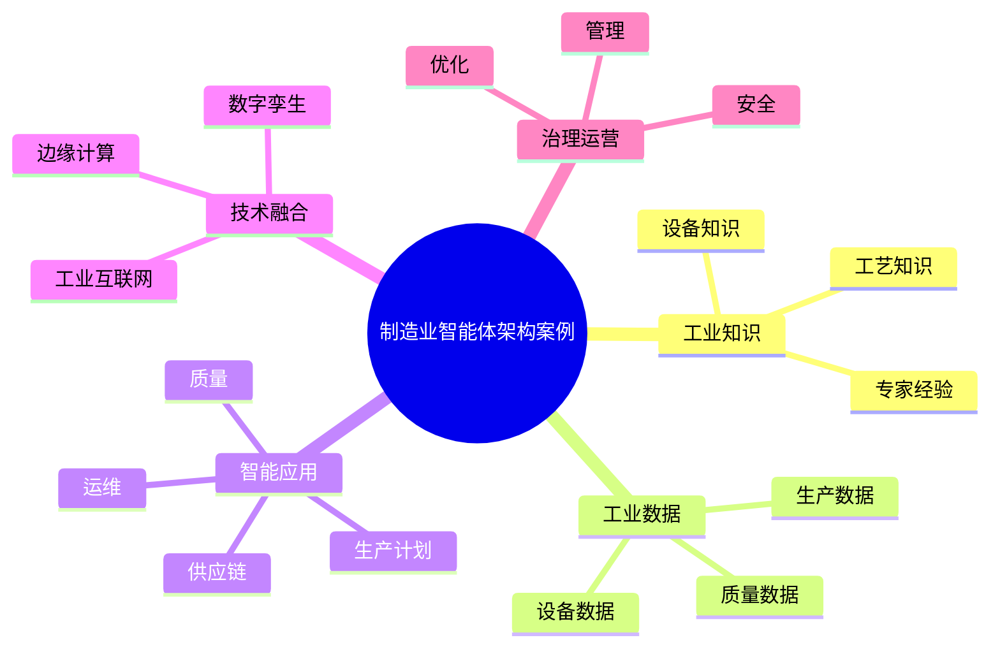

# 96-ai-agent-manufacturing-case.md（制造业智能体架构案例）

> 本文用于系统架构设计师考试案例分析专题 V2 复习。
>
> 本篇重点整理 Manufacturing AI Agent（制造业智能体）架构设计案例，包括工业知识库、工业数据体系、工业互联网融合、数字孪生、生产计划、设备运维、质量检测、工艺优化、供应链协同以及智能制造平台建设。

---

# 目录

1. 制造业智能体案例概述
2. 制造Agent基本概念
3. 智能制造AI应用挑战案例
4. 制造业智能体总体架构案例
5. 工业知识库建设案例
6. 工业数据体系案例
7. 工业互联网融合案例
8. 数字孪生智能体案例
9. 生产计划Agent案例
10. 设备运维Agent案例
11. 质量检测Agent案例
12. 工艺优化Agent案例
13. 供应链协同Agent案例
14. 智能仓储Agent案例
15. 制造多智能体协同案例
16. 工业Agent安全治理案例
17. 制造Agent运营管理案例
18. 智能制造智能体平台案例
19. 制造Agent建设方法案例
20. 制造业智能体演进案例
21. 案例分析答题模板
22. 高频考点
23. 易错点
24. Mermaid知识结构图
25. 本节小结

---

# 1. 制造业智能体案例概述

制造业智能体：

> 面向工业生产场景，结合工业知识、生产数据和制造流程，实现生产分析、设备控制和智能决策的AI Agent系统。

传统制造系统：

```text
生产人员

↓

MES系统

↓

设备系统

↓

生产数据
```

制造业智能体：

```text
生产人员

↓

制造Agent

↓

工业知识库

↓

MES/ERP/设备系统

↓

工业数据平台

↓

工业模型
```

---

# 2. 制造Agent基本概念

核心能力：

- 工业知识理解；
- 生产过程分析；
- 设备状态判断；
- 工艺优化；
- 自动决策。

特点：

- 强业务关联；
- 强实时性；
- 高可靠性。

---

# 3. 智能制造AI应用挑战案例

主要问题：

- 工业数据孤岛；
- 工艺知识依赖专家；
- 生产过程复杂；
- 实时性要求高。

---

# 4. 制造业智能体总体架构案例

```text
制造用户

↓

制造Agent应用层

↓

Agent能力服务层

↓

工业知识与数据层

↓

工业模型层

↓

工业互联网平台
```

---

# 5. 工业知识库建设案例

知识来源：

- 工艺规范；
- 设备手册；
- 维修记录；
- 专家经验。

技术：

- RAG；
- 知识图谱；
- 工业知识库。

---

# 6. 工业数据体系案例

数据：

- 设备数据；
- 生产数据；
- 质量数据；
- 能耗数据。

来源：

- 传感器；
- PLC；
- MES；
- ERP。

---

# 7. 工业互联网融合案例

融合：

- 工业设备；
- 边缘计算；
- 云平台；
- 数据平台。

实现：

设备、数据与Agent连接。

---

# 8. 数字孪生智能体案例

能力：

- 实时模拟；
- 状态预测；
- 优化建议。

流程：

```text
真实设备

↓

数字孪生模型

↓

Agent分析

↓

优化决策
```

---

# 9. 生产计划Agent案例

能力：

- 订单分析；
- 生产排程；
- 资源优化。

---

# 10. 设备运维Agent案例

能力：

- 状态监测；
- 故障预测；
- 维修建议。

流程：

```text
设备数据

↓

异常检测

↓

故障预测

↓

维护建议
```

---

# 11. 质量检测Agent案例

能力：

- 缺陷识别；
- 质量分析；
- 原因追踪。

结合：

- 机器视觉；
- 工业数据分析。

---

# 12. 工艺优化Agent案例

能力：

- 参数调整；
- 工艺分析；
- 生产优化。

---

# 13. 供应链协同Agent案例

能力：

- 需求预测；
- 库存优化；
- 供应商分析。

---

# 14. 智能仓储Agent案例

能力：

- 库存管理；
- 自动调度；
- 物流优化。

---

# 15. 制造多智能体协同案例

架构：

```text
生产计划Agent

↓

设备Agent

↓

质量Agent

↓

供应链Agent

↓

决策Agent
```

实现：

生产全过程协同。

---

# 16. 工业Agent安全治理案例

安全：

- 工业网络安全；
- 设备访问控制；
- 数据保护；
- 操作审计。

---

# 17. 制造Agent运营管理案例

管理：

- Agent版本；
- 模型效果；
- 设备适配；
- 运行成本。

---

# 18. 智能制造智能体平台案例

平台能力：

```text
工业模型

+

知识管理

+

设备连接

+

Agent开发

+

运行治理
```

---

# 19. 制造Agent建设方法案例

步骤：

```text
业务分析

↓

选择制造场景

↓

建设工业知识

↓

接入设备数据

↓

设计Agent

↓

持续优化
```

---

# 20. 制造业智能体演进案例

```text
自动化制造

↓

数字化制造

↓

智能制造

↓

制造智能体

↓

AI原生制造
```

---

# 案例分析答题模板

## 制造经验无法沉淀

> 建设制造业智能体，通过工业知识库和知识图谱沉淀专家经验。

## 设备维护成本高

> 引入设备运维Agent，实现状态监测、故障预测和智能维护。

## 生产优化能力不足

> 结合工业数据、数字孪生和智能体，实现生产过程优化。

## 推进智能制造转型

> 建设制造智能体平台，实现AI能力与工业系统深度融合。

---

# 高频考点

重点掌握：

1. 制造业智能体总体架构；
2. 工业知识库建设；
3. 工业数据体系；
4. 工业互联网融合；
5. 数字孪生智能体；
6. 设备运维与生产优化；
7. 智能制造平台建设。

---

# 易错点

|易错知识|正确理解|
|-|-|
|制造Agent只是聊天助手|需要连接设备和生产系统|
|只关注模型能力|还需要工业知识和数据|
|工业场景可以完全自动化|关键环节仍需人工控制|
|智能制造只依赖AI模型|需要工业平台和系统集成|

---

# Mermaid知识结构图



---

# 本节小结

制造业智能体架构案例核心：

> 通过工业知识、生产数据、工业互联网和AI Agent结合，实现生产过程智能化、设备运维智能化和制造决策智能化。

案例分析重点：

- 理解制造业Agent架构；
- 掌握工业知识和数据建设；
- 理解数字孪生融合；
- 掌握智能制造智能体建设路径。
