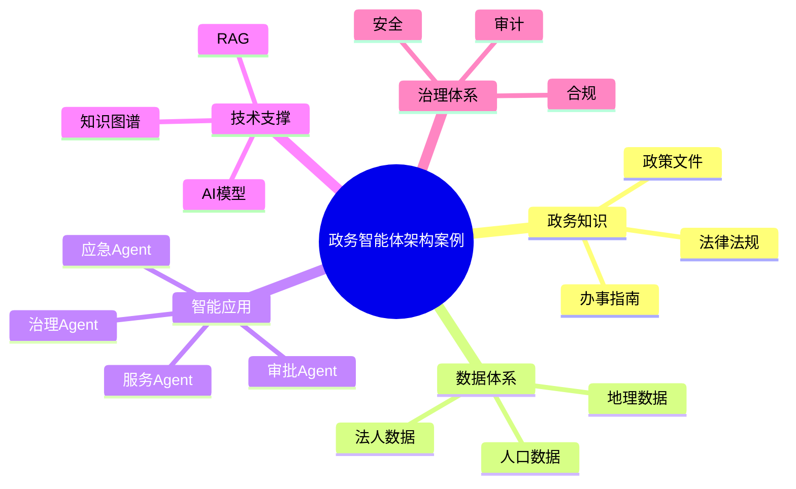

# 97-ai-agent-government-case.md（政务智能体架构案例）

> 本文用于系统架构设计师考试案例分析专题 V2 复习。
>
> 本篇重点整理 Government AI Agent（政务智能体）架构设计案例，包括政策知识库、政务数据资源、知识图谱、政务服务Agent、政策咨询Agent、智能审批Agent、城市治理Agent、应急管理Agent以及智慧城市智能体平台建设。

---

# 目录

1. 政务智能体案例概述
2. 政务Agent基本概念
3. 数字政府AI应用挑战案例
4. 政务智能体总体架构案例
5. 政策知识库建设案例
6. 政务数据资源体系案例
7. 政务知识图谱案例
8. 政务服务Agent案例
9. 政策咨询Agent案例
10. 智能审批Agent案例
11. 城市治理Agent案例
12. 公共服务Agent案例
13. 应急管理Agent案例
14. 政务多智能体协同案例
15. 政务Agent安全治理案例
16. 政务Agent合规监管案例
17. 智慧城市智能体平台案例
18. 政务Agent建设方法案例
19. 政务智能体演进案例
20. 案例分析答题模板
21. 高频考点
22. 易错点
23. Mermaid知识结构图
24. 本节小结

---

# 1. 政务智能体案例概述

政务智能体：

> 面向政府管理和公共服务场景，结合政策知识、政务数据和业务流程，实现智能咨询、业务办理和治理辅助的AI Agent系统。

传统政务系统：

```text
群众

↓

政务大厅

↓

业务系统

↓

人工办理
```

政务智能体：

```text
群众

↓

政务Agent

↓

政策知识库

↓

政务系统

↓

数据平台

↓

AI模型
```

---

# 2. 政务Agent基本概念

核心能力：

- 政策理解；
- 服务咨询；
- 流程执行；
- 数据分析；
- 决策辅助。

特点：

- 强政策约束；
- 高可靠要求；
- 强安全要求。

---

# 3. 数字政府AI应用挑战案例

主要问题：

- 政策知识复杂；
- 数据共享困难；
- 服务流程复杂；
- 安全合规要求高。

---

# 4. 政务智能体总体架构案例

```text
政府用户

↓

政务Agent应用层

↓

Agent能力服务层

↓

政策知识与数据层

↓

政务模型层

↓

数字政府基础平台
```

---

# 5. 政策知识库建设案例

知识来源：

- 法律法规；
- 政策文件；
- 办事指南；
- 历史案例。

技术：

- RAG；
- 知识图谱；
- 向量数据库。

---

# 6. 政务数据资源体系案例

数据：

- 人口数据；
- 法人数据；
- 地理数据；
- 业务数据。

目标：

形成政务数据资源体系。

---

# 7. 政务知识图谱案例

构建：

```text
政策

↓

事项

↓

部门

↓

流程

↓

材料
```

作用：

提高政策理解和服务准确性。

---

# 8. 政务服务Agent案例

能力：

- 办事咨询；
- 材料准备；
- 流程指导。

流程：

```text
群众问题

↓

服务Agent

↓

知识检索

↓

办理建议
```

---

# 9. 政策咨询Agent案例

能力：

- 政策查询；
- 条件判断；
- 政策匹配。

---

# 10. 智能审批Agent案例

流程：

```text
申请提交

↓

材料分析

↓

规则检查

↓

审批建议

↓

人工确认
```

---

# 11. 城市治理Agent案例

场景：

- 城市管理；
- 交通分析；
- 环境监测。

---

# 12. 公共服务Agent案例

应用：

- 社保咨询；
- 医疗服务；
- 教育服务。

---

# 13. 应急管理Agent案例

能力：

- 风险预测；
- 应急分析；
- 指挥辅助。

---

# 14. 政务多智能体协同案例

架构：

```text
政策Agent

↓

服务Agent

↓

审批Agent

↓

数据Agent

↓

决策Agent
```

实现：

跨部门协同。

---

# 15. 政务Agent安全治理案例

安全：

- 身份认证；
- 数据权限；
- 隐私保护；
- 操作审计。

---

# 16. 政务Agent合规监管案例

要求：

- 可解释；
- 可追溯；
- 可监督。

措施：

- 日志管理；
- 决策记录；
- 人工审核。

---

# 17. 智慧城市智能体平台案例

平台能力：

```text
政策模型

+

知识管理

+

数据治理

+

Agent开发

+

运行监管
```

---

# 18. 政务Agent建设方法案例

步骤：

```text
业务分析

↓

选择政务场景

↓

建设知识体系

↓

接入政务数据

↓

设计Agent

↓

安全治理
```

---

# 19. 政务智能体演进案例

```text
电子政务

↓

数字政府

↓

智慧政务

↓

政务智能体

↓

AI原生政府服务
```

---

# 案例分析答题模板

## 群众办事效率低

> 建设政务智能体，通过政策知识库和流程自动化提升公共服务效率。

## 政策信息复杂

> 利用RAG和知识图谱构建政策智能服务能力，提高政策查询准确性。

## 跨部门协同困难

> 建设政务Agent平台，实现数据共享和业务流程协同。

## 政府AI应用规模化

> 构建统一政务智能体平台，实现AI能力与数字政府体系融合。

---

# 高频考点

重点掌握：

1. 政务智能体总体架构；
2. 政策知识库建设；
3. 政务数据资源体系；
4. 政务知识图谱；
5. 智能审批流程；
6. 政务AI安全治理；
7. 智慧城市智能体平台。

---

# 易错点

|易错知识|正确理解|
|-|-|
|政务Agent只是客服机器人|需要连接政策、数据和业务系统|
|只依赖大模型能力|需要知识库和流程支撑|
|政务数据可以直接开放|需要权限和安全治理|
|AI可以完全替代审批人员|高风险环节需要人工审核|

---

# Mermaid知识结构图



---

# 本节小结

政务智能体架构案例核心：

> 通过政策知识、政务数据、业务流程与AI Agent结合，实现智慧政务服务和政府治理智能化。

案例分析重点：

- 理解政务Agent架构；
- 掌握政策知识与数据建设；
- 理解政务流程智能化；
- 掌握政府AI治理方法。
