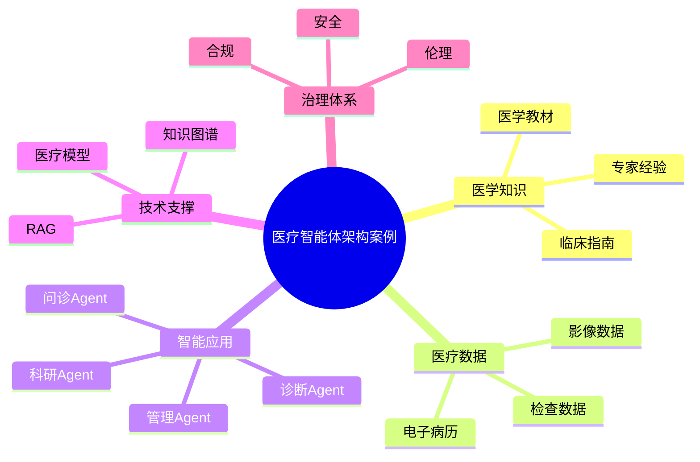

# 98-ai-agent-healthcare-case.md（医疗智能体架构案例）

> 本文用于系统架构设计师考试案例分析专题 V2 复习。
>
> 本篇重点整理 Healthcare AI Agent（医疗智能体）架构设计案例，包括医学知识库、医疗数据体系、医学知识图谱、智能问诊、辅助诊断、病历分析、医学科研、药物研发、医疗管理以及医疗AI安全治理体系。

---

# 目录

1. 医疗智能体案例概述
2. 医疗Agent基本概念
3. 医疗AI应用建设挑战案例
4. 医疗智能体总体架构案例
5. 医学知识库建设案例
6. 医疗数据体系案例
7. 医学知识图谱案例
8. 智能问诊Agent案例
9. 辅助诊断Agent案例
10. 病历分析Agent案例
11. 医学科研Agent案例
12. 药物研发Agent案例
13. 医疗管理Agent案例
14. 医疗多智能体协同案例
15. 医疗Agent安全治理案例
16. 医疗Agent伦理合规案例
17. 智慧医疗智能体平台案例
18. 医疗Agent建设方法案例
19. 医疗智能体演进案例
20. 案例分析答题模板
21. 高频考点
22. 易错点
23. Mermaid知识结构图
24. 本节小结

---

# 1. 医疗智能体案例概述

医疗智能体：

> 面向医疗服务场景，结合医学知识、医疗数据和诊疗流程，实现辅助诊疗、医疗服务和管理优化的AI Agent系统。

传统医疗系统：

```text
患者

↓

医院系统

↓

医生诊断

↓

医疗记录
```

医疗智能体：

```text
患者/医生

↓

医疗Agent

↓

医学知识库

↓

电子病历/医疗系统

↓

医疗数据平台

↓

AI模型
```

---

# 2. 医疗Agent基本概念

核心能力：

- 医学知识理解；
- 症状分析；
- 辅助推理；
- 医疗信息查询；
- 临床决策辅助。

特点：

- 高专业性；
- 高安全要求；
- 强监管要求。

---

# 3. 医疗AI应用建设挑战案例

主要问题：

- 医学知识复杂；
- 医疗数据敏感；
- 诊疗风险高；
- 数据标准不统一。

---

# 4. 医疗智能体总体架构案例

```text
医疗用户

↓

医疗Agent应用层

↓

Agent能力服务层

↓

医学知识与医疗数据层

↓

医疗模型层

↓

智慧医疗基础平台
```

---

# 5. 医学知识库建设案例

知识来源：

- 医学教材；
- 临床指南；
- 医疗规范；
- 专家经验。

技术：

- RAG；
- 知识图谱；
- 向量数据库。

---

# 6. 医疗数据体系案例

数据：

- 电子病历；
- 检查数据；
- 医学影像；
- 基因数据。

目标：

支撑医疗智能分析。

---

# 7. 医学知识图谱案例

```text
疾病

↓

症状

↓

检查

↓

治疗方案

↓

药物
```

作用：

提升医疗推理能力。

---

# 8. 智能问诊Agent案例

能力：

- 症状咨询；
- 健康建议；
- 就医指导。

流程：

```text
患者描述

↓

问诊Agent

↓

知识检索

↓

健康建议
```

---

# 9. 辅助诊断Agent案例

能力：

- 症状分析；
- 检查结果分析；
- 诊断建议。

流程：

```text
患者数据

↓

AI分析

↓

诊断建议

↓

医生确认
```

---

# 10. 病历分析Agent案例

能力：

- 病历摘要；
- 信息提取；
- 风险提示。

---

# 11. 医学科研Agent案例

能力：

- 文献分析；
- 实验设计辅助；
- 数据分析。

---

# 12. 药物研发Agent案例

能力：

- 靶点分析；
- 药物筛选；
- 研发辅助。

---

# 13. 医疗管理Agent案例

应用：

- 医院运营分析；
- 床位管理；
- 医疗资源调度。

---

# 14. 医疗多智能体协同案例

架构：

```text
问诊Agent

↓

诊断Agent

↓

治疗Agent

↓

药物Agent

↓

管理Agent
```

实现：

医疗全过程协同。

---

# 15. 医疗Agent安全治理案例

安全：

- 数据脱敏；
- 访问控制；
- 隐私保护；
- 操作审计。

---

# 16. 医疗Agent伦理合规案例

要求：

- 人工医生确认；
- 决策可解释；
- 医疗责任明确。

---

# 17. 智慧医疗智能体平台案例

平台能力：

```text
医学模型

+

知识管理

+

医疗数据治理

+

Agent开发

+

安全监管
```

---

# 18. 医疗Agent建设方法案例

步骤：

```text
医疗场景分析

↓

选择应用方向

↓

建设医学知识体系

↓

接入医疗数据

↓

设计Agent

↓

安全验证
```

---

# 19. 医疗智能体演进案例

```text
电子医疗

↓

数字医疗

↓

智慧医疗

↓

医疗智能体

↓

AI原生医疗
```

---

# 案例分析答题模板

## 医疗知识利用不足

> 建设医疗智能体，通过医学知识库和知识图谱提升医疗知识服务能力。

## 医生工作压力大

> 引入辅助诊断Agent，提高医疗分析效率。

## 医疗数据价值不足

> 建立医疗数据治理体系，为Agent提供可靠数据支撑。

## 医疗AI存在风险

> 通过人工审核、安全治理和伦理监管，实现可信医疗智能化。

---

# 高频考点

重点掌握：

1. 医疗智能体总体架构；
2. 医学知识库建设；
3. 医疗数据治理；
4. 医学知识图谱；
5. 辅助诊断流程；
6. 医疗AI安全治理；
7. 医疗智能化演进。

---

# 易错点

|易错知识|正确理解|
|-|-|
|医疗Agent只是问答机器人|需要结合医疗数据和诊疗流程|
|只需要模型能力|还需要医学知识和数据治理|
|AI可以替代医生|高风险诊疗需要医生参与|
|医疗数据可以直接使用|需要隐私保护和安全治理|

---

# Mermaid知识结构图



---

# 本节小结

医疗智能体架构案例核心：

> 通过医学知识、医疗数据、诊疗流程与AI Agent结合，实现安全、可靠、可信的智慧医疗应用。

案例分析重点：

- 理解医疗Agent架构；
- 掌握医学知识和数据建设；
- 理解辅助诊断应用；
- 掌握医疗AI治理方法。
