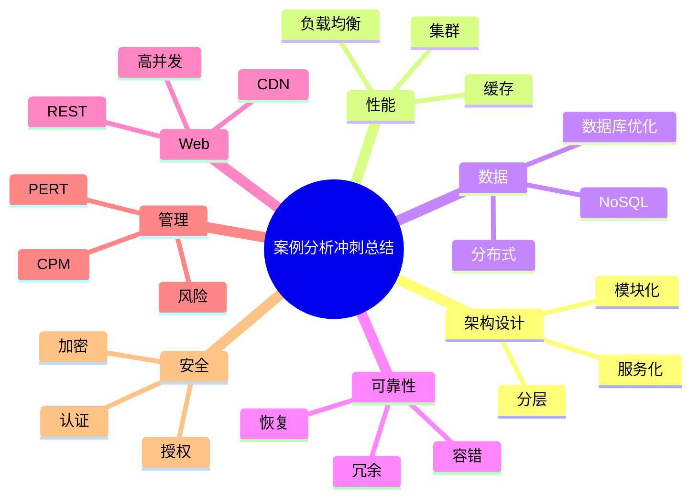

# 11 Summary（案例分析冲刺总结）

> 本文用于系统架构设计师考试案例分析专题冲刺复习。
>
> 本篇对案例分析专题进行整体总结，整理案例分析答题方法、常见案例类型、质量属性与技术方案对应关系、高频考点以及考前复习策略。

---

# 目录

1. 案例分析考试特点
2. 案例分析通用答题框架
3. 九大案例类型速查
4. 质量属性与架构策略映射
5. 高频关键词与技术方案
6. 万能答题模板
7. 案例分析易错点
8. 考前冲刺重点
9. Mermaid知识总览图
10. 本章总结

---

# 1. 案例分析考试特点

系统架构设计师案例分析主要考查：

- 架构设计能力；
- 技术方案选择能力；
- 问题分析能力；
- 工程实践能力。

案例不是简单考查概念，而是要求：

```text
业务背景

↓

发现问题

↓

分析原因

↓

提出架构方案

↓

说明技术优势
```

---

# 2. 案例分析通用答题框架（★★★★★）

面对任何案例，可以按照以下流程回答。

## 第一步：识别系统问题

关注关键词：

| 关键词 | 对应问题 |
|---|---|
| 访问量大 | 性能问题 |
| 数据增长快 | 扩展问题 |
| 不能中断 | 可用性问题 |
| 数据泄露 | 安全问题 |
| 经常修改 | 可维护性问题 |

---

## 第二步：确定质量属性

常见质量属性：

- 性能；
- 可用性；
- 安全性；
- 可靠性；
- 可修改性；
- 可扩展性。

---

## 第三步：选择技术方案

例如：

```text
高并发

↓

缓存 + 负载均衡 + 集群
```

```text
高可靠

↓

冗余 + 容错 + 故障恢复
```

---

## 第四步：说明收益

回答不要只写技术名称，需要说明作用。

例如：

错误：

> 使用Redis。

正确：

> 使用Redis缓存热点数据，减少数据库访问压力，提高系统响应速度。

---

# 3. 九大案例类型速查

## 3.1 软件架构设计案例

核心：

- 架构风格；
- 分层架构；
- 模块化设计。

关键词：

- 扩展；
- 维护；
- 解耦。

---

## 3.2 软件质量属性案例

核心：

| 属性 | 策略 |
|---|---|
| 性能 | 缓存、集群、负载均衡 |
| 可用性 | 冗余、故障转移 |
| 安全性 | 认证、授权、加密 |
| 可修改性 | 分层、接口隔离 |
| 可靠性 | 容错、备份 |

---

## 3.3 MVC / SOA / ESB案例

MVC：

> 分离表示层、业务逻辑和数据处理。

SOA：

> 将业务能力封装成服务，提高复用能力。

ESB：

> 实现服务通信、转换和路由。

---

## 3.4 数据库系统案例

常见方案：

| 问题 | 方案 |
|---|---|
| 查询慢 | 索引、SQL优化 |
| 并发高 | 缓存、读写分离 |
| 数据量大 | 分库分表 |
| 高可靠 | 主从、备份 |

---

## 3.5 NoSQL案例

核心：

- CAP理论；
- BASE模型；
- Redis；
- 文档数据库。

应用：

- 高并发；
- 海量数据；
- 灵活结构。

---

## 3.6 嵌入式系统案例

核心：

- 实时性；
- 可靠性；
- 容错。

重点：

- N版本程序设计；
- 恢复块设计。

---

## 3.7 Web应用开发案例

核心：

- B/S架构；
- REST；
- 前后端分离；
- CDN；
- 负载均衡。

---

## 3.8 项目管理案例

重点：

- 甘特图；
- PERT；
- CPM；
- 关键路径；
- 总时差。

公式：

```text
总时差 = LS - ES

总时差 = LF - EF
```

---

## 3.9 信息安全案例

重点：

- 身份认证；
- 访问控制；
- 加密；
- 防火墙；
- IDS/IPS。

---

# 4. 质量属性与架构策略映射（★★★★★）

| 需求 | 架构策略 |
|---|---|
| 高性能 | 缓存、异步、集群 |
| 高可用 | 冗余、故障转移 |
| 高安全 | 加密、认证、授权 |
| 高可靠 | 容错、备份 |
| 易维护 | 分层、模块化 |
| 易扩展 | 服务化、接口化 |

---

# 5. 高频关键词与技术方案

## 高并发

关键词：

- 用户量大；
- 响应慢。

方案：

- 负载均衡；
- 缓存；
- 集群；
- 异步处理。

---

## 数据量增长

方案：

- 分库分表；
- 分布式存储；
- NoSQL。

---

## 系统不可用

方案：

- 主备；
- 冗余；
- 故障转移。

---

## 数据安全

方案：

- 加密；
- 权限控制；
- 审计；
- 备份。

---

# 6. 万能答题模板（★★★★★）

## 性能问题

> 采用缓存、负载均衡和集群部署方式，将请求压力分散，提高系统吞吐能力和响应速度。

---

## 可用性问题

> 采用冗余设计和故障转移机制，避免单点故障，提高系统可用性。

---

## 安全问题

> 采用身份认证、权限控制和数据加密措施，保障系统和数据安全。

---

## 扩展问题

> 采用模块化、服务化设计，通过接口降低耦合，提高系统扩展能力。

---

# 7. 案例分析易错点

| 错误 | 正确理解 |
|---|---|
| 技术名称越多越好 | 重点说明解决的问题 |
| 缓存解决全部性能问题 | 缓存只是优化手段 |
| SOA就是Web Service | SOA是架构思想 |
| 关键路径是最短路径 | 关键路径是最长路径 |
| IDS负责阻断攻击 | IDS主要检测 |

---

# 8. 考前冲刺重点

★★★★★必须掌握：

1. 质量属性与架构策略；
2. MVC/SOA/ESB；
3. 数据库优化方案；
4. NoSQL与CAP；
5. 嵌入式可靠性设计；
6. Web高并发架构；
7. 关键路径计算；
8. 信息安全措施。

---

# 9. Mermaid知识总览图



---

# 10. 本章总结

案例分析的核心不是背诵技术，而是：

> 根据业务需求识别问题，根据质量属性选择架构策略，并使用规范的架构术语说明解决方案。

最终答题目标：

- 看到问题 → 判断类型；
- 判断类型 → 选择方案；
- 选择方案 → 说明价值。

掌握固定分析框架，可以覆盖大部分系统架构设计师案例分析题型。
