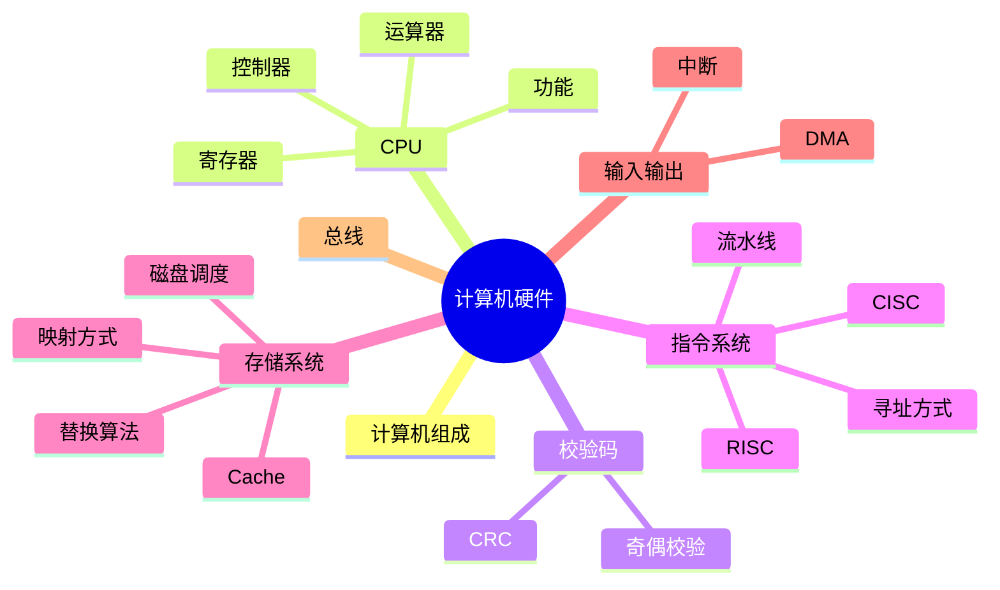

# 第一章｜计算机硬件

> **章节定位**
>
> 本章介绍计算机硬件系统基础，包括计算机组成、CPU、校验码、指令系统、存储系统、输入/输出技术及总线结构。
>
> 本文档为《系统架构设计师知识库》第一章门户页（Index），用于建立整体学习路线和章节导航。

------------------------------------------------------------------------

## 📖 一句话理解

**计算机硬件负责数据的输入、处理、存储和输出，而 CPU
是整个硬件系统的核心。**

------------------------------------------------------------------------

## 🎯 学习目标

完成本章后，你应该能够：

-   理解计算机五大组成部分
-   掌握 CPU 的组成与功能
-   掌握常见寄存器
-   理解奇偶校验与 CRC
-   理解指令执行过程
-   掌握 Cache 工作机制
-   理解 DMA、中断与总线

------------------------------------------------------------------------

## 🧭 本章知识地图



------------------------------------------------------------------------

## ⭐ 考情分析

| 知识点 | 考试指数 |
| --- | --- |
| CPU | ⭐⭐⭐⭐⭐ |
| Cache | ⭐⭐⭐⭐⭐ |
| 流水线 | ⭐⭐⭐⭐⭐ |
| CRC | ⭐⭐⭐⭐ |
| DMA | ⭐⭐⭐⭐ |
| 总线 | ⭐⭐⭐ |
| 磁盘调度 | ⭐⭐ |

------------------------------------------------------------------------

## 📚 推荐学习路线

```text
计算机组成
    ↓
CPU
    ↓
校验码
    ↓
指令系统
    ↓
存储系统
    ↓
输入/输出技术
    ↓
总线结构
```

------------------------------------------------------------------------

## 📑 章节导航

| 学习单元 | 内容 |
| --- | --- |
| [计算机组成](./02-computer-organization) | 五大组成部分与数据流转 |
| [CPU](./03-cpu) | CPU 功能、结构与寄存器 |
| [校验码](./04-checksum) | 码距、奇偶校验与 CRC |
| [指令系统](./05-instruction-system) | 指令格式、执行过程与寻址方式 |
| [存储系统](./06-storage-system) | 存储层次、Cache 与局部性原理 |
| [输入输出技术](./07-io) | 程序控制、中断与 DMA |
| [总线](./08-bus) | 数据、地址与控制总线 |
| [历年真题](./09-past-exams) | 原资料真题与考点整理 |
| [综合练习](./10-exercises) | 选择题、判断题与思考题 |
| [第一章总结](./11-summary) | 核心知识、易错点与速记 |

---

## 🤖 AI 学习建议

推荐 Prompt：

> 请结合生活中的例子，解释计算机硬件各组成部分之间如何协同工作，并说明
> CPU、Cache 与 DMA 在整个系统中的作用。

------------------------------------------------------------------------

## 💼 开发者视角

完成本章后，你将能够理解：

-   浏览器为什么依赖 CPU；
-   Redis 为什么被称为 Cache；
-   为什么 SSD 比机械硬盘速度更快；
-   为什么 DMA 能减少 CPU 开销。

这些知识将在后续操作系统、数据库和计算机网络章节继续延伸。

------------------------------------------------------------------------

## 📌 阅读建议

建议先完成[计算机组成](./02-computer-organization)，再进入 [CPU](./03-cpu)。CPU 是整个第一章的核心，也是后续多个章节的重要基础。

------------------------------------------------------------------------

## 🚀 下一步

➡ [开始学习：计算机组成](./02-computer-organization)
