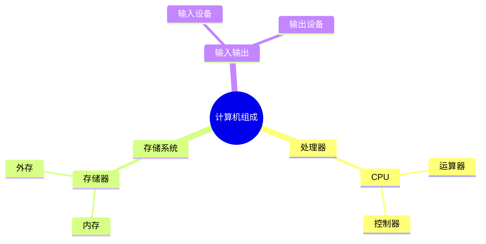

# 第一节 计算机组成

> **说明**
>
> 本文依据《计算机硬件》资料进行知识重构，保持原资料知识框架，优化为知识库阅读形式。

## 一句话理解

计算机硬件由**运算器、控制器、存储器、输入设备、输出设备**五大部分组成，其中**运算器和控制器共同组成
CPU**。

------------------------------------------------------------------------

## 为什么学习这一节？

本节是整个第一章的基础。CPU、Cache、DMA、总线等内容都建立在计算机组成结构之上。

------------------------------------------------------------------------

## 学习目标

-   理解五大组成部分
-   理解 CPU 在系统中的位置
-   区分内存与外存
-   建立整体硬件认知

------------------------------------------------------------------------

## 知识地图



------------------------------------------------------------------------

## 五大组成部分

### 运算器（Arithmetic Unit）

负责完成算术运算和逻辑运算，是执行数据处理的核心部件。

### 控制器（Control Unit）

负责取指、分析指令、发出控制信号，协调各部件工作。

> **提示：** **CPU = 运算器 + 控制器**

### 存储器

用于保存程序、数据以及中间结果。

| 类型 | 特点 |
| --- | --- |
| 内存 | 速度快，容量较小，用于程序运行 |
| 外存 | 容量大，速度较慢，用于长期保存数据 |

### 输入设备

常见设备：键盘、鼠标、扫描仪、摄像头。

### 输出设备

常见设备：显示器、打印机、音箱。

------------------------------------------------------------------------

## 数据流转示意


------------------------------------------------------------------------

## 高频考点

| 知识点 | 频率 |
| --- | --- |
| CPU = 运算器 + 控制器 | ⭐⭐⭐⭐⭐ |
| 五大组成 | ⭐⭐⭐⭐ |
| 内存与外存 | ⭐⭐⭐⭐ |

------------------------------------------------------------------------

## 易错点

> **注意：**
>
> CPU 并不是整个计算机，也不是整个主机。
>
> CPU 仅由**运算器**和**控制器**组成。

------------------------------------------------------------------------

## AI 学习建议

推荐 Prompt：

> 请用一家物流公司的例子解释输入设备、CPU、存储器、输出设备之间如何协同完成一次数据处理。

------------------------------------------------------------------------

## 开发者视角

| 理论知识 | 工程实践 |
| --- | --- |
| CPU | JavaScript 执行 |
| 内存 | 浏览器运行时内存 |
| 外存 | SSD / HDD |
| 输入设备 | 鼠标、键盘 |
| 输出设备 | 浏览器页面、显示器 |

------------------------------------------------------------------------

## 架构师思考

为什么 CPU 不直接访问磁盘，而是需要内存？

尝试从**速度差异**和**分层设计**两个角度思考，后续学习 Cache
与操作系统时会得到更完整的答案。

------------------------------------------------------------------------

## 一分钟速记

```text
计算机
├── CPU
│  ├── 运算器
│  └── 控制器
├── 存储器
│  ├── 内存
│  └── 外存
├── 输入设备
└── 输出设备
```

------------------------------------------------------------------------

## 本节总结

-   掌握计算机五大组成部分。
-   牢记 **CPU = 运算器 + 控制器**。
-   区分内存与外存。
-   为后续 CPU、Cache、DMA 等章节打下基础。

------------------------------------------------------------------------

## 下一节

➡ [继续阅读：CPU](./03-cpu)
