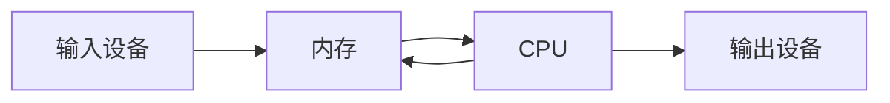
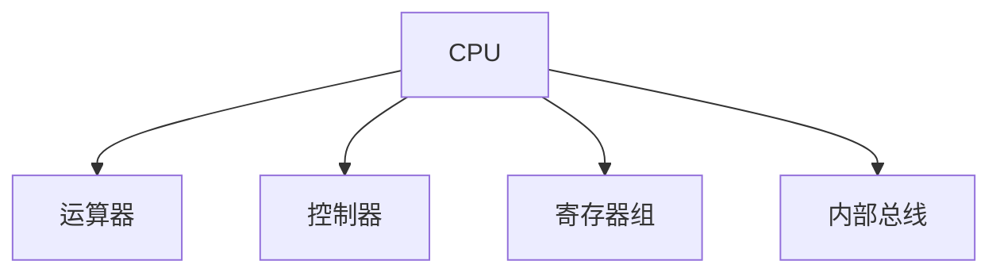
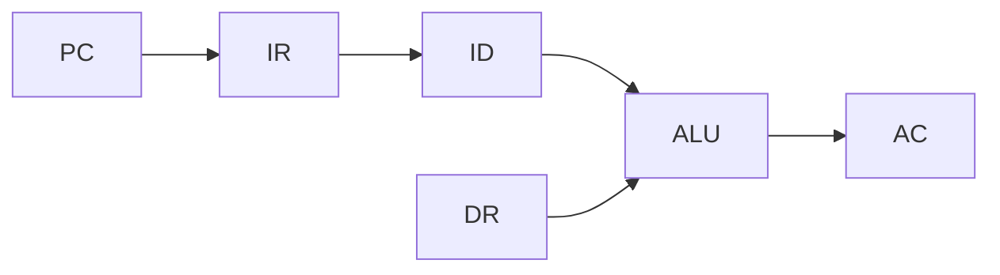

# 第二节 CPU（中央处理器）

> **说明**
> 本文依据你提供的《计算机硬件》资料整理，并在不改变原有知识框架的基础上增加了知识图、学习建议和工程实践内容。

## 一句话理解

CPU（Central Processing
Unit，中央处理器）是计算机的核心部件，负责执行程序、处理数据并协调计算机各组成部分的工作。

------------------------------------------------------------------------

## 本节学习目标

-   理解 CPU 的作用
-   掌握 CPU 的五项主要功能
-   掌握 CPU 的组成结构
-   熟悉常见寄存器及其作用
-   能应对软考相关考点

------------------------------------------------------------------------

## CPU 在计算机中的位置



------------------------------------------------------------------------

## CPU 的主要功能

根据资料，CPU 主要具有以下功能：

| 功能 | 说明 |
| --- | --- |
| 程序控制 | 按程序顺序执行指令 |
| 操作控制 | 产生各种控制信号，协调各部件工作 |
| 时间控制 | 控制各项操作的时序 |
| 数据处理 | 完成算术运算和逻辑运算 |
| 中断处理 | 响应异常或中断请求 |

> **重点：** **程序控制、操作控制、时间控制、数据处理**
> 是考试中的高频考点，同时资料还提到 CPU 负责处理中断（异常）请求。

------------------------------------------------------------------------

## CPU 的组成

CPU 主要由以下几部分组成：



------------------------------------------------------------------------

### 运算器（ALU）

运算器负责执行：

-   算术运算
-   逻辑运算

常见寄存器：

| 寄存器 | 作用 |
| --- | --- |
| ALU | 算术逻辑运算单元 |
| AC | 累加器，保存运算结果 |
| DR | 数据寄存器，保存参与运算的数据 |
| PSW | 程序状态字寄存器，保存状态标志 |

------------------------------------------------------------------------

### 控制器

控制器负责解释指令并发出控制信号。

常见寄存器：

| 寄存器 | 作用 |
| --- | --- |
| IR | 指令寄存器，保存当前指令 |
| PC | 程序计数器，保存下一条指令地址 |
| AR | 地址寄存器 |
| ID | 指令译码器 |

------------------------------------------------------------------------

## 数据流示意



------------------------------------------------------------------------

## 高频考点

-   CPU = 运算器 + 控制器 + 寄存器组 + 内部总线
-   AC 保存运算结果
-   PC 保存下一条指令地址
-   IR 保存当前执行指令
-   PSW 保存程序运行状态

------------------------------------------------------------------------

## 易错点

> **注意：** **PC
> 保存的是下一条将要执行的指令地址，而不是当前指令地址。**

> **注意：** **IR 保存的是当前正在执行的指令内容。**

------------------------------------------------------------------------

## AI 学习建议

可以向 AI 提问：

```text
请结合生活中的快递分拣中心，解释 CPU 中 ALU、PC、IR、DR、AC、PSW 分别对应什么角色。
```

------------------------------------------------------------------------

## 开发者视角

对于前端开发者来说：

-   JavaScript 最终会被 CPU 执行。
-   浏览器解析 HTML、CSS、JavaScript 的过程，都需要 CPU 完成大量计算。
-   CPU 性能会直接影响大型前端项目的编译速度和运行效率。

------------------------------------------------------------------------

## 架构师思考

为什么 CPU 不把所有数据都放在寄存器中？

提示：

-   寄存器速度最快，但容量极小。
-   因此现代计算机采用 **寄存器 → Cache → 内存 → 外存** 的层次结构。

------------------------------------------------------------------------

## 一分钟速记

```text
CPU
├── 运算器
│   ├── ALU
│   ├── AC
│   ├── DR
│   └── PSW
├── 控制器
│   ├── IR
│   ├── PC
│   ├── AR
│   └── ID
├── 寄存器组
└── 内部总线
```

------------------------------------------------------------------------

## 本节总结

-   CPU 是计算机的核心。
-   熟记 CPU 的主要功能。
-   掌握各寄存器作用，特别是 AC、PC、IR、PSW。
-   为后续存储系统、指令系统等内容打下基础。

------------------------------------------------------------------------

## 下一节

➡ [继续阅读：校验码](./04-checksum)
