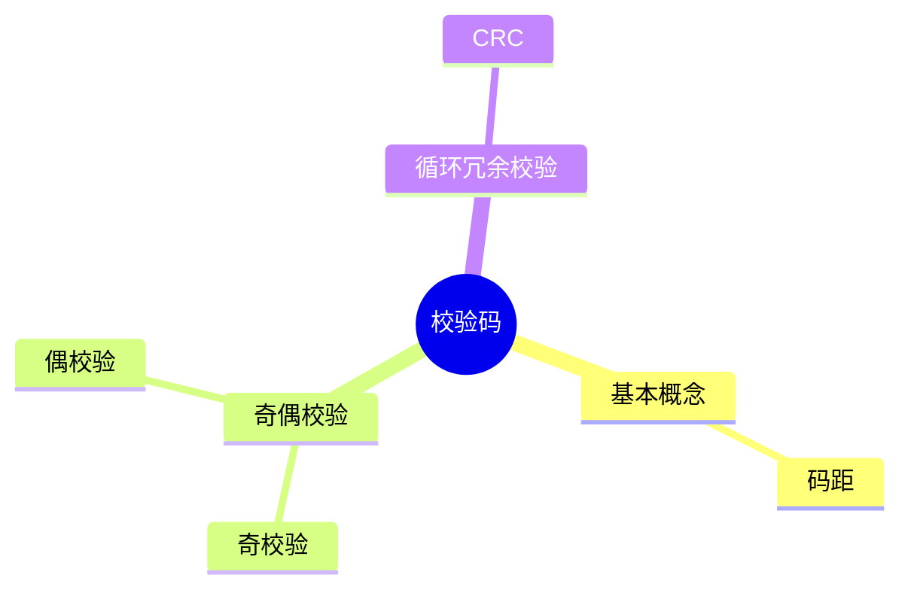

# 第三节 校验码

> **说明**
> 本文依据你提供的《计算机硬件》资料整理，在保持资料知识框架的基础上增加了知识图、学习建议和工程实践内容。

## 一句话理解

校验码用于发现（部分还能纠正）数据在传输或存储过程中产生的错误，是软考的重要考点。

------------------------------------------------------------------------

## 学习目标

-   理解码距的概念
-   掌握奇偶校验
-   掌握 CRC 基本原理
-   理解不同校验方式的特点

------------------------------------------------------------------------

## 知识地图



------------------------------------------------------------------------

## 为什么需要校验码？

网络传输、磁盘读写、内存访问都可能发生比特错误。

校验码的作用就是尽可能发现错误，部分算法还能进行纠错。

------------------------------------------------------------------------

## 码距（Hamming Distance）

码距表示两个编码之间**不同二进制位的数量**。

> **提示：** 最小码距越大，检错和纠错能力通常越强。

------------------------------------------------------------------------

## 奇偶校验

### 奇校验

增加一个校验位，使数据中 **1 的个数为奇数**。

### 偶校验

增加一个校验位，使数据中 **1 的个数为偶数**。

> **重点：** 奇偶校验只能发现部分错误，一般不能纠正错误。

------------------------------------------------------------------------

## CRC（循环冗余校验）

CRC 是实际工程中应用最广泛的检错算法之一。

基本步骤：

1.  发送端选择生成多项式；
2.  数据补零；
3.  模 2 除法；
4.  得到余数并附加到数据末尾；
5.  接收端再次进行模 2 运算验证结果。


------------------------------------------------------------------------

## 校验方式比较

| 方法 | 检错 | 纠错 | 特点 |
| --- | --- | --- | --- |
| 奇校验 | ✔ | ✘ | 实现简单 |
| 偶校验 | ✔ | ✘ | 实现简单 |
| CRC | ✔✔✔ | ✘ | 检错能力强，广泛使用 |

------------------------------------------------------------------------

## 高频考点

-   码距概念
-   奇偶校验特点
-   CRC 基本流程
-   CRC 计算题

------------------------------------------------------------------------

## 易错点

> **注意：** 奇偶校验**不能**保证发现所有错误，也**不能**完成纠错。

> **注意：** CRC 主要用于**检错**，不要与纠错码混淆。

------------------------------------------------------------------------

## AI 学习建议

尝试提问：

```text
请用一个快递包裹运输的例子解释奇偶校验和 CRC 的区别。
```

------------------------------------------------------------------------

## 开发者视角

-   网络通信协议大量使用 CRC。
-   ZIP、PNG 等文件格式也会利用 CRC 检测数据是否损坏。
-   Git 对对象完整性也采用校验思想，但实现机制不同。

------------------------------------------------------------------------

## 架构师思考

为什么高速网络依然需要 CRC？

因为链路速度提升并不能消除噪声、硬件故障和传输误码，可靠性仍然需要校验机制保障。

------------------------------------------------------------------------

## 一分钟速记

```text
校验码
├── 码距
├── 奇校验（检错）
├── 偶校验（检错）
└── CRC（高效检错）
```

------------------------------------------------------------------------

## 本节总结

-   理解码距含义。
-   掌握奇偶校验特点。
-   熟悉 CRC 工作流程。
-   能区分不同校验方法的应用场景。

------------------------------------------------------------------------

## 下一节

➡ [继续阅读：指令系统](./05-instruction-system)
