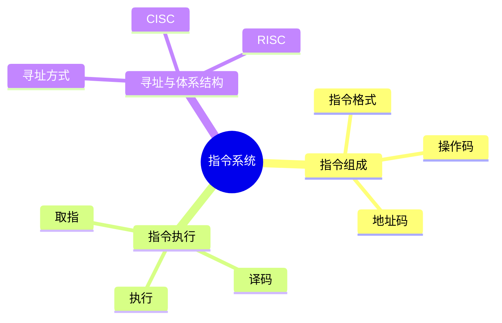
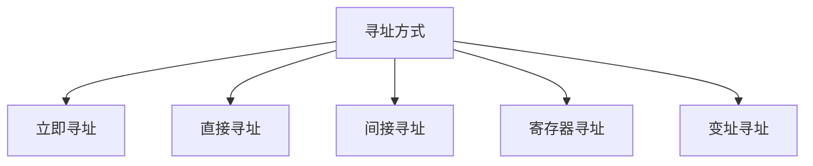

# 第四节 指令系统

> **说明**
> 本文依据你提供的《计算机硬件》资料整理，在保持原资料知识框架的基础上补充了知识图、学习建议和工程实践内容。

## 一句话理解

指令是 CPU
能直接识别并执行的命令，指令系统规定了计算机能够完成哪些操作以及如何完成。

------------------------------------------------------------------------

## 学习目标

-   理解指令与指令系统
-   掌握指令格式
-   理解操作码与地址码
-   熟悉常见寻址方式
-   掌握考试高频考点

------------------------------------------------------------------------

## 知识地图



------------------------------------------------------------------------

## 什么是指令系统？

程序由大量机器指令组成。

CPU 按照"取指 → 译码 → 执行"的流程依次执行每条指令。


------------------------------------------------------------------------

## 指令格式

一条机器指令通常由两部分组成：

| 组成 | 作用 |
| --- | --- |
| 操作码(OP) | 表示执行什么操作 |
| 地址码(A) | 表示操作对象的位置 |

> **提示：** 操作码决定"做什么"，地址码决定"对谁做"。

------------------------------------------------------------------------

## 操作码

操作码决定 CPU 要执行的功能，例如：

-   加法
-   减法
-   数据传送
-   跳转
-   比较

------------------------------------------------------------------------

## 地址码

地址码用于指出：

-   操作数的位置
-   运算结果保存的位置
-   下一步访问的数据位置

------------------------------------------------------------------------

## 常见寻址方式



| 寻址方式 | 特点 |
| --- | --- |
| 立即寻址 | 数据直接写在指令中 |
| 直接寻址 | 指令给出内存地址 |
| 间接寻址 | 通过地址找到真正数据 |
| 寄存器寻址 | 数据位于寄存器 |
| 变址寻址 | 常用于数组、字符串 |

------------------------------------------------------------------------

## 高频考点

-   操作码与地址码区别
-   各种寻址方式特点
-   指令执行流程

------------------------------------------------------------------------

## 易错点

> **注意：** 操作码表示操作类型，不保存数据。

> **注意：** 地址码不一定直接保存数据，也可能保存数据地址。

------------------------------------------------------------------------

## AI 学习建议

```text
请用"点外卖"举例说明立即寻址、直接寻址、间接寻址和寄存器寻址的区别。
```

------------------------------------------------------------------------

## 开发者视角

虽然高级语言不会直接编写机器指令，但编译器最终都会把代码转换为 CPU
可执行的机器指令。

理解指令系统有助于分析程序性能、理解编译优化以及阅读汇编代码。

------------------------------------------------------------------------

## 架构师思考

为什么现代 CPU 会不断扩展指令集（如 SIMD、向量指令）？

思考：如果一条指令能够同时处理多份数据，对性能会带来什么影响？

------------------------------------------------------------------------

## 一分钟速记

```text
指令
├── 操作码(OP)
└── 地址码(A)

执行流程
取指 → 译码 → 执行
```

------------------------------------------------------------------------

## 本节总结

-   指令由操作码和地址码组成。
-   操作码决定执行什么操作。
-   地址码决定操作对象。
-   掌握寻址方式是考试重点。

------------------------------------------------------------------------

## 下一节

➡ [继续阅读：存储系统](./06-storage-system)
