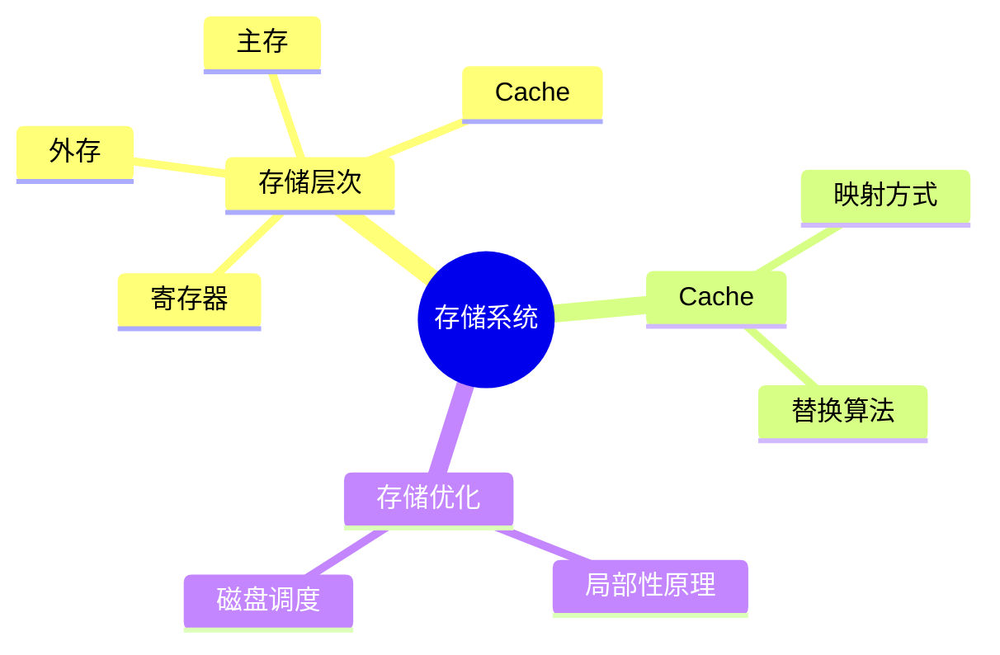
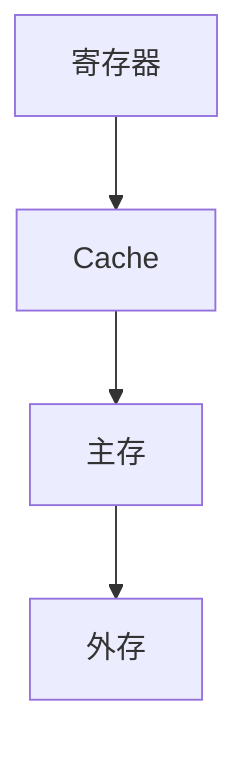
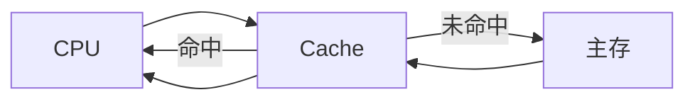

# 第五节 存储系统

> **说明**
> 本文依据《计算机硬件》资料整理，保持原有知识框架，并增加知识图、工程实践和学习建议等内容。

## 一句话理解

存储系统负责保存程序和数据，现代计算机采用多层次存储结构，在速度、容量和成本之间取得平衡。

------------------------------------------------------------------------

## 学习目标

-   理解存储系统层次结构
-   掌握寄存器、Cache、主存、外存的特点
-   理解局部性原理
-   掌握 Cache 基本概念
-   熟悉软考高频考点

------------------------------------------------------------------------

## 知识地图



------------------------------------------------------------------------

## 为什么需要多层次存储？

不同存储介质在速度、容量和成本方面存在明显差异。

现代计算机通过建立层次化存储系统，使 CPU 能够以较高效率访问数据。



------------------------------------------------------------------------

## 存储层次

| 层次 | 速度 | 容量 | 成本 |
| --- | --- | --- | --- |
| 寄存器 | 最高 | 最小 | 最高 |
| Cache | 很高 | 小 | 高 |
| 主存（RAM） | 较高 | 中 | 中 |
| 外存（SSD/HDD） | 较低 | 大 | 最低 |

> **提示：** 越靠近 CPU，速度越快、容量越小、成本越高。

------------------------------------------------------------------------

## Cache（高速缓冲存储器）

Cache 位于 CPU 与主存之间，用于缓解两者之间的速度差异。

### Cache 的作用

-   提高访问速度
-   降低 CPU 等待时间
-   提高系统整体性能

------------------------------------------------------------------------

## 局部性原理

Cache 能发挥作用的重要原因是程序具有局部性。

### 时间局部性

最近访问的数据，未来很可能再次访问。

例如：

```text
for(i=0;i<100;i++)
```

变量 i 会不断被访问。

### 空间局部性

访问某个地址后，其附近地址也很可能被访问。

例如：

```text
arr[0]
arr[1]
arr[2]
```

------------------------------------------------------------------------

## 数据访问流程



------------------------------------------------------------------------

## 高频考点

-   存储层次
-   Cache 的作用
-   时间局部性
-   空间局部性
-   Cache 命中率

------------------------------------------------------------------------

## 易错点

> **注意：** Cache 并不能替代主存。

> **注意：** Cache 的容量远小于主存，但速度更快。

------------------------------------------------------------------------

## AI 学习建议

```text
请用图书馆借书的例子解释为什么需要 Cache，以及什么是时间局部性和空间局部性。
```

------------------------------------------------------------------------

## 开发者视角

对于前端开发者而言：

-   浏览器频繁访问的数据会受益于 CPU Cache。
-   连续遍历数组通常比随机访问更符合空间局部性，因此性能更高。
-   数据结构设计也会影响 CPU Cache 的利用效率。

------------------------------------------------------------------------

## 架构师思考

为什么不能把 Cache 做得无限大？

思考：

-   Cache 越大，成本越高；
-   Cache 越大，访问延迟也可能增加；
-   因此需要在容量、成本和速度之间取得平衡。

------------------------------------------------------------------------

## 一分钟速记

```text
寄存器
   ↓
Cache
   ↓
主存
   ↓
外存

速度：快 → 慢
容量：小 → 大
成本：高 → 低
```

------------------------------------------------------------------------

## 本节总结

-   存储系统采用层次化结构。
-   Cache 用于提升 CPU 访问效率。
-   理解时间局部性和空间局部性是考试重点。
-   存储层次体现了计算机体系结构中的性能与成本平衡思想。

------------------------------------------------------------------------

## 下一节

➡ [继续阅读：输入输出技术](./07-io)
