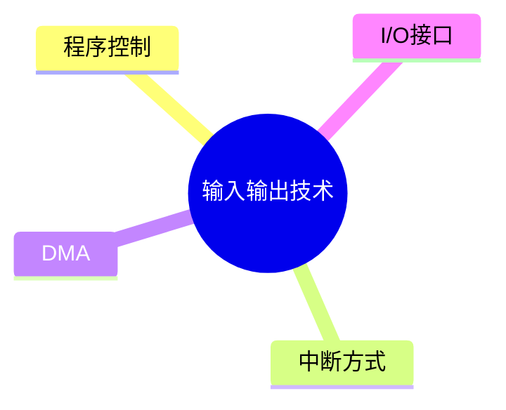
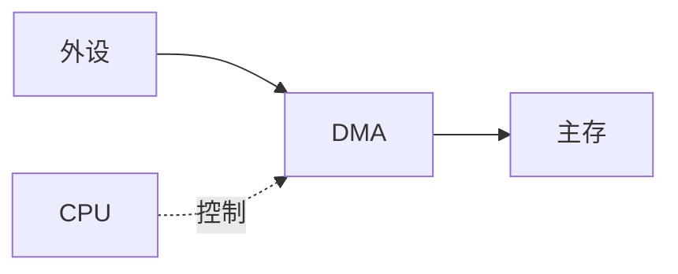

# 第六节 输入输出技术（I/O）

> **说明**
> 本文依据《计算机硬件》资料整理，保持原资料知识框架，并补充知识图、学习建议与工程实践内容。

## 一句话理解

输入输出技术负责实现
CPU、内存与外部设备之间的数据交换，是计算机体系结构中的重要组成部分。

------------------------------------------------------------------------

## 学习目标

-   理解 I/O 的作用
-   掌握程序控制、中断、DMA 等数据传输方式
-   理解各种 I/O 方式的特点
-   掌握考试高频考点

------------------------------------------------------------------------

## 知识地图



------------------------------------------------------------------------

## 为什么需要 I/O 技术？

CPU
与外部设备之间存在速度差异，因此需要专门的输入输出技术来提高系统效率。

------------------------------------------------------------------------

## 数据传输方式

### 程序控制方式（PIO）

CPU 主动查询设备状态并完成数据传输。

特点：

-   实现简单
-   CPU 长时间等待设备
-   效率较低

### 中断方式

外设完成准备后主动通知 CPU。

特点：

-   CPU 无需持续等待
-   提高 CPU 利用率
-   广泛应用于键盘、鼠标等设备

### DMA（直接存储器访问）

DMA 控制器直接在外设和内存之间传输数据。

特点：

-   CPU 不参与每次数据传输
-   大幅降低 CPU 开销
-   适合磁盘、网卡等高速设备



------------------------------------------------------------------------

## 三种方式比较

| 方式 | CPU参与程度 | 效率 | 适用场景 |
| --- | --- | --- | --- |
| 程序控制 | 高 | 低 | 简单设备 |
| 中断 | 中 | 较高 | 通用外设 |
| DMA | 低 | 高 | 高速设备 |

------------------------------------------------------------------------

## I/O 接口

I/O 接口位于 CPU 与外设之间，负责：

-   数据缓冲
-   速度匹配
-   状态控制
-   信号转换

------------------------------------------------------------------------

## 高频考点

-   三种 I/O 方式比较
-   DMA 工作原理
-   中断与 DMA 的区别

------------------------------------------------------------------------

## 易错点

> **注意：** DMA 并不是 CPU 完全不参与，而是 CPU
> 负责初始化和结束控制。

> **注意：** 中断方式每次数据交换通常仍需要 CPU 参与。

------------------------------------------------------------------------

## AI 学习建议

```text
请用快递仓库的例子解释程序控制、中断方式和 DMA 三种数据传输方式的区别。
```

------------------------------------------------------------------------

## 开发者视角

-   SSD、网卡等高速设备大量依赖 DMA 提高吞吐能力。
-   浏览器加载资源时，底层仍需要经过操作系统和 I/O 子系统完成数据交换。

------------------------------------------------------------------------

## 架构师思考

为什么高速存储设备仍然需要 DMA？

因为如果每次传输都由 CPU
搬运数据，将浪费大量计算资源，影响整体系统性能。

------------------------------------------------------------------------

## 一分钟速记

```text
I/O
├── 程序控制（CPU等待）
├── 中断（设备通知CPU）
└── DMA（设备直接访问主存）
```

------------------------------------------------------------------------

## 本节总结

-   输入输出技术解决 CPU 与外设速度不匹配问题。
-   掌握程序控制、中断、DMA 三种方式的特点。
-   理解 DMA 是软考中的重点内容。

------------------------------------------------------------------------

## 下一节

➡ [继续阅读：总线](./08-bus)
