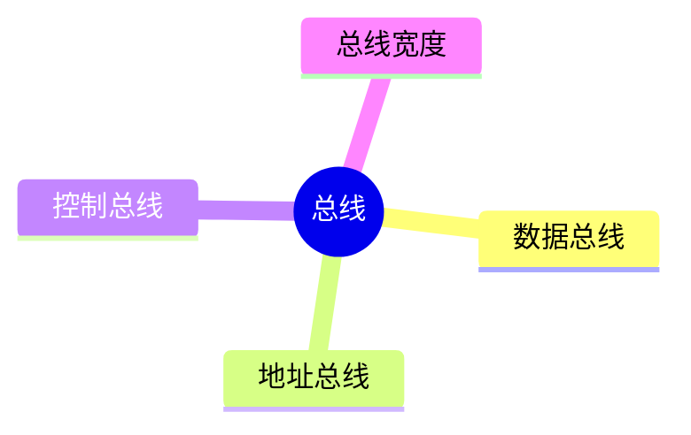
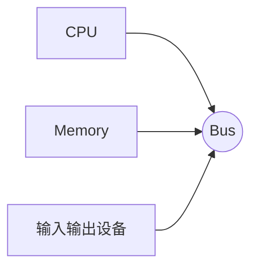

# 第七节 总线（Bus）

> **说明**
> 本文依据你提供的《计算机硬件》资料整理，在保持原资料知识框架的基础上增加了知识图、学习建议与工程实践内容。

## 一句话理解

总线是连接
CPU、存储器和输入输出设备的公共通信通道，负责传输数据、地址和控制信息。

------------------------------------------------------------------------

## 学习目标

-   理解总线的作用
-   掌握数据总线、地址总线、控制总线
-   理解总线宽度与系统性能的关系
-   掌握软考相关考点

------------------------------------------------------------------------

## 知识地图



------------------------------------------------------------------------

## 什么是总线？

总线是一组共享传输线路，用于在计算机各硬件模块之间交换信息。



------------------------------------------------------------------------

## 总线分类

### 数据总线（Data Bus）

负责传输数据。

-   一般为双向传输。
-   数据总线位数越宽，一次可传输的数据越多。

### 地址总线（Address Bus）

负责传输存储单元地址。

-   通常由 CPU 指向存储器或 I/O。
-   地址总线宽度决定可寻址空间。

### 控制总线（Control Bus）

负责传输控制和状态信号。

例如：

-   读信号（Read）
-   写信号（Write）
-   中断请求
-   时钟信号

------------------------------------------------------------------------

## 三种总线比较

| 总线类型 | 传输内容 | 方向 | 关键作用 |
| --- | --- | --- | --- |
| 数据总线 | 数据 | 双向 | 数据交换 |
| 地址总线 | 地址 | 通常单向 | 指定访问位置 |
| 控制总线 | 控制信号 | 双向（依信号而定） | 协调各部件工作 |

------------------------------------------------------------------------

## 总线宽度

总线宽度越大，单位时间可传输的信息越多。

> **提示：**
> 地址总线宽度决定最大寻址能力，数据总线宽度影响一次传输的数据量。

------------------------------------------------------------------------

## 高频考点

-   三类总线的作用
-   地址总线与寻址空间
-   数据总线与数据传输能力
-   控制总线传输的信号类型

------------------------------------------------------------------------

## 易错点

> **注意：**
> 数据总线宽度不会决定可寻址空间，可寻址空间由地址总线宽度决定。

> **注意：** 控制总线传输的是控制信号，不传输普通数据。

------------------------------------------------------------------------

## AI 学习建议

```text
请用高速公路的例子解释数据总线、地址总线和控制总线各自承担的角色。
```

------------------------------------------------------------------------

## 开发者视角

现代 CPU、内存和 PCIe
设备之间都依赖总线或高速互连技术进行通信。理解总线概念，有助于理解硬件性能瓶颈及数据传输流程。

------------------------------------------------------------------------

## 架构师思考

为什么总线不能无限扩宽？

因为更宽的总线会增加硬件成本、布线复杂度和时序设计难度，需要在性能、成本和实现复杂度之间取得平衡。

------------------------------------------------------------------------

## 一分钟速记

```text
总线
├── 数据总线（传数据）
├── 地址总线（传地址）
└── 控制总线（传控制信号）
```

------------------------------------------------------------------------

## 本节总结

-   总线负责连接各硬件模块。
-   数据总线、地址总线、控制总线职责不同。
-   地址总线决定寻址能力，数据总线影响数据吞吐量。
-   总线是软考中的重要基础知识点。

------------------------------------------------------------------------

## 下一节

➡ [继续阅读：历年真题](./09-past-exams)
