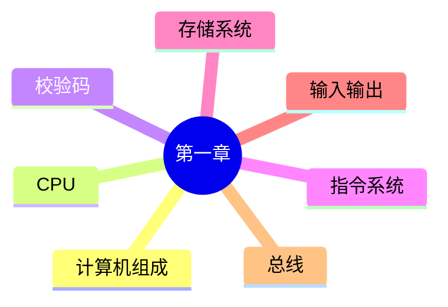

# 第一章 综合练习

> **说明**
> 本文用于巩固第一章知识。练习题覆盖计算机组成、CPU、校验码、指令系统、存储系统、输入输出技术和总线等主题。
>
> **说明：**
> 本文练习题为知识巩固用途，并非原资料中的真题；如需收录原资料真题，可在后续内容中单独整理。

------------------------------------------------------------------------

## 知识回顾



------------------------------------------------------------------------

## 一、选择题

### 1.

CPU 的核心组成是（ ）。

A. 控制器 + 存储器

B. 运算器 + 控制器

C. Cache + 主存

D. ALU + 主存

**答案：B**

------------------------------------------------------------------------

### 2.

下列哪一种存储器访问速度最快？

A. SSD

B. 主存

C. Cache

D. 寄存器

**答案：D**

------------------------------------------------------------------------

### 3.

以下哪一种方式最适合高速设备进行数据传输？

A. 程序控制

B. 中断方式

C. DMA

D. 查询方式

**答案：C**

------------------------------------------------------------------------

### 4.

地址总线主要负责传输（ ）。

A. 数据

B. 地址

C. 指令

D. 程序

**答案：B**

------------------------------------------------------------------------

### 5.

下列关于 CRC 的描述正确的是（ ）。

A. 用于纠错

B. 用于检错

C. 用于压缩

D. 用于加密

**答案：B**

------------------------------------------------------------------------

## 二、判断题

| 题目 | 答案 |
| --- | --- |
| CPU 包含运算器和控制器。 | ✔ |
| Cache 容量通常大于主存。 | ✘ |
| DMA 每次传输都需要 CPU 搬运数据。 | ✘ |
| 数据总线决定寻址空间。 | ✘ |
| 奇偶校验只能发现部分错误。 | ✔ |

------------------------------------------------------------------------

## 三、思考题

1.  为什么现代计算机采用多层次存储结构？
2.  Cache 为什么能够提升性能？
3.  DMA 与中断方式最大的区别是什么？
4.  地址总线宽度为什么会影响可寻址空间？
5.  为什么现代 CPU 需要越来越大的 Cache？

------------------------------------------------------------------------

## 四、AI 练习

```text
请模拟系统架构设计师考试，根据第一章内容生成 20 道单项选择题，并在最后统一给出答案与解析。
```

------------------------------------------------------------------------

## 五、学习建议

建议完成本章后进行以下复习：

-   再次绘制计算机组成图；
-   默写 CPU 各寄存器作用；
-   对比三种 I/O 方式；
-   对比三类总线；
-   总结存储层次特点。

------------------------------------------------------------------------

## 本章重点速查

| 模块 | 必会内容 |
| --- | --- |
| 计算机组成 | 五大组成、CPU 组成 |
| CPU | ALU、AC、PC、IR、PSW |
| 校验码 | 码距、奇偶校验、CRC |
| 指令系统 | 操作码、地址码、寻址方式 |
| 存储系统 | Cache、局部性原理 |
| I/O | 程序控制、中断、DMA |
| 总线 | 数据总线、地址总线、控制总线 |

------------------------------------------------------------------------

## 下一节

➡ [继续阅读：第一章总结](./11-summary)
