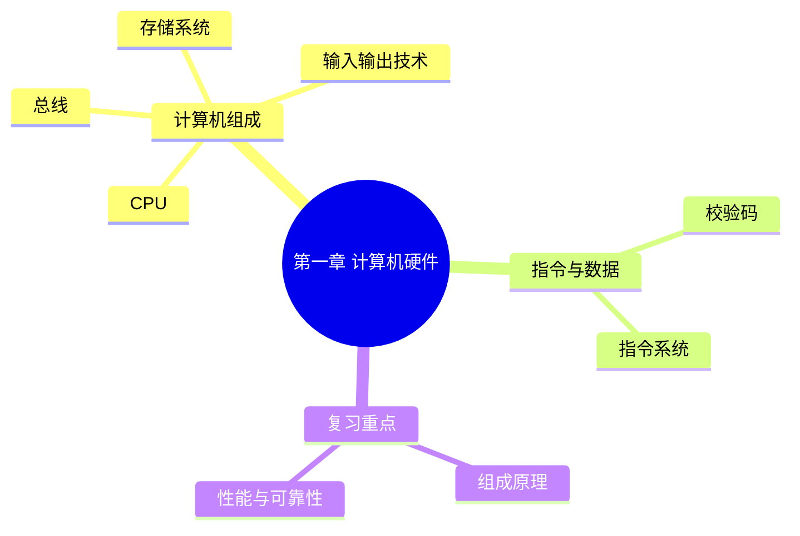

# 第一章总结

> **说明**
> 本文根据《计算机硬件》资料，对第一章内容进行整体回顾，便于考前快速复习。

## 第一章知识结构



------------------------------------------------------------------------

## 核心知识回顾

### 1. 计算机组成

-   五大组成：运算器、控制器、存储器、输入设备、输出设备。
-   CPU = 运算器 + 控制器。

### 2. CPU

重点掌握：

-   CPU 的主要功能
-   ALU、AC、DR、PSW
-   IR、PC、AR 等寄存器作用

### 3. 校验码

重点内容：

-   码距
-   奇校验、偶校验
-   CRC 的基本原理

### 4. 指令系统

重点内容：

-   指令格式
-   操作码
-   地址码
-   常见寻址方式

### 5. 存储系统

重点内容：

-   寄存器
-   Cache
-   主存
-   外存
-   局部性原理

### 6. 输入输出技术

重点内容：

-   程序控制方式
-   中断方式
-   DMA

### 7. 总线

重点内容：

-   数据总线
-   地址总线
-   控制总线

------------------------------------------------------------------------

## 高频考点速查

| 模块 | 高频考点 |
| --- | --- |
| 计算机组成 | 五大组成、CPU 组成 |
| CPU | AC、PC、IR、PSW |
| 校验码 | 奇偶校验、CRC、码距 |
| 指令系统 | 操作码、地址码、寻址方式 |
| 存储系统 | Cache、局部性原理 |
| I/O | 程序控制、中断、DMA |
| 总线 | 数据总线、地址总线、控制总线 |

------------------------------------------------------------------------

## 易错点汇总

> **注意：** - CPU 不等于整个主机。 - PC 保存下一条指令地址。 - Cache
> 不能替代主存。 - 奇偶校验主要用于检错。 - DMA 需要 CPU
> 完成初始化和结束处理。 - 地址总线决定可寻址空间。

------------------------------------------------------------------------

## 一页速记

```text
计算机组成
├── CPU
│   ├── 运算器
│   └── 控制器
├── 存储器
│   ├── Cache
│   ├── 主存
│   └── 外存
├── 输入输出
│   ├── 程序控制
│   ├── 中断
│   └── DMA
└── 总线
    ├── 数据总线
    ├── 地址总线
    └── 控制总线
```

------------------------------------------------------------------------

## 学习建议

建议按以下顺序复习：

1.  先掌握计算机组成与 CPU。
2.  再学习存储系统和 Cache。
3.  理解 I/O 与 DMA。
4.  熟悉指令系统和总线。
5.  完成综合练习与历年真题整理。

------------------------------------------------------------------------

## 第一章结束

恭喜完成第一章《计算机硬件》的学习。

建议继续进入第二章《操作系统》，保持相同的学习节奏，并结合练习题与历年真题进行巩固。

---

## 下一章

➡ [继续学习：第二章 操作系统](./chapter-02/01-operating-system)
