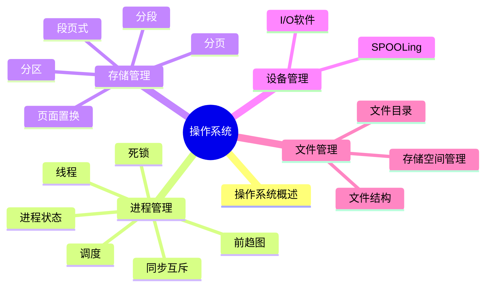

# 第二章 操作系统

> **说明**
> 本章依据你提供的《2.操作系统知识》资料整理，保持原资料知识框架，在此基础上补充知识图、学习建议、开发者视角等内容。

## 本章简介

操作系统是系统架构设计师考试的重要章节，主要围绕**进程管理、存储管理、设备管理、文件管理**四大模块展开，同时包含大量历年真题与计算题，是考试中的高频内容。

## 学习目标

-   理解操作系统的作用、功能和分类
-   掌握进程与线程、同步互斥、PV 操作
-   掌握进程调度与死锁
-   理解分区、分页、分段、段页式存储管理
-   掌握页面置换算法
-   理解设备管理、I/O 软件与 SPOOLing
-   掌握文件管理与索引结构

## 知识导图

## 文档目录

| 学习单元 | 内容 |
| --- | --- |
| [操作系统概述](./02-os-overview) | 定义、作用、特征、功能与分类 |
| [进程组成与状态](./03-process-state) | 进程、PCB 与状态模型 |
| [前趋图与资源图](./04-precedence-graph) | 任务依赖、并发与执行顺序 |
| [进程同步、互斥与 PV 操作](./05-process-sync) | 信号量、同步和互斥 |
| [进程调度](./06-process-scheduling) | 调度层次、算法与评价指标 |
| [死锁](./07-deadlock) | 必要条件、预防、避免与检测 |
| [存储管理](./08-memory-management) | 分页、分段、段页式与地址转换 |
| [页面置换算法](./09-page-replacement) | OPT、FIFO、LRU 与 LFU |
| [设备管理](./10-device-management) | I/O 控制、DMA、缓冲与 Spooling |
| [文件管理](./11-file-management) | 目录、存储方式、访问与保护 |
| [本章练习](./12-exercises) | 操作系统核心考点自测 |
| [第二章总结](./13-summary) | 知识回顾、考点与复习路线 |

## 学习建议

建议按照目录顺序学习，每完成一个知识点立即完成对应真题，再统一进行章节总结。

## 下一节

➡ [开始学习：操作系统概述](./02-os-overview)

