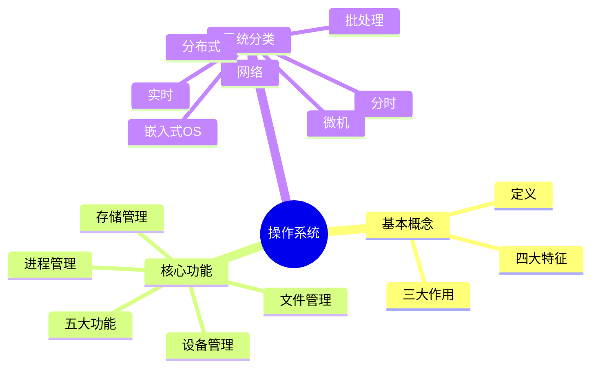

# 第一节 操作系统概述

> **说明**
> 本文依据你提供的《2.操作系统知识》资料整理，保持原资料知识框架，并补充知识导图、学习建议、开发者视角等内容。

## 一句话理解

**操作系统（OS）是管理计算机软硬件资源、组织程序运行，并向用户和应用程序提供统一接口的软件。**

------------------------------------------------------------------------

## 学习目标

-   理解操作系统定义
-   掌握三大作用、四大特征、五大功能
-   熟悉操作系统分类
-   理解嵌入式操作系统特点及初始化流程

------------------------------------------------------------------------

## 知识导图



------------------------------------------------------------------------

## 1. 操作系统定义

操作系统能够**有效组织和管理系统中的各种软硬件资源**，合理组织计算机工作流程，控制程序执行，并向用户提供良好的工作环境和统一接口。

------------------------------------------------------------------------

## 2. 三大作用

-   管理计算机中运行的程序和各类软硬件资源。
-   为用户提供友好的人机交互界面。
-   为应用程序开发和运行提供高效平台。

------------------------------------------------------------------------

## 3. 四大特征

| 特征 | 含义 |
| --- | --- |
| 并发性 | 多个程序在一段时间内交替执行。 |
| 共享性 | 多个任务共享系统资源。 |
| 虚拟性 | 通过软件技术让用户获得"独占资源"的体验。 |
| 不确定性（异步性） | 各进程推进速度不可预知。 |

> **考试重点：四大特征需要牢记。**

------------------------------------------------------------------------

## 4. 五大功能

1.  进程管理
2.  文件管理
3.  存储管理
4.  设备管理
5.  作业管理（含用户接口）

------------------------------------------------------------------------

## 5. 操作系统分类

| 类型 | 关键词 |
| --- | --- |
| 批处理系统 | 吞吐量高 |
| 分时系统 | 多终端、时间片 |
| 实时系统 | 快速响应 |
| 网络操作系统 | 网络资源共享 |
| 分布式操作系统 | 多机协同 |
| 微型计算机操作系统 | Windows、macOS、Linux |

------------------------------------------------------------------------

## 6. 嵌入式操作系统

### 主要特点

-   微型化
-   可定制
-   实时性
-   高可靠性
-   易移植性

### 初始化流程

```text
片级初始化
    ↓
板级初始化
    ↓
系统初始化
```

以上流程及特点均来自原资料。

------------------------------------------------------------------------

## 高频考点

-   操作系统四大特征
-   五大功能
-   各类操作系统特点
-   嵌入式操作系统特点

## 易错点

> **注意：** 不要混淆"四大特征"和"五大功能"。

> **注意：** 分时系统强调公平共享；实时系统强调响应时间。

------------------------------------------------------------------------

## AI 学习建议

```text
请分别用生活中的例子解释并发性、共享性、虚拟性和异步性，并比较分时系统与实时系统的区别。
```

------------------------------------------------------------------------

## 开发者视角

现代 Linux、Windows、macOS
都通过进程调度、虚拟内存、文件系统和设备驱动，为应用程序提供统一运行环境。

## 架构师思考

系统架构设计中，中间件、容器和云平台都建立在操作系统提供的资源管理能力之上，理解操作系统有助于分析系统性能瓶颈。

------------------------------------------------------------------------

## 一分钟速记

```text
定义
↓
三大作用
↓
四大特征
↓
五大功能
↓
分类
↓
嵌入式OS
```

------------------------------------------------------------------------

## 本节总结

本节介绍了操作系统的基础概念，是后续学习进程管理、存储管理、设备管理和文件管理的基础。

## 下一节

➡ [继续阅读：进程组成与状态](./03-process-state)
