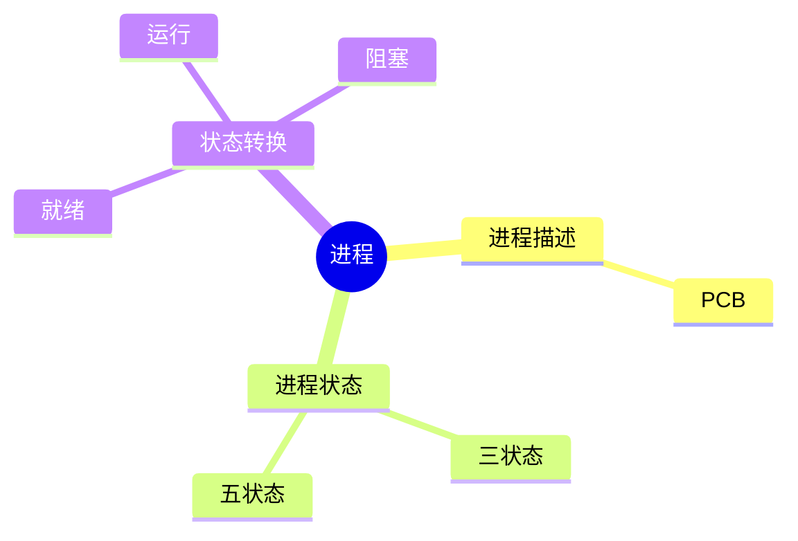
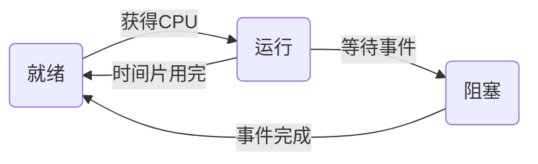

# 第二节 进程组成与状态

> **说明** 本文依据《2.操作系统知识》资料整理，重点介绍进程、PCB
> 以及进程状态模型。

## 一句话理解

**进程是程序的一次执行过程，是操作系统进行资源分配和调度的基本单位。**

## 学习目标

-   理解进程概念
-   掌握 PCB 的作用
-   掌握三状态、五状态模型
-   理解状态转换

## 知识导图



## 1. 什么是进程

进程是程序在某个数据集合上的一次运行活动，是系统进行资源分配和调度的基本单位。

## 2. PCB（进程控制块）

PCB（Process Control
Block）保存进程运行所需的重要信息，是操作系统管理进程的重要数据结构。

常见内容：

-   进程标识
-   处理机状态
-   程序计数器
-   资源信息
-   调度信息

> PCB 是历年考试高频考点。

## 3. 进程的三状态模型



| 状态 | 含义 |
| --- | --- |
| 就绪 | 已具备运行条件，等待 CPU |
| 运行 | 正在占用 CPU |
| 阻塞 | 等待资源或事件 |

## 4. 五状态模型

三状态基础上增加：

-   新建（New）
-   终止（Exit）

```text
新建 → 就绪 → 运行 → 阻塞
          ↑      ↓
          └──────┘
            终止
```

## 5. 状态转换

-   新建 → 就绪：创建完成
-   就绪 → 运行：调度获得 CPU
-   运行 → 就绪：时间片结束
-   运行 → 阻塞：等待 I/O 或资源
-   阻塞 → 就绪：等待事件完成
-   运行 → 终止：程序结束

## 高频考点

-   PCB 的作用
-   三状态模型
-   五状态模型
-   各状态转换条件

## 易错点

> **注意：**
> 阻塞状态不会直接进入运行状态，必须先进入就绪状态，再等待调度。

> **注意：** 就绪状态表示"可以运行"，不是"正在运行"。

## AI 学习建议

```text
请用银行排队的例子解释进程三状态和五状态模型，并画出状态转换过程。
```

## 开发者视角

线程池、协程和事件循环都建立在操作系统进程与线程调度机制之上。理解进程状态有助于分析程序卡顿、阻塞和性能问题。

## 架构师思考

大型系统通常通过多进程、多线程提高并发能力，而合理的调度和资源管理是系统稳定性的基础。

## 一分钟速记

```text
PCB
↓
三状态
↓
五状态
↓
状态转换
```

## 本节总结

本节掌握了进程概念、PCB 以及进程状态模型，为后续学习前趋图、PV
操作和进程调度奠定基础。

## 下一节

➡ [继续阅读：前趋图与资源图](./04-precedence-graph)
