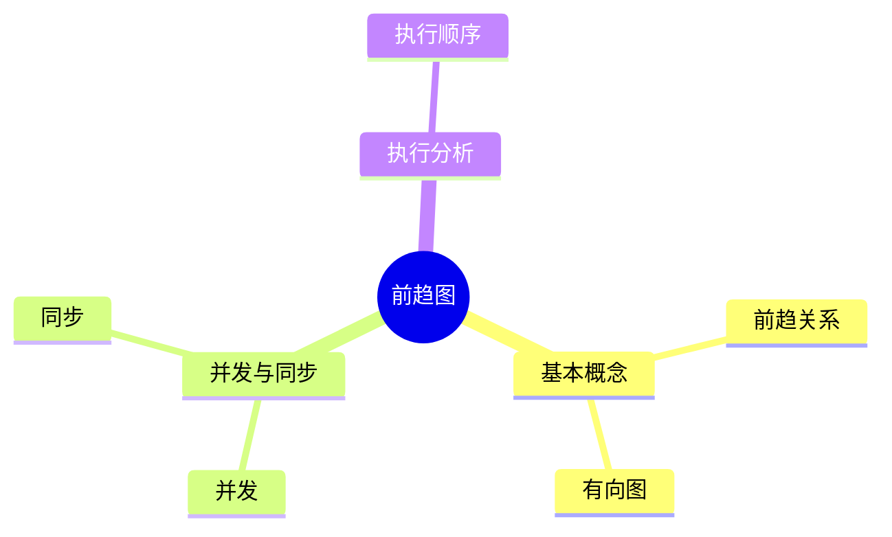
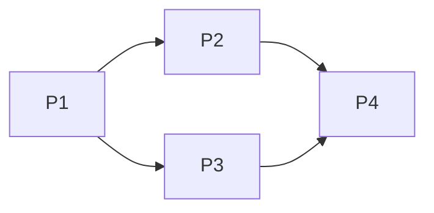

# 第三节 前趋图与资源图

> **说明**
> 本文依据《2.操作系统知识》资料整理，重点介绍前趋图、资源依赖关系及考试中的典型分析方法。

## 一句话理解

**前趋图用于描述任务之间的先后依赖关系，是分析并发执行、PV
操作和调度顺序的重要基础。**

------------------------------------------------------------------------

## 学习目标

-   理解前趋关系
-   掌握前趋图的表示方法
-   能分析任务执行顺序
-   为后续 PV 操作打基础

------------------------------------------------------------------------

## 知识导图



------------------------------------------------------------------------

## 1. 什么是前趋图

前趋图（Precedence
Graph）使用**有向无环图（DAG）**表示多个任务之间的执行依赖关系。

-   顶点：任务（P1、P2......）
-   有向边：前驱关系

只有当前驱任务完成后，后继任务才能开始执行。

------------------------------------------------------------------------

## 2. 前趋图示例



说明：

-   P1 完成后，可并发执行 P2、P3。
-   P4 必须等待 P2、P3 全部完成。

------------------------------------------------------------------------

## 3. 前驱与后继

| 概念 | 含义 |
| --- | --- |
| 前驱 | 当前任务之前必须完成的任务 |
| 后继 | 当前任务完成后才能执行的任务 |

例如：

-   P2 的前驱是 P1
-   P4 的前驱是 P2、P3

------------------------------------------------------------------------

## 4. 并发分析

满足以下条件的任务可以并发：

-   不存在直接依赖关系
-   不存在间接依赖关系
-   不共享互斥资源

考试中常要求判断哪些任务能够同时执行。

------------------------------------------------------------------------

## 5. 与 PV 操作的关系

前趋图可转换为 PV 操作。

基本思想：

```text
前驱结束
    ↓
V(S)

后继开始
    ↓
P(S)
```

信号量保证任务严格按照前趋关系执行。

------------------------------------------------------------------------

## 6. 真题分析方法

根据资料中的典型题型，可按以下步骤分析：

1.  找出所有前驱关系。
2.  确认可并发执行的节点。
3.  判断最终汇聚节点。
4.  写出对应的 PV 同步关系。

------------------------------------------------------------------------

## 高频考点

-   前趋关系判断
-   哪些任务可以并发
-   前趋图转换为 PV 操作
-   阅读复杂前趋图

------------------------------------------------------------------------

## 易错点

> **注意：** 多个前驱必须全部完成，后继任务才能开始。

> **注意：** 前趋图描述的是依赖关系，不代表 CPU 的实际调度顺序。

------------------------------------------------------------------------

## AI 学习建议

```text
请根据一个包含 P1~P6 的前趋图，分析执行顺序，并生成对应的 PV 操作代码。
```

------------------------------------------------------------------------

## 开发者视角

前趋图与现代软件工程中的 **DAG（Directed Acyclic Graph）**
十分相似，例如：

-   GitHub Actions 工作流
-   Apache Airflow
-   Spark DAG
-   CI/CD Pipeline

这些系统都依赖任务间的先后关系进行调度。

------------------------------------------------------------------------

## 架构师思考

大型分布式系统会将复杂业务拆分为多个任务节点，通过依赖关系实现并行执行，提高整体吞吐量。

------------------------------------------------------------------------

## 一分钟速记

```text
节点 = 任务
箭头 = 前驱关系
无依赖 = 可并发
有依赖 = 必须等待
```

------------------------------------------------------------------------

## 本节总结

前趋图是理解 PV
操作、进程同步和调度算法的重要基础，也是第二章历年真题中的高频内容。

## 下一节

➡ [继续阅读：进程同步、互斥与 PV 操作](./05-process-sync)
