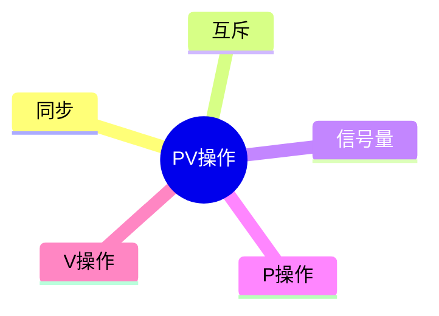

# 第四节 进程同步、互斥与 PV 操作

> **说明**
> 本文依据《2.操作系统知识》资料整理，重点介绍进程同步、互斥、信号量及
> PV 操作，并结合资料中的典型题型总结分析方法。

## 一句话理解

**PV
操作利用信号量（Semaphore）协调多个进程之间的同步与互斥，是软考第二章最重要的考点之一。**

## 学习目标

-   理解同步与互斥
-   掌握信号量（Semaphore）
-   理解 P、V 操作含义
-   能分析常见 PV 真题

## 知识导图



## 1. 同步与互斥

**同步**：多个进程按照约定的先后顺序协作执行。

**互斥**：多个进程不能同时访问同一临界资源。

## 2. 信号量（Semaphore）

信号量是操作系统中用于协调并发进程的重要同步机制。

-   S \> 0：存在可用资源
-   S = 0：无空闲资源
-   S \< 0：有进程等待资源

## 3. P、V 操作

### P（Wait）

```text
P(S)
S = S - 1
若 S < 0，则阻塞当前进程
```

### V（Signal）

```text
V(S)
S = S + 1
若 S <= 0，则唤醒一个等待进程
```

以上定义与资料中的信号量说明一致。

## 4. PV 操作流程

```mermaid
flowchart LR
A[P(S)] --> B{资源可用?}
B -- 是 --> C[进入临界区]
B -- 否 --> D[阻塞等待]
C --> E[V(S)]
E --> F[释放资源]
```

## 5. PV 与前趋图

对于前驱任务：

```text
前驱结束
    ↓
V(S)

后继开始
    ↓
P(S)
```

利用信号量保证执行顺序。

## 6. 真题分析方法

资料中的 PV 题通常可按以下步骤分析：

1.  找出任务依赖关系。
2.  为每条依赖关系建立信号量。
3.  前驱任务结束执行 `V(S)`。
4.  后继任务开始执行 `P(S)`。
5.  检查是否存在死锁或顺序错误。

## 高频考点

-   P、V 操作定义
-   信号量取值变化
-   前趋图转 PV
-   多进程同步

## 易错点

> **注意：** P 操作可能导致阻塞；V 操作不会阻塞调用进程。

> **注意：** 同步解决执行顺序，互斥解决共享资源访问。

## AI 学习建议

```text
请根据 P1~P5 的前趋图，设计对应的信号量，并写出每个进程的 PV 操作。
```

## 开发者视角

Java 的 `Semaphore`、POSIX
信号量以及数据库锁机制都体现了同步与互斥思想。理解 PV
操作有助于理解并发编程和线程安全。

## 架构师思考

在分布式系统中，虽然不直接使用传统 PV
操作，但分布式锁、消息队列和一致性协议都延续了同步与资源协调的思想。

## 一分钟速记

```text
同步 → 控制顺序
互斥 → 保护资源
P → 申请资源
V → 释放资源
```

## 本节总结

PV
操作是操作系统并发控制的基础，也是系统架构设计师考试中的高频计算题。掌握信号量变化规律和前趋图转换方法，是解决相关题目的关键。

## 下一节

➡ [继续阅读：进程调度](./06-process-scheduling)

